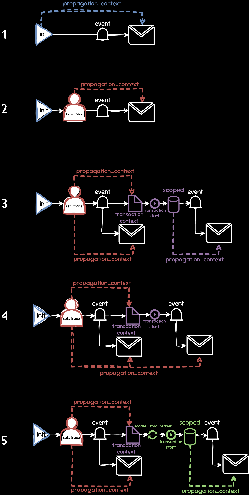

## Scenarios
In the Native SDK we have the following scenarios, showcasing how trace-context data flows:

### Tracing without Performance
In Tracing without Performance ([TwP](https://develop.sentry.dev/sdk/telemetry/traces/tracing-without-performance/)) the SDK does not create spans. However, we still want to connect events across boundaries so we use a `propagation_context` to store the relevant data (a `trace_id` and a `span_id`) which gets generated during SDK initialization. This `propagation_context` can be updated by calling `sentry_set_trace()`, for example from a downstream SDK.

### Tracing with Performance
When any [traces sampling option](https://docs.sentry.io/platforms/native/configuration/sampling/#configuring-the-transaction-sample-rate) is enabled, the SDK can send spans. Just like in TwP, we still use a `propagation_context` to store the relevant data (a `trace_id` and a `span_id`). Now, events and spans can be connected through a common `trace_id` and, if a span is scoped, it will additionally be connected hierarchically to the event through its `span_id`. By default, both spans and events will inherit the `trace_id` from the `propagation_context` as generated during SDK initialization.

Downstream SDKs are still able to use `sentry_set_trace()`, which updates the `propagation_context` with a new `trace_id`, `span_id` and `parent_span_id`. Root spans (=transactions) will pick up the data currently in the `propagation_context`, which can still be overwritten by `sentry_transaction_context_update_from_header()` before the span is started. Child spans will inherit the trace data from their parent. While a span is scoped, any event will use that span's data. If no spans are scoped, events will just use the `propagation_context` data directly.

### Visualization
The flow of the trace-context (via the `propagation_context`) can be visualized for the following scenarios:

The following steps assume transaction creation and transaction context creation as a single step for brevity. As mentioned above, any trace context inheritance happens during transaction context creation.

1. The SDK initializes `propagation_context` with a `trace_id` and `span_id`. The event sent will use this data.
2. The SDK initializes `propagation_context` with a `trace_id` and `span_id`, which gets overwritten by `sentry_set_trace()`. The event sent will use this updated data.
3. The SDK initializes `propagation_context` with a `trace_id` and `span_id`, which gets overwritten by `sentry_set_trace()`. The event sent will use this updated data. Now, a transaction is created, which uses the `propagation_context` data. Since the transaction is started and scoped, any event sent while it is scoped will use the transaction's data (which has the same `trace_id` as the `propagation_context`, but its own `span_id`).
4. The SDK initializes `propagation_context` with a `trace_id` and `span_id`, which gets overwritten by `sentry_set_trace()`. The event sent will use this updated data. Now, a transaction is created, which uses the `propagation_context` data. Since the transaction is started and not scoped, any event sent will use the `propagation_context` data. The transaction and event will still have the same `trace_id`, but different `span_id`s.
5. The SDK initializes `propagation_context` with a `trace_id` and `span_id`, which gets overwritten by `sentry_set_trace()`. The event sent will use this updated data. Now, a transaction is created, which uses the `propagation_context` data. It gets updated by `sentry_transaction_context_update_from_header()`, setting a new `trace_id`. Since the transaction is started and scoped, any event sent while it is scoped will use the transaction's data, which now differs from the `propagation_context` data.
