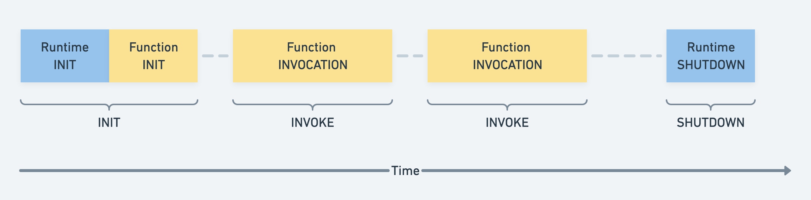

Lambda functions can be written in numerous programming languages (Javascript,
Python, Ruby, Java, Go, ...). Sentry is currently supporting automatic
instrumentation of Lambda functions written in Javascript and Python.
See the [Sentry Documentation](https://docs.sentry.io/product/integrations/cloud-monitoring/)
on how to set up serverless instrumentation.

## A short primer into AWS Lambda functions, and layers.

A Lambda function is a zipped directory that contains everything the Lambda
language runtime needs to execute the code in it. You need to have your
function code as well as all dependencies in your Lambda function directory.
Lambda functions are invoked by an event (ex: visiting an URL) and are billed
by the milliseconds the function took to complete.

AWS Lambda layers can be attached to functions. Layers are zipped directories
as well and contain additional code used by your Lambda function.
Layers are used for sharing code between functions or to add third-party functionality,
like the Sentry SDK to your Lambda function.

## Sentry AWS Lambda Integration

With the AWS Lambda Integrations users can add Sentry functionality to their
Lambda function without changing the code of the Lambda function.

Sentry is providing a Lambda Layer including the Javascript SDK (or Python
SDK).

See the documentation to learn how customers can instrument their Lambda
functions: https://docs.sentry.io/product/integrations/cloud-monitoring/aws-lambda/

## Sentry Lambda Layer

Sentry is deploying one Lambda Layer for Node-based Lambda functions
(`SentryNodeServerlessSDK`) and one Lambda Layer for Python-based Lambda
functions (`SentryPythonServerlessSDK`). Those Lambda layers are distributed
to various AWS regions to be close to the users.

Both these layers include the latest Sentry Javascript SDK (or Python SDK).

### Building of the Python Layer

The contents of the Layer directory for the Python layer are built during the
"CI" workflow in Github actions. The steps necessary can be found
[here](https://github.com/getsentry/sentry-python/blob/master/.github/workflows/ci.yml).

This will prepare the Lambda layer directory, compress everything and upload the resulting zip file as
an artifact to GitHub.

### Deployment of the Python Layer

The zip file prepared in the previous step will be deployed to AWS Lambda by
[Craft](https://github.com/getsentry/craft).The configuration of craft for doing
this can be found [here](https://github.com/getsentry/sentry-python/blob/master/.craft.yml).

To deploy a new version of the Lambda layer to AWS, you need to trigger a new
release of the Python SDK.

### Building of the Javascript/Node Layer

The contents of the Layer directory for the Javascript/Node layer are built during the
"Build & Test" workflow in Github actions. The steps necessary can be found
[here](https://github.com/getsentry/sentry-javascript/blob/master/.github/workflows/build.yml).

This will prepare the Lambda layer directory, compress everything and upload the resulting zip file as
an artifact to GitHub.

### Deployment of the Javascript/Node Layer

The zip file prepared in the previous step will be deployed to AWS Lambda by
[Craft](https://github.com/getsentry/craft). The configuration of craft for doing
this can be found [here](https://github.com/getsentry/sentry-javascript/blob/master/.craft.yml).

To deploy a new version of the Lambda layer to AWS, you need to trigger a new
release of the Javascript SDK.
