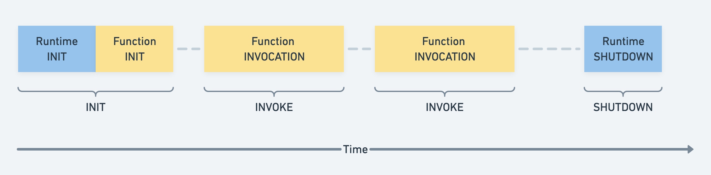
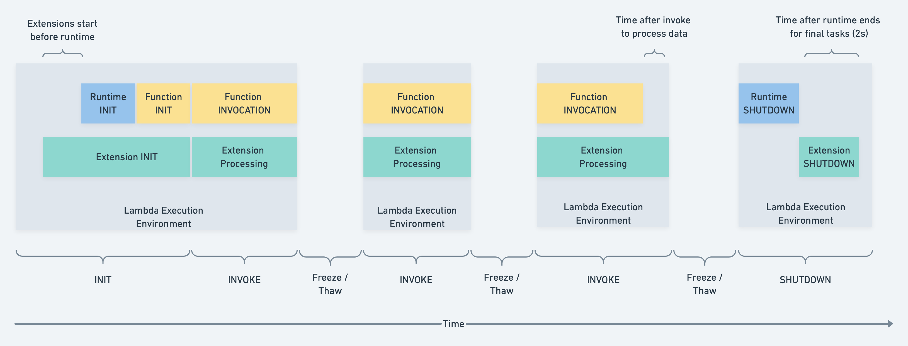
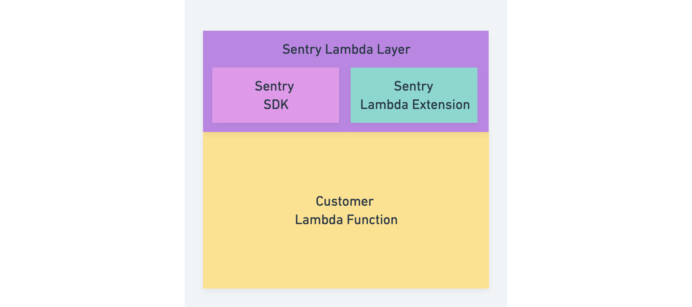

Lambda functions can be written in numerous programming languages (Javascript,
Python, Ruby, Java, Go, ...). Sentry is currently supporting automatic
instrumentation of Lambda functions written in Javascript and Python.
See the [Sentry Documentation](https://docs.sentry.io/product/integrations/cloud-monitoring/)
on how to set up serverless instrumentation.

## A short primer into AWS Lambda functions, layers, and extensions.

A Lambda function is a zipped directory that contains everything the Lambda
language runtime needs to execute the code in it. You need to have your
function code as well as all dependencies in your Lambda function directory.
Lambda functions are invoked by an event (ex: visiting an URL) and are billed
by the milliseconds the function took to complete.

AWS Lambda layers can be attached to functions. Layers are zipped directories
as well and contain additional code used by your Lambda function.
Layers are used for sharing code between functions or to add third-party functionality,
like the Sentry SDK to your Lambda function.

### Lambda extensions

A Lambda layer can also contain a Lambda extension, which is an executable
that lives in the special `/extensions` directory inside the layer directory.

When a Lambda function is invoked a Lambda execution environment is
initialized, during which it starts multiple things in parallel.
First, the Lambda execution environment checks if it can find any executables
in the `/extensions` directory and invokes those Lambda extensions. (Extension
INIT) Second, a runtime for the function is initialized and the "handler
method" of the function is invoked. (Function INVOCATION)

When the execution of the handler method finishes, the invocation of the
function ends and after a timeout, the runtime and the extension will be shut
down. (SHUTDOWN phase) If the Lambda function is invoked again when the execution
environment is still alive it will be reused (called a "warm" start).
If the execution environment is already gone the whole process described above
will happen again ("cold" start).

Lambda extensions run in a separate process and survive the shutting down of the
Lambda function. Extensions can therefore be long-running processes and cater to
multiple Lambda function invocations.

See the official [Lambda Extensions API documentation](https://docs.aws.amazon.com/lambda/latest/dg/runtimes-extensions-api.html)
for further details.

## Sentry AWS Lambda Integration

With the AWS Lambda Integrations users can add Sentry functionality to their
Lambda function without changing the code of the Lambda function.

Sentry is providing a Lambda Layer including the Javascript SDK (or Python
SDK) and the Sentry Lambda Extension.

See the documentation to learn how customers can instrument their Lambda
functions: https://docs.sentry.io/product/integrations/cloud-monitoring/aws-lambda/

## Sentry Lambda Layer

Sentry is deploying one Lambda Layer for Node-based Lambda functions
(`SentryNodeServerlessSDK`) and one Lambda Layer for Python-based Lambda
functions (`SentryPythonServerlessSDK`). Those Lambda layers are distributed
to various AWS regions to be close to the users.

Both these layers include:

- The latest Sentry Javascript SDK (or Python SDK)
- The latest Sentry Lambda Extension

Because the Extension is a rust binary we currently only support Intel-based
Lambda functions. ARM-based Lambda functions are planned, but there is no timeline yet.

### Building of the Python Layer

The contents of the Layer directory for the Python layer are built during the
"CI" workflow in Github actions. The steps necessary can be found
[here](https://github.com/getsentry/sentry-python/blob/master/.github/workflows/ci.yml).

This will prepare the Lambda layer directory, include the latest Sentry
Lambda Extension, compress everything and upload the resulting zip file as
an artifact to GitHub.

### Deployment of the Python Layer

The zip file prepared in the previous step will be deployed to AWS Lambda by
[Craft](https://github.com/getsentry/craft).The configuration of craft for doing
this can be found [here](https://github.com/getsentry/sentry-python/blob/master/.craft.yml).

To deploy a new version of the Lambda layer to AWS, you need to trigger a new
release of the Python SDK.

### Building of the Javascript/Node Layer

The contents of the Layer directory for the Javascript/Node layer are built during the
"Build & Test" workflow in Github actions. The steps necessary can be found
[here](https://github.com/getsentry/sentry-javascript/blob/master/.github/workflows/build.yml).

This will prepare the Lambda layer directory, include the latest Sentry
Lambda Extension, compress everything and upload the resulting zip file as
an artifact to GitHub.

### Deployment of the Javascript/Node Layer

The zip file prepared in the previous step will be deployed to AWS Lambda by
[Craft](https://github.com/getsentry/craft). The configuration of craft for doing
this can be found [here](https://github.com/getsentry/sentry-javascript/blob/master/.craft.yml).

To deploy a new version of the Lambda layer to AWS, you need to trigger a new
release of the Javascript SDK.

## Sentry Lambda Extension

The Sentry Lambda Extension is [Relay](/services/relay/) running in proxy mode
alongside the Lambda function. This way the Lambda function does not send data
to https://sentry.io but only to Relay running alongside in the same Lambda
execution environment. This reduces latency and keeps the overhead in processing
time Sentry puts on the Lambda function at a minimum.

### Development, Deployment, and Releases

As the Sentry Lambda Extension is built into Relay the deploy and release
processes of Relay are in place.
See [Relays README.md](https://github.com/getsentry/relay/blob/master/README.md)
