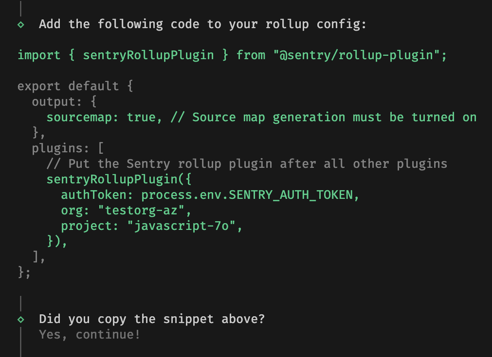

Some SDKs support automatic SDK setup with the Sentry Wizard to make setting up the SDK as easy as possible.
Creating such a wizard for your SDK is completely optional and not required when building an SDK.

This page provides guidelines how we develop wizards for SDKs and what to consider when creating a new wizard.

Before we get started, some important basics:

- Wizards are not part of the SDK itself, but they are shipped in a separate package.
- Currently, all wizards are located in the [`getsentry/sentry-wizard`](https://github.com/getsentry/sentry-wizard) repository.
- Currently, all wizards are written in TypeScript and published in the `@sentry/wizard` package on `npm` and `brew`.
  Additional publishing targets can be added in the future.

## Expectations

New wizards should meet the following high-level expectations and requirements:

### Easy to use

Setting up an SDK with the wizard should be as easy as possible for users.
One shell command, along with additional, simple user inputs along the way should be enough to get the SDK up and running.
Wizards should set up as much as possible automatically and only ask for user input if necessary.
Think of various CLI tools that set up new projects for you. This is how we want the wizard to work.

Wizard usage Example:

```sh
npx @sentry/wizard@latest -i sveltekit
```

<Alert level="warning">

While the wizard should provide the easiest way to set up the SDK, it does not replace the SDK's documentation how to set it up manually.
Showing the wizard command in the <Link to="https://docs.sentry.io/platforms/javascript/guides/nextjs/#install">Getting Started</Link> docs and providing an additional <Link to="https://docs.sentry.io/platforms/javascript/guides/nextjs/manual-setup/">Manual Setup</Link> page proved to be a good approach.

</Alert>

### Transparency

Wizards touch our users' projects. They might modify files, install packages or change around configurations.
It is important that we communicate these changes to our users so that they're aware of the impact.

For instance:

- If the wizard creates a new or modifies a file, mention the specific filename in the console output.
- If new packages are installed, it should let users know about the specific packages.
- If something fails along the way, it should notify users and provide some guidance how to fix or what to do next.

Related to this, wizards should [check the git status](#1-check-preconditions) of the project and warn users if they're not in a clean state.
This ensures that users can revert the changes easily if something goes wrong.

### Cater to the 80%

Wizards should be opinionated in which SDK options are set and cater to the 80% use case.
The SDK setup doesn't necessarily have to be minimal.
For example, it can include optional but recommended integrations (e.g. session replay or profiling) or options (e.g. sample rates).

Given that most wizards will actively modify code or config files, there is a chance that they might fail or break something.
That's okay and expected as long as we're transparent about it and we tell users upfront that we're touching their files.
We cannot possibly cover all edge cases but we should try to cover the 80% so that typical projects can be set up with the wizard.

### Support Self-Hosted Sentry

Wizards should be usable by everyone, hence we need to support self-hosted Sentry.
If not already specified via the `--url` param, wizards should ask if users are using self-hosted Sentry and if so, ask for the URL.

## Wizard Flow

When creating a new wizard, the execution flow should roughly adhere to the outlined steps. Additional steps can be added as necessary.

<Alert level="info">

Many of the individual steps and checks are already implemented in <Link to="#building-blocks-and-helper-functions">helper functions</Link>.

</Alert>

### 1. Check Preconditions

A wizard should check for necessary preconditions so that the SDK can be set up.
The specific preconditions depend on the SDK but some common ones are:

- Check if the wizard is executed in a git repository.
- Check if the git status of the project is clean.
- Check if the framework (e.g. NextJS) is installed in a version that's supported by the SDK.

In case preconditions are not met, ask if users want to continue anyway or abort the wizard with a reason if there's no change for a successful setup.

### 2. Project Selection

To set the correct DSN and set up additional features (e.g. source maps upload), the wizard needs to know which project the SDK is used in.
Our wizards will use a specific Sentry API endpoint to log in and fetch the list of projects for the user (see [Helper Functions](#building-blocks-and-helper-functions)).

### 3. SDK Configuration

The most important part of the wizard and the one where you probably have to implement the most logic.
SDK setup is highly specific to the SDK and the framework it's used in.
Some common tasks include:

- Add the SDK to the project's dependencies and download it.
- Add a SDK initialization code to the project.
- Configure source maps or debug artifact upload.

<Alert level="warning">

Whenever you modify code in an existing file, be aware that things can go wrong.
Try to detect already existing Sentry code and ask if users want to proceed anyway.
If the wizard fails, provide a fallback solution to manually set up the failed step.

</Alert>

### 4. Verification

Similarly to how we document SDK setup verification in our docs, the wizard should provide instructions how to verify the new Sentry installation.
On a minimum, the wizard should print instructions to the console.

If possible, the wizard should also add an example page or component to the project that throws an error.
The implementation of such an example depends on the framework and is optional.

## Building Blocks and Helper Functions

When creating a new wizard, it's recommended to reuse existing building blocks and helper functions from our newer wizards.
Many of the common challenges have already been solved and extracted to reusable funcitons.
For example, you can take the [NextJS](https://github.com/getsentry/sentry-wizard/tree/master/src/nextjs) wizard as a reference.

If you come across logic that's not yet reusable but might be applicable in other wizards, feel free to extract it.

<Alert level="warning">

Our older wizards use a class and step-based approach which is not recommended anymore.
We want to keep things simple and avoid unnecessary abstractions going forward.

</Alert>

### Prompting for user input

Waiting for input always gives users the chance to cancel or exit the wizard.
If you create a new prompt, make sure you wrap it with the [`abortIfCancelled`](https://github.com/getsentry/sentry-wizard/blob/c5b7f72f306cde8e6516acc11a5c6b75acee60c6/src/utils/clack-utils.ts#L48) function.
This will take care of correctly handling Cmd+C inputs, flushing Sentry events (if using [telemetry](#telemetry)) and exiting the process.
For example:

```TypeScript
const continueWithoutGit = await abortIfCancelled(
  clack.confirm({
    message:
      'You are not inside a git repository. The wizard will create and update files. Do you still want to continue?',
  }),
);
```

<Alert level="info">

A lot of <Link to="https://github.com/getsentry/sentry-wizard/blob/master/src/utils/clack-utils.ts">helpers</Link> around specific user input questions can be reused.
For example, the entire authentication and project selection flow is <Link to="https://github.com/getsentry/sentry-wizard/blob/master/src/utils/clack-utils.ts#L518">already covered</Link>.

</Alert>

### Handling User Data

Whenever we upload files (source maps, debugging artifacts, etc.) to Sentry, we need to specify an auth token.
This token is either fetched or generated when users log in in the browser.
The wizard needs to store this token in a config file so that it can be accessed later on when users upload files.

<Alert level="warning">

**Important:** Auth tokens **must not** be directly injected into user code. They should be
kept secret and not be committed to users' repositories.

</Alert>

Therefore:

- Use our helpers to store the token in `.sentryclirc`, `sentry.properties` or `.env.sentry-build-plugins`.
- Make sure the created file is added to the users' `.gitignore` file (our helpers take care of that).
- Make sure that other data (e.g. project, org, url) is not stored in the same file as the auth token.
  We can safely insert everything but the auth token into user code.

### Code Modifications

If you need to modify code, some of these strategies have proven helpful:

- AST modifications with [`magicast`](https://github.com/unjs/magicast) or [`recast`](https://github.com/benjamn/recast).
  This is the recommended approach as it's the most reliable and flexible one.
  However, it's also the most complex one and many edge cases have to be covered individually.
- Sometimes, RegEx is enough to find and replace code in the correct places.
  Use it with caution and only if you're sure that the regex will not match unintended places.
  For example, it's hard to detect comments with regex, so you might end up detecting or replacing commented code.

## UI Suggestions

The wizard is a CLI tool but we should still care about the UI.
In addition to `clack` we use `chalk` to further customize output, e.g. by coloring certain parts of the output.
When printing messages, we recommend the following guidelines but diverging is fine if it makes sense.

### Colors

Use colors sparingly and consistently.
Specific cases might require individual solutions but here are some recommendations:

- Use `clack.log.success` and optionally `chalk.green` for (major) success messages.
- Use `clack.log.warn` and optionally `chalk.yellow` for (major) warnings.
  For example, if Sentry code was already found in a file the wizard was supposed to modify.
- Use `clack.log.error` and optionally `chalk.red` for (major) errors.
- Use `clack.log.info` along the way to print additional information.
- Use `clack.log.step` to print a message regarding completing or entering a new step that doesn't require success message.
- Use `chalk.cyan` to highlight file names, package names or other important parts of the message.
  Make sure that modified files are highlighted to increase [transparency](#transparency).
- To print intro and outro messages, use `clack.intro` and `clack.outro`.
- For long lasting operations (e.g. downloads), consider using [`clack.spinner`](https://github.com/natemoo-re/clack/tree/main/packages/prompts#spinner)

### Copy & Paste Snippets

Some wizards (e.g. source maps wizard) provide copy & paste snippets instead of modifying files in certain situations.
This is always an option to fall back to if code mods are not possible or too complex.

When printing copy & paste snippets, make sure to use `console.log` directly, without any `clack` helpers.
This will prevent the snippet from being printed with additional console characters.
While this breaks the UI consistency, it provides the best copy & paste experience which we always want to prioritize.

It's recommended to print a `diff`-like snippet, using `chalk.gray` and `chalk.green(Bright)` to highlight the lines that need adjustments.
For example:



After printing the snippet, give users the chance to copy and paste the snippet by adding a confirmation prompt that they performed the necessary changes.

## Telemetry

Wizards may collect telemetry data and send it to Sentry.
This helps us understand how our users use the wizard, which actions they take and what we can improve.

### Getting Started

It's easiest to use the `withTelemetery` wrapper function that's available in the `@sentry/wizard` package:

```TypeScript
export async function runSourcemapsWizard(
  options: WizardOptions,
): Promise<void> {
  return withTelemetry(
    {
      enabled: options.telemetryEnabled, // this can be controlled by users
      integration: 'sourcemaps', // the name of the wizard (the -i argument)
    },
    () => runSourcemapsWizardWithTelemetry(options),
  );
}
```

This will create a minimal Sentry client and send events, such as sessions, transactions and minimal errors to Sentry.

If you want to add spans to individual steps within a wizard flow, you can use the `traceStep` helper function:

```TypeScript
const res = await traceStep('npm-script-setup', () => setupNpmScriptInCI());
```

### Transparency

If you decide to collect telemetry data, make sure to be transparent about it and support the `disable-telemetry` opt-out option.
It's recommended to print a message about this to the console in the intro section.
For example:

```
This setup wizard sends telemetry data and crash reports to Sentry.
You can turn this off by running the wizard with the '--disable-telemetry' flag.
```

### Collecting data

While error monitoring is great, we need to be _very_ careful with what we capture in the wizard.
This is a program that directly runs on our users' machines and we cannot capture any sensitive data.

For example, we can't collect stack traces, as the stack frames' file names might contain absolute paths.
If you use the `withTelemetery` helper, it will automatically filter out stack traces for you.

### What to collect

Some suggestions what to collect:

- Set tags (`Sentry.setTag`) to collect user decisions. Tags can be queried in Sentry dashboards later on to track such decisions.
- Set tags to collect installed SDK versions, framework versions, package managers, etc.
- Record spans of individual steps within the wizard flow to measure performance or durations.
