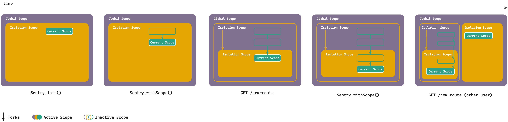

<Alert>
  This document uses key words such as "MUST", "SHOULD", and "MAY" as defined in [RFC 2119](https://www.ietf.org/rfc/rfc2119.txt) to indicate requirement levels.
</Alert>

The implementation in each SDK MUST consist of three types of scopes:

- The global scope
- The isolation scope
- The current scope

Users MUST be able to add data such as `tags`, `breadcrumbs`, and `context` to any scope, regardless of its type.

## Choosing the Right Scope

### Global Scope

The global scope functions as a persistent global variable throughout the application's execution. Any data assigned to this scope is automatically applied to **all** events emitted by the SDK.

It is typically used to store application-wide data, such as the `release`, `environment`, and similar context.

### Isolation Scope

The isolation scope MUST contain data specific to the current execution context: a single request (on a server), a single tab (in a browser), or a single user session (on mobile). Top-level SDK APIs, such as `sentry.setTag()` and `sentry.setContext()` MUST write to the isolation scope.

The isolation scope SHOULD be implemented using a context variable, thread-local storage, async-local storage, or an equivalent mechanism appropriate for the platform.

SDK integrations MUST handle the forking of isolation scopes automatically. Users MUST NOT need to manage or be concerned with the details of scope isolation or its forking process.

### Current Scope

The current scope MUST maintain data for the active span. When a new span is started, the current scope of the parent span is forked (i.e., duplicated), transferring all data from the parent span to the new span. This allows modifications or additions specific to the new span without affecting the parent span. This behavior aligns with a "copy-on-write" model.

Any changes made to the current scope after forking MUST NOT impact the forked scope.

The current scope SHOULD be implemented using a context variable, thread-local storage, async-local storage, or an equivalent mechanism appropriate for the platform.

Users MAY fork the current scope explicitly by invoking `sentry.withScope()` or implicitly by starting a new span.

## Applying Scope Data to Events

Data from all three scope types MUST be merged in a specific order before being applied to an event. The process is as follows:

1. data from the global scope is...
2. merged with data from the isolation scope, which is...
3. merged with data from the current scope, which is ...
4. applied to the event



## Scope Methods

### Setting Attributes

Users MUST be able to attach attributes to any scope using a dedicated method (e.g., `scope.setAttributes()` or `scope.setAttribute()`). These attributes follow the structure defined in the [Span Protocol](/sdk/telemetry/spans/span-protocol/#attribute-object-properties).

Attributes are key-value pairs where each value is an object containing:

- `type`: The data type (`"string"`, `"integer"`, `"double"`, or `"boolean"`)
- `value`: The actual attribute value, which MUST match the specified type
- `unit` (optional): The unit of measurement (e.g., `"ms"`, `"s"`, `"bytes"`, `"count"`, `"percent"`)

#### Example Usage

```javascript
Sentry.getGlobalScope().setAttributes({
  "app.feature_flag.enabled": {
    type: "boolean",
    value: true
  },
  "app.session_duration": {
    type: "integer",
    value: 3600,
    unit: "s"
  }
});
```

```python
sentry_sdk.get_global_scope().set_attributes({
    "app.feature_flag.enabled": {
        "type": "boolean",
        "value": True
    },
    "app.session_duration": {
        "type": "integer",
        "value": 3600,
        "unit": "s"
    }
})
```

#### Method Signature

The method SHOULD accept a dictionary/map/object where:
- Keys are attribute names (strings)
- Values are attribute objects with `type`, `value`, and optionally `unit` properties

#### Behavior

- Attributes set on the global scope MUST be applied to all logs
- Attributes set on the isolation scope MUST be applied to all logs in that execution context
- Attributes set on the current scope MUST be applied only to the current log
- When the same attribute key exists in multiple scopes, the more specific scope's value takes precedence (current > isolation > global)

See [Span Protocol - Common Attribute Keys](/sdk/telemetry/spans/span-protocol/#common-attribute-keys) for a list of standard attributes and [Sentry Conventions](https://github.com/getsentry/sentry-conventions/) for the complete attribute registry.

## Related Documents

This document provides a concise summary of the [Hub & Scope Refactoring](/sdk/miscellaneous/hub_and_scope_refactoring/), focusing on implementation details and expected features. The original document remains unchanged, offering additional historical context and migration strategies.
