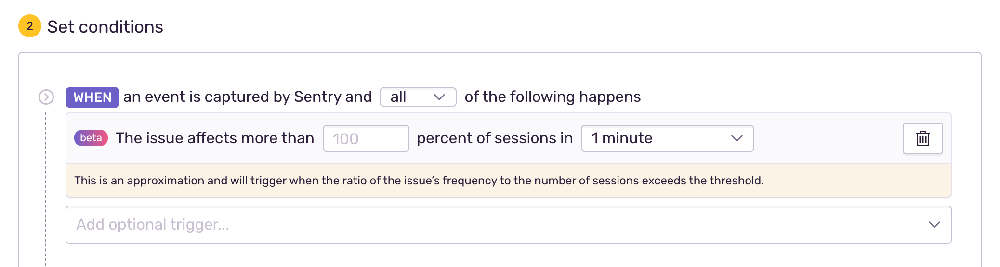

<Alert>

Looking for Sentry's **Session Replay**? Click <a class href="https://docs.sentry.io/product/session-replay/">here</a> to learn more.

</Alert>

For basic health tracking Sentry accepts <Link to="/sdk/data-model/envelopes/">envelopes</Link>
containing session update events. These session update events can be used to
inform Sentry about release and project associated project health.

**Note:** When working with Sessions locally, make sure that you update your configuration file `~/.sentry/sentry.config.py`
with a necessary environment variable:

```python
SENTRY_EVENTSTREAM = 'sentry.eventstream.kafka.KafkaEventStream'
```

## Basic Operation

- Sessions are entirely client driven. The client determines when a session
  starts, ends or transitions into an unhealthy state.
  - The client can explicitly end a session to record time or exit condition (crash etc.)
  - Clients should explicitly end sessions on restart if needed but it is acceptable
    for a session not to end.
- Sessions are updated through session change events that hold the entire session state.
- Sessions are updated from events sent in. The most recent event holds the
  entire session state. The initial session event that is sent to the server is
  marked explicitly.
- Session updates must not change the attributes or data corrupts when materialized.
  See the section below on <Link to="#attribute-immutability">Attribute Immutability</Link>.
- Sessions can only be updated for a period of 5 days. If a session did not
  receive a second event in 5 days it's permanently good.
- A session does not have to be started in order to crash. Just reporting a crash is sufficient.

## Server Model

At present Sentry's session system is optimized towards ease of scalability and
cost of operation. This means that the protocol is heavily geared towards
achieving this goal. Some of these optimizations show in the protocol and it's
important for the client to follow the protocol accurately to avoid creating
bad data on the server.

The server has hourly buckets of pre-materialized session data. As a session
update event comes in the server will immediately materialize the data into the
correct bucket. This means that the protocol is restricted to being "additive".
This also means that the client needs to store the entire state of the session
on its side.

## Session Update Payload

A session update is an item in an envelope called `session`. It consists of a JSON
payload that looks roughly like this:

```json
{
  "sid": "7c7b6585-f901-4351-bf8d-02711b721929",
  "did": "optional distinct user id",
  "init": true,
  "started": "2020-02-07T14:16:00Z",
  "duration": 60,
  "status": "exited",
  "attrs": {
    "release": "my-project-name@1.0.0",
    "environment": "environment name",
    "ip_address": "optional user ip address for filtering",
    "user_agent": "optional user agent for filtering"
  }
}
```

Note that this must be enclosed in an envelope. So the full event looks
something like this:

```json
{}
{"type":"session"}
{"sid":"..."}
```

The following fields exist:

`sid`

: _String, optional_. Session ID (unique and client generated).
Clients are allowed to skip it if the initial session state is `exited`.

`did`

: _String, optional_. The distinct ID. Should be a device or user ID.
The system automatically hashes this ID before storing it.

`seq`

: _Number, optional_. A logical clock. Defaults to the current UNIX timestamp
in milliseconds during ingestion. The value `0` is reserved in the sense that
a session with `init` set to `true` will automatically have `seq` forced to `0`.

`timestamp`

: _String, optional_. The timestamp of when the session change event came in.
Must be an ISO DateTime string. If not sent, the server will assume the current
UTC timestamp. In the data model, this is called `received`.

`started`

: **String, required**. Timestamp when the session started.
Must be an ISO DateTime string.

`init`

: _Boolean, optional, default is `false`_.
If this is set to `true` it means that this was the first event of the session.
This lets the server optimize the session counts because no deduplication is
needed (client is authoritative anyways). Internally when this flag is set
`seq` is changed to `0` on processing.

`duration`

: _Number, optional_. An optional field that can transmit the session duration
when the event was received. This can be client controlled so, for instance,
inactive time can be subtracted (seconds as float).

`status`

: _String, optional, default is `ok`_. The current status of the session.
A session can only be in two states effectively: `ok` which means the session
is alive or one of the terminal states. When a session is moved away from `ok`
it must not be updated anymore.

- `ok`: The session is currently in progress but healthy. This can be the terminal state of a session.
- `exited`: The session terminated normally.
- `crashed`: The session terminated in a crash.
- `abnormal`: The session encountered a non crash related abnormal exit.

`errors`

: _Number, optional, default is `0`_. A running counter of errors encountered
while this session was ongoing. It's important that this counter is also
incremented when a session goes to `crashed`.
(eg: the crash itself is always an error as well).
Ingest should force `errors` to 1 if not set or 0.

`abnormal_mechanism`

: _String, optional, default is `none`_. The mechanism that caused the session to finish with
an `abnormal` status. This meta property is useful to determine abnormal session rate for specific
cases, for example, on platforms like Android this is used to calculate user-perceived
ANR rate.

`attrs`

: **Object, required** _all keys but `release` optional_. An object with the following attributes:

- `release`: The sentry release ID (`release`), suggested format `my-project-name@1.0.0`.
- `environment`: The sentry environment (`environment`).
- `ip_address`: The primary IP address to be considered. This is normally the
  IP of the user. This data is not persisted but used for filtering. If not
  set the IP is filled in automatically.
- `user_agent`: The user agent to be considered. This is normally the user
  agent of the user that caused the session. This data is not persisted but
  used for filtering.

## Session Aggregates Payload

Especially for _request-mode_ sessions
(<Link to="#sdk-considerations">see below</Link>), it is common to have
thousands of requests, and thus sessions, per second.

Under the assumption that these sessions will be short-lived, and tracking their
duration is not desired, these sessions can be aggregated together on the
SDK side, before they are sent to Sentry.

An SDK should aggregate closed sessions and group them by their `started` time,
`distinct_id` and their `attrs`. These groups will be sent as `sessions` envelope item.
It consists of a JSON payload that looks roughly like this:

```json
{
  "aggregates": [
    {
      "started": "2020-02-07T14:16:00Z",
      "exited": 123
    },
    {
      "started": "2020-02-07T14:16:00Z",
      "did": "optional distinct user id",
      "exited": 12,
      "errored": 3
    }
  ],
  "attrs": {
    "release": "my-project-name@1.0.0",
    "environment": "development"
  }
}
```

Note that this must be enclosed in an envelope. So the full envelope looks
something like this:

```json
{}
{"type": "sessions"}
{"aggregates": [...], "attrs": {...}}
```

`aggregates`

: **Array, required**. An array of aggregates grouped by their `started` timestamp and distinct id (did).

- `started`: **Required**. Timestamp of the group, rounded down to the minute. Must be an ISO DateTime string.
- `did`: _Optional_. The distinct user id of the group.
- `exited`: _Optional_. The number of sessions with status `"exited"` _without_ any errors.
- `abnormal`: _Optional_. The number of sessions with status `"abnormal"`.
- `crashed`: _Optional_. The number of sessions with status `"crashed"`.
- `errored`: _Optional_. The number of sessions with status `"exited"` that had a non-zero `errors` count.

`attrs`

: **Object, required**. See above.

## Crashes vs Sessions

Sessions and error events are two distinct systems within Sentry. Session
updates can be done without error events to be sent and likewise, errors can be
sent without session updates.

This gives the client full control over how session updates should be
performed. The motivating factor is that the server is free to reject error
events in some situations where it would still be interesting to record
session information. For instance, if a project has a rate limit applied on
error events they session data can still be routed to the project bypassing
this rate limit.

However, it's strongly recommended to send session updates in the same envelope
as the crash event in case the session transitions to the crashed status. This
will ensure that the events arrive at the same time in the system if the
network is unreliable.

## Important Client Behavior

These are important rules that the clients must follow:

### Attribute Immutability

It's currently not allowed for a session to change any of the attributes
in subsequent updates which includes the `did`, `started` or other attributes.
The only attributes which are allowed to change are the session status, duration
or error count. If a user is not known in the beginning then either the session
start should be delayed or the session should be restarted once the user is
known.

### Session Counting / init

It's crucial that the initial session update sent to the system has `init` set
to `true`. This is necessary because the server currently does not
deduplicate the total session count as an optimization. If the initial
`init: true` flag is missing, the session might not be ingested correctly by Sentry.

### Terminal Session States

A session can exist in one of two states: in progress or terminated. A terminated
session must not receive further updates. `exited`, `crashed` and `abnormal`
are all terminal states. When a session reaches this state the client must
not report any more session updates or start a new session.

SDKs are encouraged to distinguish between different ways of ending a session:

- `exited`: this means the session ended cleanly. It's is the same as the
  session staying in `ok` from the point of success reports. However only
  sessions ending in `exited` will be considered for session durations.
  A session is allowed to go to `exited` even if errors occurred.

- `crashed`: a session should be reported as crashed under the following cases:

  - an unhandled error occurred and there is a natural session end (eg: end of HTTP request)
  - a complete crash of the application occurred (crash to desktop, termination)
  - a user feedback dialog is surfaced to the user. After this, the SDK must start a new session as if it fully crashed.;

- `abnormal`: SDKs are encouraged to always transition a session to `exited` or
  `crashed` if they can do so. For SDKs that are capable of always ending sessions, they should end a
  session in `abnormal` if they could not detect the application shutting down
  correctly. Examples for abnormal sessions:

  - a computer was shut down / lost power
  - the user force closed an application through `kill -9` or the task manager

  Abnormal session ends are normally to be recorded on application restart.

### Crashed, Abnormal vs Errored

A session is supposed to transition to `crashed` when it encountered an unhandled
error such as a full application crash. For applications that cannot fully
crash such as a website, it's acceptable to transition to the crashed state if
the user encountered an error dialog. For server environments where we create sessions
for every incoming request, `crashed` is basically like status code `500` internal server error.
So if there is an unhandled error happening during the request, the session should be `crashed`.

Abnormal are sessions of which their fate is unknown. For desktop applications, for instance, it makes sense to transition a session to abnormal if it was stored
but the exit of the application was not observed but also did not crash. These are situations where the user forced the app to close via the
task manager, the machine lost power or other situations. A session can be
_stored_ by persisting it to disk eagerly. This saved file can be detected on
application restart to close the session as `abnormal`.

Errored sessions are determined by an `errors` counter greater than zero.
The client is required to count events that are considered errors and send the
count along with session updates. A session that is `ok` and has an error
count of greater than zero is considered an errored session. All crashed and
abnormal sessions are also at all times considered errored but subtracted from
the final errored session count.

Only events that stem from `captureException`, `captureError`, or `captureEvent`
must increment the `errors` counter when their level is `error` or higher. As SDKs
set the default level to `error` for these methods, a level lower than `error`
means the users changed it manually. This gives the users the ability to capture
error events not marking sessions as errored. `captureEvent` is included because
users might manually create exception events with it. Events stemming from
`captureMessage` must not affect the session's error count, regardless of their
log level. For all methods, it doesn't matter if the event has a stack trace or not.
The following table summarizes the behavior of the methods:

| method | level  | increments `errors` counter |
| --- | --- | --- |
| captureException / captureError | `fatal` | `yes` |
| captureException / captureError | `error` | `yes` |
| captureException / captureError | `warning` | `no` |
| captureEvent  | `fatal` | `yes` |
| captureEvent  | `error` | `yes` |
| captureEvent  | `warning` | `no` |
| captureMessage | `fatal` | `no` |
| captureMessage | `error` | `no` |
| captureMessage | `warning` | `no` |


### Exited

A session can transition to `exited` which is exactly the same state as `ok`
with one difference: sessions transitioned to `exited` have their session
duration averaged. This lets Sentry show you the duration of non crashed
sessions over time.

## Alerts

Trigger an alert when an issue affects a specified percent of sessions.
Create a new [issue alert](https://docs.sentry.io/product/alerts/alert-types/#issue-alerts) and select the "When" condition
"An issue affects more than \{X} percent of sessions". See more issue alert options in the
[Issue Alert Configuration](https://docs.sentry.io/product/alerts/create-alerts/issue-alert-config/) docs.



## SDK Considerations

Generally speaking, there are two separate modes for health reporting that SDKs
can use. One is very short lived sessions, the other is user attended sessions.

**Short lived sessions** _(server-mode / request-mode)_

These sessions roughly correspond to HTTP requests or RPC calls in a
server setting.

- high in volume, typically one session for each request
- the number of sessions is usually higher than the number of sentry events
- sessions are attached to a single hub / concurrency unit
- timing information is typically useless because session time in the milliseconds

**User attended sessions** _(user-mode / application-mode)_

These are sessions that are more corresponding to an actual user session or
application run. This is what you would see in a web browser, mobile world,
command line application or similar.

- typically just a single session from application start to quit
- when applicable, sessions can end once the app is put on the background for over 30 seconds (mobile SDKs)
- there are usually fewer sessions than Sentry events
- sessions span multiple hubs / threads
- session duration typically in the minutes, timing information is useful

Both of those cases look similar from the API point of view but different
recommendations apply for SDKs.

### Choosing the Session Mode

While it is in theory possible to use both session modes in a single application,
it is recommended that the SDK default to a single mode that is most
appropriate to the main use case of the language ecosystem. This is similar to
and can be used in the same way as a _global Hub mode_ that certain SDKs support.

When the SDK is configured to use _user-mode_ sessions or global Hub mode, a
single session should be started at the start of the application and should
persist through the application's runtime. Depending on the SDK internals, this
single session can be shared among all application threads and thread-local Hubs.

When using _server-mode_ sessions, no application-wide session will be started,
and it is up to integrations or the user to start the session when the request is
received and end it when a response is returned.

### Unified API Implications

The <Link to="/sdk/miscellaneous/unified-api/">Unified API</Link> that SDKs should
adhere to defines the concepts of `Hub`, `Scope` and `Client`.

Conceptually speaking, the session is a concern of the `Hub`, and unlike scopes,
sessions should not be nested. When any kind of event happens, there should be
only one unambiguous session that keeps track of the error count.

When considering the flow of events through the SDK, from the static
`capture_event` function, through the thread local `Hub`, and into the
`Client::capture_event(event, scope)` method; depending on the internal
implementation details of the SDK, it might make sense to attach the session to
the `Scope`, which would make it possible for the `Client` to bundle an event
and a session update into a single envelope to be sent to Sentry.

### Session Updates and when to send Updates upstream

For all SDKs, the current session shall be automatically updated whenever data is
captured at a similar place where `apply_to_scope` is called to increase the
`error` count, or update the session based on the distinct ID / user ID.

SDKs should generally aim to decrease the number of envelopes sent upstream.

_server-mode_ SDKs that track a great number of sessions should consider using
a periodic session flusher (every 60 secs) that pre-aggregates sessions into a
single `session_aggregates` envelope item.

_user-mode_ SDKs may instead opt into sending session updates along with
captured events in the same envelope. The final session update that closes the
session may be batched similar to _server-mode_ sessions.

In either case, the `init` flag must be set correctly for the _first
transmission_ of the session, and session metadata such as the distinct ID must
be immutable after the initial transmission.

### Pre-aggregation of Sessions

If an SDK is configured to use _server-mode_ sessions, it should group and
pre-aggregate session counts before sending them to Sentry. Whenever a session
is being closed (transitions to a terminal state), and it was not previously
being sent upstream (its `init` flag would be `true`), it is eligible for
aggregation, which is performed like so:

- The `started` timestamp of the session should be rounded down to minutes.
- The session must then be aggregated into the bucket identified by that rounded
  timestamp, and the sessions distinct id (`did`).
- In the appropriate bucket, increase the session count corresponding to the
  sessions status. Contrary to individual session updates, the `"errored"`
  state is used to mark sessions that have the `"exited"` state, and a non-zero
  `errors` count.

### Exposed API

The most basic API exposed is on the hub level and lets you start and stop session recording:

**API:**

`Hub.start_session()`

> Stores a session on the current scope and starts tracking it. This normally attaches a brand new session to the scope,
> and implicitly ends any already existing session.

`Hub.end_session()`

> Ends the session, setting an appropriate `status` and `duration`, and enqueues it for sending to Sentry.

`Hub.start_auto_session_tracking()` / `Hub.stop_auto_session_tracking()`

> Stops and reactivates automatic session tracking.

**Init Options:**

`auto_session_tracking`

> This enables / disables automatic session tracking through integrations.

## SDK Implementation Guideline

<Alert title="WIP">
  Before jumping into implementing this feature in an SDK, please reach out to
  the team. https://github.com/getsentry/develop/pull/323
</Alert>

We track the health of each release of projects in Sentry by sending session payloads from SDKs.
The session payload provide data such as session duration and the presence or absence of errors/crashes.

SDKs track sessions in one of two modes:

- Single Session
- Session Aggregates

Single session is the general case, and is a good fit for (relatively short-lived) applications that are typically involving only a single user. Examples:

- command-line utility like [`craft`](https://github.com/getsentry/craft); <dfn title="Note: this is just an example, assuming craft was instrumented with a Sentry SDK supporting sessions">every execution of a `craft` subcommand</dfn> report a single session to Sentry
- user interacting with a mobile app
- user loading a web site with their favorite browser

Session aggregates are used when sending individual sessions would be undesirable or unpractical. To constrain resource usage (namely memory and network), SDKs keep track of summary information about a batch of sessions that occured in the recent past, never actually having to deal with session objects representing the individual sessions that make up the aggregate. This mode is the choice for applications that run for an arbitrarily long time and handle larger throughputs for potentially multiple users, such as web servers, background job workers, etc. Note that for those types of application, a better definition of session matches the execution of a single HTTP request or task, instead of a single execution of the whole application process.

In either case, SDKs should create and report sessions by default, choosing to report them individually or as aggregates depending on the type of application.

If an SDK can detect that an application is better served by session aggregates, then it must not report an application-wide session. The application-wide session may still be created during SDK initialization but must be aborted and never sent to Sentry. As an example, in the Node.js SDK, we can detect an application is probably a web server if it uses the `requestHandler` integration that is provided.

### Individual Session Functionality

#### Configuration

- On by default for global/static API;
  User should be able to disable sessions if they don't want to track them.

Pre-requisites for reporting sessions and determining Release Health of projects in Sentry, such as release should be automatically detected by the SDK such as by looking up env vars.

(Maybe, needs discussion) if I pre-requisite cannot be detect (for example, no good way to determine release version), then we set some default value so that we can always report sessions by default (depending on discussion, this might not be a change in SDK code, but in Relay, basically removing hard-requirements in the session payload).

#### Lifetime of a Session

Sessions should be enabled by default only for the global hub/client that is initialized by Sentry.init, and disabled by default for any other manually created client.
A session is started when the SDK is initialized (ideally when the default client is bound to the global hub) and ended when one of these conditions happen:
The Hub.endSession() method is explicitly called; or
The program terminates without errors; or
The program terminates with an unhandled exception; or
The program terminates with an unhandled promise rejection.

Care must be taken to never attempt to send new session payloads to Sentry for a session that is already ended. For example, if the user manually ends the session with Hub.endSession(), there should not be any new updates to the session when the program terminates.

#### Session Atrributes and Mutability

#### Sending Session to Sentry

Session is sent initially after a certain (initially hard-coded, less config is better) delay (something between 1s to 30s TBD), and then updated with the duration and final status and error count when the program terminates. Note that, as an optimization, short lived programs will not send 2 session requests to Relay, but only the final one with status and duration.

### Session Aggregates Functionality

#### Configuration

Sessions should be enabled by default, a session is started as soon as a request is received by a web server and ends as soon as the response is fully sent back.

#### Lifetime of a Session

Sessions are never tracked nor sent individually, instead they are aggregated and the aggregates are sent every 30s and a final time when the web server is terminating.
As an implementation hint to the point above, when a "Client" is closed or flushed the associated "Session Flusher" shall also be flushed and submit the current aggregates the transport, before the transport is flushed/closed.
Make sure this works reasonably for Serverless — there we shall not use "request mode" and SessionFlusher because we cannot have any work that happens outside of the request-response flow.
Provide an easy way to integrate with existing Node frameworks (Express, Next.js, Koa).

### Session update filtering

Our filtering mechanisms (sample rate, rate limiting, beforeSend, event processors, or ignored exception types) may drop events. Only events dropped due to sampling and rate limiting should update the session despite being dropped, as we assume the event was dropped to save quota, but it would have been something the developer cares about. Events dropped for other reasons should not update the session, as we assume they are more likely to be dropped because the developer chooses to ignore them.

#### Filter order

The python SDK shall serve as a reference here. The order for filtering error events is:

1. Check for ignored exception types (a.k.a `ignore_errors`)
2. Apply scoped `event_processor` (a.k.a `error_processor`)
3. Apply global `event_processor`
4. Apply `before_send`
5. Update the session if an event made it this far
6. Apply sampling rate

#### Sending the session update

If the event has been dropped and the session updated, the session update should be sent to the server without the event in case the session changed from healthy to errored or from any state to crashed for user attended sessions.
