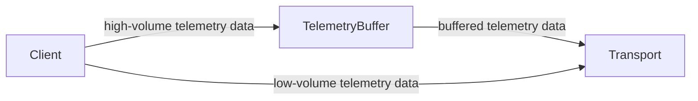

<Alert level="warning">
  🚧 This document is work in progress.
</Alert>

<Alert>
  This document uses key words such as "MUST", "SHOULD", and "MAY" as defined in [RFC 2119](https://www.ietf.org/rfc/rfc2119.txt) to indicate requirement levels.
</Alert>

The telemetry buffer sits between the client and the transport, temporarily buffering high-volume telemetry data such as spans and logs. The client **SHOULD** continue to pass low-volume telemetry data, such as events, directly to the transport. The telemetry buffer aims to efficiently batch data to reduce the number of outgoing HTTP requests and Sentry envelopes. Without buffering, each span or log would trigger its own request, quickly overwhelming our backends.

Because telemetry workloads and platform constraints vary widely, buffer requirements differ across environments. For example, backend SDKs need high throughput and backpressure management to handle large data volumes. Mobile SDKs have lower throughput and don't need to worry much about backpressure, but they do need to minimize data loss in the event of abnormal process termination. Browser and GDX SDKs also have different requirements.

Therefore, we recommend implementing different types of telemetry buffers tailored to the platform's needs. As of Nov 5th, 2025, this page is under development, and we're currently refining the requirements for different platforms:

* [Backend Telemetry Buffer](./backend-telemetry-buffer/): Detailed backend design
* [Browser Telemetry Buffer](./browser-telemetry-buffer/): To be defined
* [GDX Telemetry Buffer](./gdx-telemetry-buffer/): To be defined
* [Mobile Telemetry Buffer](./mobile-telemetry-buffer/): Spec under validation.

# Common Requirements

This section covers the common requirements relevant for all platforms.

## Data Forwarding Scenarios

The TelemetryBuffer **MUST** forward all data in memory to the transport to avoid data loss in the following scenarios:

1. When the user calls `SentrySDK.flush()`, the TelemetryBuffer **MUST** forward all data in memory to the transport, and only then **SHOULD**  the transport flush the data.
2. When the user calls  `SentrySDK.close()`, the TelemetryBuffer **MUST** forward all data in memory to the transport. SDKs **SHOULD** keep their existing closing behavior.
3. When the application shuts down gracefully, the TelemetryBuffer **SHOULD** forward all data in memory to the transport. The transport **SHOULD** keep its existing behavior, which usually stores the data to disk as an envelope. It is not required to call transport `flush`.

## FAQ

### Where is the Batch Processor?

The batch processor is deprecated, so we moved it to the [batch-processor](/sdk/telemetry/telemetry-buffer/batch-processor/) page. The telemetry buffer will include parts of the batch processor functionality.
