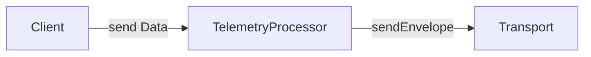
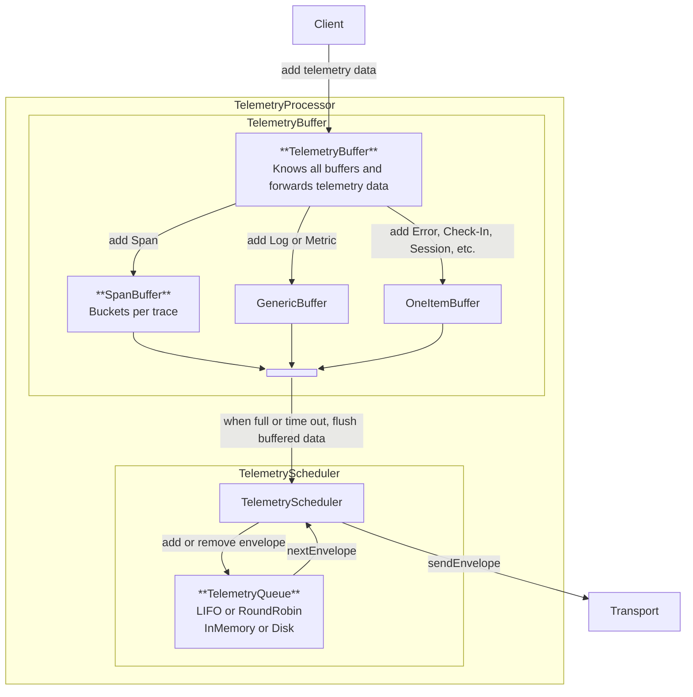

<Alert level="warning">
  🚧 This document is work in progress. 🚧 
  For feedback or suggestions, open an issue or PR and tag @philipphofmann, @isaacs, or @giortzisg for review. We welcome input as we validate this approach.
</Alert>

<Alert>
  This document uses key words such as "MUST", "SHOULD", and "MAY" as defined in [RFC 2119](https://www.ietf.org/rfc/rfc2119.txt) to indicate requirement levels.
</Alert>

The telemetry processor ensures data is delivered efficiently to Sentry. It receives data from the client and forwards it to the transport. Its key responsibilities include buffering, rate limiting, client reporting, priority-based sending, and, on some platforms, offline caching. We recommend adding the telemetry processor only for high-volume data, such as spans, logs, and metrics. If your SDK doesn't implement any of these high-volume data features, it **MAY** not have a telemetry processor.

After integrating the telemetry processor, SDK clients **SHOULD** forward all data to it instead of the transport. SDKs **MAY** temporarily route only some telemetry data through the processor during a migration phase. The telemetry processor consists of two major components:

- **Telemetry Buffer**: Focuses on buffering high-volume data, such as spans and logs, into batches to minimize HTTP requests.
- **Telemetry Scheduler**: Takes buffered data from the TelemetryBuffer and manages prioritized sending, including potential offline caching and sending of client reports.

Here's a more detailed overview of the most important components of the telemetry processor:

Here's a simplified example of a log traveling through the telemetry processor:

1. The client adds the log to the telemetry processor.
2. The telemetry processor adds the log to the telemetry buffer.
3. When the telemetry buffer is full or its timeout fires, it forwards a batch of logs to the telemetry scheduler.
4. The telemetry scheduler builds the envelope containing the batch of logs and adds it to the telemetry queue.
5. Depending on the platform, the telemetry queue can use either in-memory or disk storage. Each platform can also choose a priority concept. It can be, for example, LIFO or RoundRobin.
6. The telemetry scheduler asks the telemetry queue for the next envelope to send and passes it to the transport.
7. The transport sends the envelope to Sentry.

It’s worth noting that we don’t enforce this exact flow on all SDKs. SDKs **MAY** choose a different flow depending on their needs. For example, if it’s better on your platform that the telemetry scheduler pulls data from the telemetry buffer rather than the buffer pushing data to the telemetry scheduler, you **MAY** do so. Also, SDKs **MAY** refactor their client and transport interactions to follow this architecture, but they don't have to.

We try to streamline requirements across all platforms to ensure that all SDKs share similar logic. This is especially useful for SDKs supporting multiple platforms, such as Java, which support backend and mobile. Still, it's acceptable for the requirements to differ per platform based on their needs. This page defines the common requirements for all platforms. You can find the platform specific requirements for each platform [below](#platform-specific-requirements).

# Telemetry Buffer

The telemetry buffer batches high-volume data and forwards it to the telemetry scheduler. This section covers the common requirements for all platforms:

1. Before adding an item to a specific buffer, the telemetry buffer **SHOULD** drop rate-limited items to avoid overhead. If doing so, it **MUST** record client reports.
2. When the telemetry buffer overflows and data must be dropped, it **MUST** record client reports.
3. The telemetry buffer **MUST** forward low-volume data, such as normal events, session replays, or user feedback, directly to the telemetry scheduler.

## Data Forwarding Scenarios

The telemetry buffer **MUST** forward all data in memory to the telemetry scheduler to avoid data loss in the following scenarios:

1. When the user calls `SentrySDK.flush()`, the telemetry buffer **MUST** forward all data in memory to the telemetry scheduler, and only then **SHOULD**  the telemetry scheduler flush the data.
2. When the user calls  `SentrySDK.close()`, the telemetry buffer **MUST** forward all data in memory to the telemetry scheduler. SDKs **SHOULD** keep their existing closing behavior.
3. When the application shuts down gracefully, the telemetry buffer **MUST** forward all data in memory to the telemetry scheduler.

# Telemetry Scheduler

The telemetry scheduler collects buffered data from the telemetry buffer, prioritizes critical low-volume data (like errors and crashes) over high-volume data (like spans), builds envelopes, and forwards them to the transport. Before sending, it enforces rate limits and records client reports for dropped envelopes.

For the priority strategy, we recommend either LIFO (last in, first out) or round-robin, but SDKs **MAY** choose different strategies based on their needs. For storing envelopes, SDKs **MAY** choose between in-memory and on-disk storage.

<Alert>
Previously, the [unified API](/sdk/telemetry/unified-api/) handled rate limits and offline caching within the transport, requiring SDKs for multi-platform environments (like Java) to maintain separate transports with and without offline cache support. To avoid bloating the transport with extra logic—such as telemetry priority queues—we now recommend that transports focus only on sending envelopes. Features like rate limiting, offline caching, and prioritization should be managed by the telemetry scheduler, enabling consistent logic across platforms. Custom transport implementations can then remain simple, while SDKs only need to adjust the telemetry scheduler to meet platform-specific needs. While not mandatory, we recommend that SDKs refactor their transports to follow this architecture.
</Alert>

Here are the common requirements for all platforms:

1. The telemetry scheduler **MUST** drop rate-limited envelope items before forwarding them to the transport. When doing so, it **MUST** record respective client reports.
2. The telemetry scheduler **SHOULD** attach the client reports to the envelopes it forwards to the transport.
3. When the telemetry queue overflows and drops envelopes, it **MUST** record the client report.

To be defined: How exactly does the telemetry scheduler interact with the transport to correctly remove items from the telemetry queue based on the received HTTP info and how to adhere to the [dealing with network failure](/sdk/expected-features/dealing-with-network-failures/) requirements.

# Client Reports and Rate Limiting

To be defined: We still need to define how the transport, client and the telemetry processor interact with client reports and rate limiting.

# Platform Specific Requirements

For the platform specific requirements, please see:

* [Backend Telemetry Processor](./backend-telemetry-processor/): Detailed backend design
* [Browser Telemetry Processor](./browser-telemetry-processor/): To be defined
* [GDX Telemetry Processor](./gdx-telemetry-processor/): To be defined
* [Mobile Telemetry Processor](./mobile-telemetry-processor/): Spec under validation.

## FAQ

### Where is the Batch Processor?

The batch processor is deprecated, so we moved it to the [batch-processor](/sdk/telemetry/telemetry-processor/batch-processor/) page. The telemetry buffer will include parts of the batch processor functionality.
