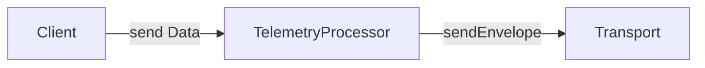

<Alert level="warning">
  🚧 This document is work in progress.
</Alert>

<Alert>
  This document uses key words such as "MUST", "SHOULD", and "MAY" as defined in [RFC 2119](https://www.ietf.org/rfc/rfc2119.txt) to indicate requirement levels.
</Alert>

The telemetry processor ensures data is delivered efficiently to Sentry. It receives data from the client and forwards it to the transport. Its key responsibilities include buffering, rate limiting, client reporting, priority-based sending, and, on some platforms, offline caching.

Once an SDK adds the telemetry processor, its client **SHOULD** only forward data to the telemetry processor, and not directly to the transport. The TelemetryProcessor consists of two major components:

- **TelemetryBuffer**: Focuses on buffering high-volume data, such as spans and logs, into batches to minimize HTTP requests.
- **TelemetryScheduler**: Takes buffered data from the TelemetryBuffer and manages prioritized sending, including potential offline caching and sending of client reports.

Because telemetry workloads and platform constraints vary widely, the requirements differ across environments. For example, backend SDKs need high throughput and backpressure management to handle large data volumes. Mobile SDKs have lower throughput and don't need to worry much about backpressure, but they do need to minimize data loss in the event of abnormal process termination. Browser and GDX SDKs also have different requirements.

Therefore, we recommend implementing different types of telemetry processors tailored to the platform's needs. As of Dec 18th, 2025, this page is under development, and we're currently refining the requirements for different platforms:

* [Backend Telemetry Processor](./backend-telemetry-processor/): Detailed backend design
* [Browser Telemetry Processor](./browser-telemetry-processor/): To be defined
* [GDX Telemetry Processor](./gdx-telemetry-processor/): To be defined
* [Mobile Telemetry Processor](./mobile-telemetry-processor/): Spec under validation.

# Telemetry Buffer

This section covers the common requirements relevant for all platforms for the TelemetryBuffer.

## Data Forwarding Scenarios

The TelemetryBuffer **MUST** forward all data in memory to the transport to avoid data loss in the following scenarios:

1. When the user calls `SentrySDK.flush()`, the TelemetryBuffer **MUST** forward all data in memory to the transport, and only then **SHOULD**  the transport flush the data.
2. When the user calls  `SentrySDK.close()`, the TelemetryBuffer **MUST** forward all data in memory to the transport. SDKs **SHOULD** keep their existing closing behavior.
3. When the application shuts down gracefully, the TelemetryBuffer **SHOULD** forward all data in memory to the transport. The transport **SHOULD** keep its existing behavior, which usually stores the data to disk as an envelope. It is not required to call transport `flush`.

## FAQ

### Where is the Batch Processor?

The batch processor is deprecated, so we moved it to the [batch-processor](/sdk/telemetry/telemetry-processor/batch-processor/) page. The telemetry buffer will include parts of the batch processor functionality.
