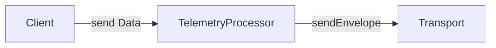
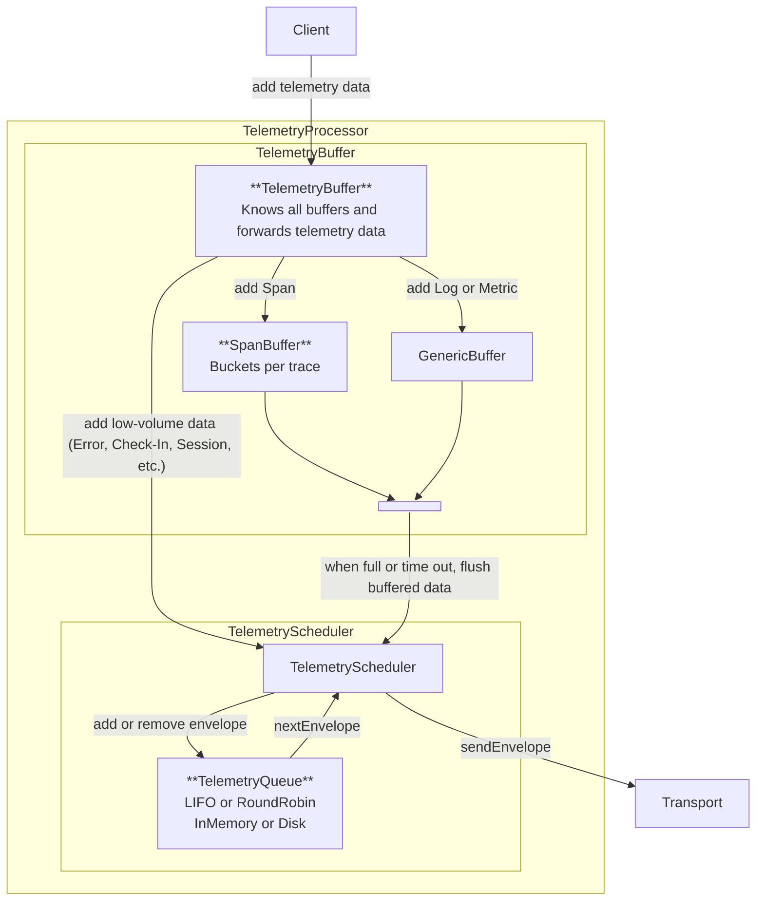
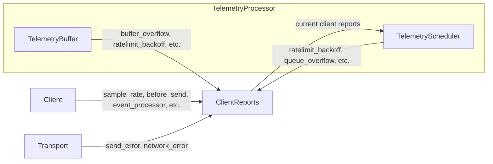

<Alert level="warning">
  🚧 This document is work in progress. 🚧 
  For feedback or suggestions, open an issue or PR and tag @philipphofmann, @isaacs, or @giortzisg for review. We welcome input as we validate this approach.
</Alert>

<Alert>
  This document uses key words such as "MUST", "SHOULD", and "MAY" as defined in [RFC 2119](https://www.ietf.org/rfc/rfc2119.txt) to indicate requirement levels.
</Alert>

The telemetry processor ensures data is delivered efficiently to Sentry. It receives data from the client and forwards it to the transport. Its key responsibilities include buffering, rate limiting, client reports, priority-based sending, and, on some platforms, offline caching.

SDKs **SHOULD** only add the telemetry processor for high-volume data (spans, logs, metrics). SDKs without these features **MAY** omit it. Once added, SDK clients **SHOULD** forward all data to the processor, not the transport. During migration, SDKs **MAY** temporarily send only some telemetry data through the processor.

The telemetry processor consists of two major components:

- **Telemetry Buffer**: Focuses on buffering high-volume data, such as spans and logs, into batches to minimize HTTP requests.
- **Telemetry Scheduler**: Takes buffered data from the TelemetryBuffer and manages prioritized sending, including potential offline caching and sending of client reports.

Here's a more detailed overview of the most important components of the telemetry processor:

Here's a simplified example of a log traveling through the telemetry processor:

1. The client adds the log to the telemetry processor.
2. The telemetry processor adds the log to the telemetry buffer.
3. When the telemetry buffer is full or its timeout fires, it forwards a batch of logs to the telemetry scheduler.
4. The telemetry scheduler builds the envelope containing the batch of logs and adds it to the telemetry queue.
5. Depending on the platform, the telemetry queue can use either in-memory or disk storage. Each platform can also choose a priority concept. It can be, for example, LIFO or RoundRobin.
6. The telemetry scheduler asks the telemetry queue for the next envelope to send and passes it to the transport.
7. The transport sends the envelope to Sentry.

This exact flow is not enforced for all SDKs. SDKs **MAY** adapt the architecture as needed, such as having the telemetry scheduler pull from the telemetry buffer instead of receiving pushed data.

We aim to standardize requirements so SDKs share consistent logic across platforms. This benefits multi-platform SDKs like Java. However, requirements **MAY** differ where necessary. This page outlines common requirements; platform-specific requirements are listed [below](#platform-specific-requirements).

# Telemetry Buffer

The telemetry buffer batches high-volume data and forwards it to the telemetry scheduler. This section covers the common requirements for all platforms:

1. Before adding an item to a specific buffer, the telemetry buffer **SHOULD** drop rate-limited items to avoid overhead. If doing so, it **MUST** record client reports.
2. When the telemetry buffer overflows and it drops data, it **MUST** record client reports.
3. The telemetry buffer **MUST** forward low-volume data, such as normal events, session replays, or user feedback, directly to the telemetry scheduler.

## Data Forwarding Scenarios

The telemetry buffer **MUST** forward all data in memory to the telemetry scheduler to avoid data loss in the following scenarios:

1. When the user calls `SentrySDK.flush()`, the telemetry buffer **MUST** forward all data in memory to the telemetry scheduler, and only then **SHOULD**  the telemetry scheduler flush the data.
2. When the user calls  `SentrySDK.close()`, the telemetry buffer **MUST** forward all data in memory to the telemetry scheduler. SDKs **SHOULD** keep their existing closing behavior.
3. When the application shuts down gracefully, the telemetry buffer **MUST** forward all data in memory to the telemetry scheduler.

# Telemetry Scheduler

The telemetry scheduler receives buffered data from the telemetry buffer, prioritizes critical low-volume data (like errors and crashes) over high-volume data (like spans), builds envelopes, and forwards them to the transport. Before sending, it enforces rate limits and records client reports for dropped envelopes and envelope items. Finally, it also forwards client reports to the transport.

The [now deprecated unified API](/sdk/miscellaneous/unified-api/) suggested to handle rate limits and offline caching in the transport, forcing multi-platform SDKs (like Java) to maintain separate transports. To simplify, transports **SHOULD** now only send envelopes. The telemetry scheduler **SHOULD** handle rate limiting, offline caching, and prioritization, ensuring consistent logic across platforms. This also keeps custom user defined transports simple. SDKs need only adjust the scheduler for platform-specific needs.

We recommend LIFO or round-robin as priority strategies, but SDKs **MAY** use other methods. Envelopes can be stored in memory, on disk, or with other solutions as needed.

Here are the common requirements for all platforms:

1. The telemetry scheduler **MUST** drop rate-limited envelope items before forwarding them to the transport. When doing so, it **MUST** record respective client reports.
2. The telemetry scheduler **SHOULD** attach the client reports to the envelopes it forwards to the transport.
3. When the telemetry queue overflows and drops envelopes, it **MUST** record the client report.

To be defined: How exactly does the telemetry scheduler interact with the transport to correctly remove items from the telemetry queue based on the received HTTP info and how to adhere to the [dealing with network failure](/sdk/expected-features/#dealing-with-network-failures) requirements.

## Client Reports

The telemetry scheduler **SHOULD** add [client reports](/sdk/telemetry/client-reports/) to outgoing envelopes or periodically send standalone client report envelopes to the transport, following the [SDK side recommendations](/sdk/telemetry/client-reports/#sdk-side-recommendations).

Client report tracking **SHOULD NOT** be implemented in the telemetry scheduler. Instead, add a client reports component accessible throughout the SDK, since data can be dropped in multiple places, as shown in the diagram below. The telemetry scheduler **SHOULD** request the current client reports from the client reports component.

Here is a diagram showing which components record client reports and how they interact with the telemetry scheduler.

## Rate Limiting

To be defined: We still need to define how the transport, client and the telemetry processor interact with client reports and rate limiting.

# Platform Specific Requirements

For the platform specific requirements, please see:

* [Backend Telemetry Processor](./backend-telemetry-processor/): Detailed backend design
* [Browser Telemetry Processor](./browser-telemetry-processor/): To be defined
* [GDX Telemetry Processor](./gdx-telemetry-processor/): To be defined
* [Mobile Telemetry Processor](./mobile-telemetry-processor/): Spec under validation.

## FAQ

### Where is the Batch Processor?

The batch processor is deprecated, so we moved it to the [batch-processor](/sdk/telemetry/telemetry-processor/batch-processor/) page. The telemetry buffer will include parts of the batch processor functionality.
