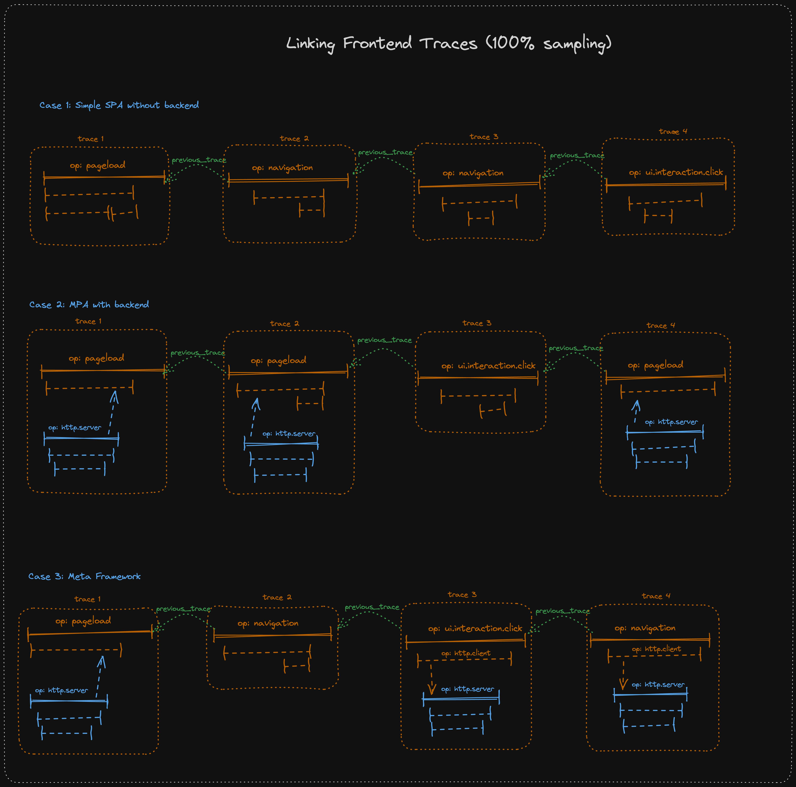
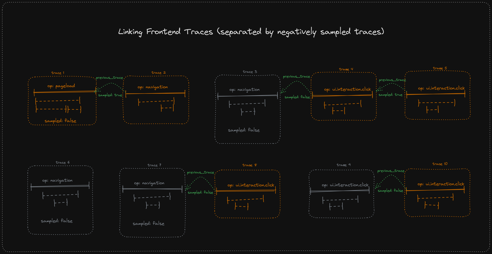

<SpecRfcAlert />

<SpecMeta />

## Overview

Span links associate one span with one or more other spans. The most important application of linking traces are frontend applications.
It can also be useful in settings with producer/consumer patterns or batch operations.
By using span links, we are able to display a user journey in our tracing views to make debugging of issues easier as developers get more context on what happened before a specific issue.

A span link can store the context of (a.k.a. link to) any other span. When necessary, a special link type can be added (see [Link Types](#link-types)).

Learn more about Span Links in [the RFC 141](https://github.com/getsentry/rfcs/blob/main/text/0141-linking-traces.md) or in the [OpenTelemetry docs](https://opentelemetry.io/docs/concepts/signals/traces/#span-links).

---

## Behavior

### Link Types

<SpecSection id="link-types" status="stable" since="1.0.0">

Links don't require a special meaning or type but if necessary (e.g. for identifying special links in the product), set the `sentry.link.type` attribute on the link to define the link type.
Any string can be used, but these types have predefined meanings:

| `sentry.link.type` | Usage                                                          | UI Implications                                                                                   |
|--------------------|----------------------------------------------------------------|---------------------------------------------------------------------------------------------------|
| "previous_trace"   | Linking e.g. a navigation span to the previous page load span. | Used to query linked traces. Shows a button to go to linked previous trace in the trace explorer. |
| "next_trace"       | Linking e.g. a page load span to the next navigation span.     | Used to query linked traces. Shows a button to go to linked next trace in the trace explorer.     |

#### `previous_trace`

Frontend traces can be linked by adding span links between root spans. For example, a navigation span includes a link to the previous page load span.

The span context inside the link object **SHOULD** be stored in a storage mechanism of choice (e.g. in-memory or `sessionStorage` in the browser).

Therefore, on root span start:
- Check if there is a previous span context stored. If yes, add the span link with the `'sentry.link.type': 'previous_trace'` attribute
- Store the root span context as the previous root span in a storage mechanism of choice (e.g. in-memory or `sessionStorage` in the browser)

SDKs are free to implement heuristics around how long a previous trace span context **SHOULD** be considered (max time) and store additional necessary data.



#### Negatively Sampled Traces

In many cases, with lower sample rates, we will not be able to provide a full trace link chain, due to some or many traces being negatively sampled.

- Sampled root spans **SHOULD** still include a link to the previous, negatively sampled root span (`traceFlags` on the spanContext() carry
  the information that the previous trace root span was negatively sampled).

This helps our product to hint that there would have been a previous trace, but it was negatively sampled.

We will not link to the previous positively sampled trace if a negatively sampled trace is in-between (see Traces 2-4 in the diagram below).
Furthermore, we will not show how many traces were negatively sampled in between two trace chains; only that there was at least one trace in between (see Trace 5-8).



</SpecSection>

---

## Wire Format

### Envelope Item Payload

<SpecSection id="envelope-item-payload" status="stable" since="1.0.0">

Span trees are serialized to transaction event envelopes in all Sentry SDKs. Therefore, the envelope item needs to accommodate span links
in its payload. If the `links` entry is an empty array, it can be omitted from the envelope.

The serialized `links` objects **SHOULD** always contain:

- `span_id: string` - id of the span to link to
- `trace_id: string` - trace id of the span to link to
- `sampled: boolean` - **REQUIRED** if sampling decision of the span to link to (corresponds to `traceFlags` in Otel span context converted to `boolean`) is available
- `attributes:` - **REQUIRED** if attributes were added to the link

Optionally, the serialized link object **MAY** contain further fields from OTel like `traceState`, `isRemote` or `droppedAttributesCount` which will be just forwarded unless we find a use case for them.

The OTel fields `spanId`, `traceId`, and `traceFlags` **SHOULD** be excluded from the links objects in the envelope to avoid duplicate data (e.g. `trace_id` vs. `traceId`).

If the root span (previously known as transaction) has span links, the links are stored in the trace context.

```ts {tabTitle:Example Trace Context}
// event envelope item
{
  type: "transaction";
  transaction: string;
  contexts: {
    trace: {
      span_id: string;
      parent_span_id: string;
      trace_id: string;
      // new field for links:
      links?: Array<{
        "span_id": string,
        "trace_id": string,
        sampled?: boolean, // traceFlags from Otel converted to boolean
        attributes?: Record<string, AttributeValue>,
        // + potentially more fields 1:1 from Otel. e.g. (traceState, droppedAttributesCount, isRemote)
      }>
      // ...
    }
  }
  // ...
}
```

Links that are stored in child spans are serialized in `spans[i].links`.

```ts {tabTitle:Example Span Link Data}
// event envelope item
{
  type: "transaction";
  transaction: string;
  spans: Array<{
    span_id: string;
    parent_span_id: string;
    trace_id: string;
    // new field for links:
    links?: Array<{
      "span_id": string,
      "trace_id": string,
      sampled?: boolean,
      attributes?: Record<string, AttributeValue>,
    }>
    // ...
  }>
  // ...
}
```

</SpecSection>

---

## Public API

### SDK Implementation Guideline

<SpecSection id="sdk-implementation-guideline" status="stable" since="1.0.0">

- Links are added on a span level, as defined and specified by [OpenTelemetry](https://opentelemetry.io/docs/specs/otel/trace/api/#link).
- In addition to linking to span IDs, a span link also holds meta information about the link, collected via attributes.
- Span links **MUST** only link to other spans. We do not support linking a span to an error or other Sentry events.
- For SDKs still having public APIs around transactions, their respective Transaction interface and `startTransaction` function(s) **SHOULD** support the same APIs.

#### Type Definitions

SDKs **SHOULD** follow the OpenTelemetry spec for the Link interface as defined by the platform.
Non-OTel SDKs **SHOULD** orient themselves on OTel, resulting in the interface below, or a related version that applies to the terminology and philosophy of the respective SDK:

```ts {tabTitle:Types}
// see https://github.com/open-telemetry/opentelemetry-js/blob/main/api/src/trace/link.ts
// or interface of respective platform
interface Link {
  // contains the SpanContext of the span to link to
  context: SpanContext;
  // key-value pair with primitive values
  attributes?: Attributes;
}


// see https://github.com/open-telemetry/opentelemetry-js/blob/main/api/src/trace/span_context.ts
// or interface of respective platform
interface SpanContext {
  traceId: string,
  spanId: string,
  traceFlags: number,
}

type Attributes = Record<string, AttributeValues>
type AttributeValues = string | boolean | number | Array<string> | Array<boolean> | Array<number>
```


#### Required Span API

Ideally, the link is added when starting a span. An optional `links` attribute is added to the `startSpan` options.
SDKs that don't offer span-centric APIs but e.g. transaction APIs, **SHOULD** ensure that their respective `start...` APIs (e.g. `startTransaction`) also offer a possibility to add links.

```ts {tabTitle:Span Options}
function startSpan(options: StartSpanOptions);

interface StartSpanOptions: {
  //... other options (name, attributes, etc)
  links?: Link[];
}
```

Furthermore, the SDKs need to expose at least an `addLink` method on their respective Span interface. For completeness with OpenTelemetry, ideally they also expose `addLinks`:

```ts {tabTitle:Span API}
interface Span {
  // return value can differ depending on platform
  addLink(link: Link): this;
  addLinks(links: Link[]): this;
}
```

</SpecSection>

---

## Usage Example

Adding span links should be possible at span start time, as well as when holding a reference to the span.

In the example below, by adding span links, we can link from the last navigation trace all the way back to the initial pageload trace.
By passing the `'sentry.link.type': 'previous_trace'` attribute, we can identify the link as a previous trace link in Sentry and display the spans accordingly.

```ts {tabTitle:TypeScript}
// 1st trace starts
const pageloadSpan = startInactiveSpan(...)

// 2nd trace starts
const navigation1Span = startInactiveSpan({
  name: '/users',
  links: [{
    context: pageloadSpan.spanContext(),
    attributes: {
      'sentry.link.type': 'previous_trace'
    }
  }]
});

// 3rd trace starts
const navigation2Span = startSpan({name: '/users/:id'}, (span) => {
  span.addLink({
    context: navigation1Span.spanContext(),
    attributes: {
      'sentry.link.type': 'previous_trace'
    }
  })
})
```

## Ingest/Relay

Relay forwards the span links in the format that is required for further processing and storage.
Importantly, Relay doesn't require span links to be defined. They are completely optional.
Relay handles passing span links in the root span as well as in any child span (see [envelope item payload](#envelope-item-payload)).

The expected type and structure of the links array and its contents is [specified in Relay](https://github.com/getsentry/relay/blob/master/relay-event-schema/src/protocol/span.rs#L753).

---

## Changelog

<SpecChangelog />
