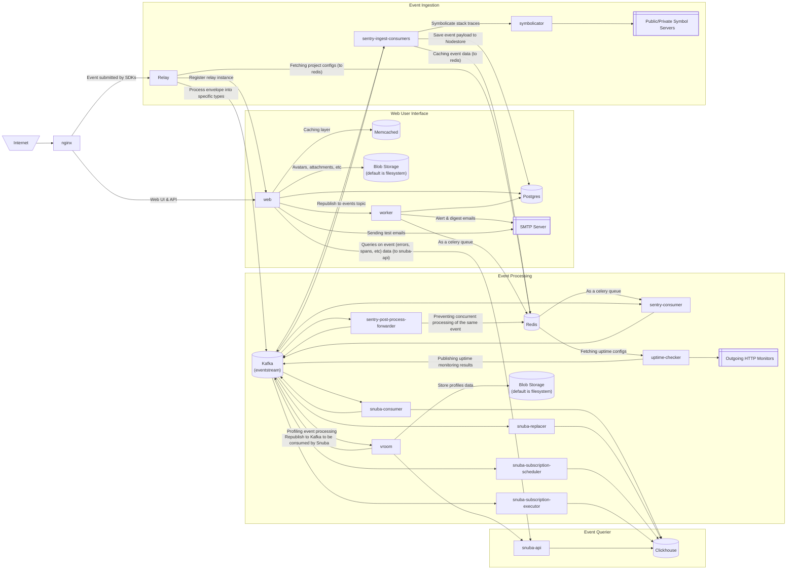

This diagram shows the data flow of self-hosted Sentry. It is similar with [Application Architecture](/application-architecture/overview/) but we are focusing more on the self-hosted components.

### Event Ingestion Pipeline

1. Events from the SDK is sent to the `relay` service.
2. Relay parses the incoming envelope, validates whether the DSN and Project ID are valid. It reads project config data from `redis`.
3. Relay build a new payload to be consumed by Sentry ingest consumers, and send it to `kafka`.
4. Sentry `ingest-*` consumers ( with `*` [wildcard] being the event type [errors, transaction, profiles, etc]) consumes the event, cache it in `redis` and start the `preprocess_event` task.
5. The `preprocess_event` task symbolicate stack traces with `symbolicator` service, and process event according to the event type's logic.
6. The `preprocess_event` task saves the event payload to nodestore (the default is to `postgres`).
7. The `preprocess_event` task publishes the event to `kafka` to `events` topic.

### Event Processing Pipeline

1. The `snuba-consumer` service consumes events from `events` topic and process them. After being written to clickhouse, snuba publishes error & transaction events to `post-process-forwarder`.
2. The Sentry consumer that consumes `post-process-forwarder` topic process the events, and republish it to `kafka`.

### Web User Interface

1. THe `web` service is what you see, it's the Django web UI and API that serves the Sentry's frontend.
2. The `worker` service mainly consumes `redis` that acts as a celery queue to execute tasks. One notable task is to send emails to SMTP servers.

