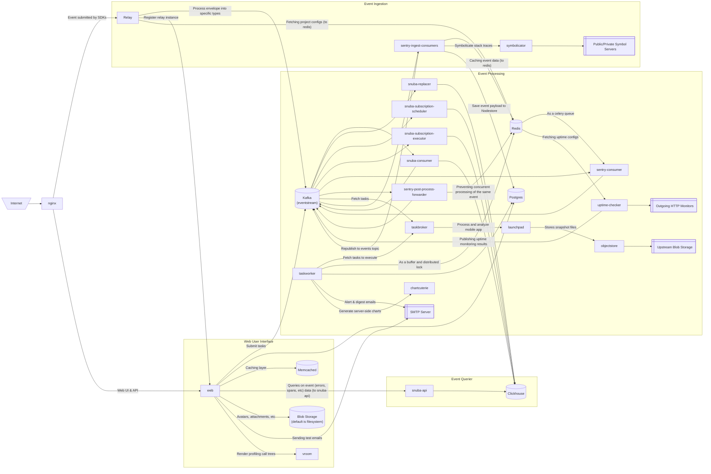

This diagram shows the data flow of self-hosted Sentry. It is similar with [Application Architecture](/application-architecture/overview/) but we are focusing more on the self-hosted components.

```mermaid
graph LR
  kafka@{ shape: cyl, label: "Kafka\n(eventstream)" }
  redis@{ shape: cyl, label: "Redis" }
  postgres@{ shape: cyl, label: "Postgres" }
  memcached@{ shape: cyl, label: "Memcached" }
  clickhouse@{ shape: cyl, label: "Clickhouse" }
  smtp@{ shape: win-pane, label: "SMTP Server" }
  symbol-server@{ shape: win-pane, label: "Public/Private Symbol Servers" }
  internet@{ shape: trap-t, label: "Internet" }

  internet --> nginx

  nginx -- Event submitted by SDKs --> relay
  nginx -- Web UI & API --> web

  subgraph querier [Event Querier]
    snuba-api --> clickhouse
  end

  subgraph processing [Event Processing]
    kafka --> snuba-consumer --> clickhouse
    snuba-consumer --> kafka
    kafka --> snuba-replacer --> clickhouse
    kafka --> snuba-subscription-scheduler --> clickhouse
    kafka --> snuba-subscription-executor --> clickhouse
    redis -- As a celery queue --> sentry-consumer
    kafka --> sentry-consumer --> kafka
    kafka --> sentry-post-process-forwarder --> kafka
    sentry-post-process-forwarder -- Preventing concurrent processing of the same event --> redis

    kafka -- Fetch tasks --> taskbroker
    taskbroker -- Process and analyze mobile app --> launchpad
    taskworker -- Fetch tasks to execute --> taskbroker
    taskworker -- As a buffer and distributed lock --> redis
    taskworker --> postgres
    taskworker -- Alert & digest emails --> smtp
    taskworker -- Generate server-side charts --> chartcuterie

    launchpad -- Stores snapshot files --> objectstore

    upstream-blob-storage@{ shape: win-pane, label: "Upstream Blob Storage"}
    objectstore --> upstream-blob-storage

    outgoing-monitors@{ shape: win-pane, label: "Outgoing HTTP Monitors" }
    redis -- Fetching uptime configs --> uptime-checker -- Publishing uptime monitoring results --> kafka
    uptime-checker --> outgoing-monitors
  end

  subgraph ui [Web User Interface]
    sentry-blob-storage@{ shape: cyl, label: "Blob Storage\n(default is filesystem)" }

    web -- Submit tasks --> kafka
    web --> postgres
    web -- Caching layer --> memcached
    web -- Queries on event (errors, spans, etc) data (to snuba-api) --> snuba-api
    web -- Avatars, attachments, etc --> sentry-blob-storage
    web -- Sending test emails --> smtp
    web -- Render profiling call trees --> vroom
  end

  subgraph ingestion [Event Ingestion]
    relay@{ shape: rect, label: 'Relay' }
    sentry_ingest_consumer[sentry-ingest-consumers]

    relay -- Process envelope into specific types --> kafka --> sentry_ingest_consumer -- Caching event data (to redis) --> redis
    relay -- Register relay instance --> web
    relay -- Fetching project configs (to redis) --> redis
    sentry_ingest_consumer -- Symbolicate stack traces --> symbolicator --> symbol-server
    sentry_ingest_consumer -- Save event payload to Nodestore --> postgres
    sentry_ingest_consumer -- Republish to events topic --> kafka
  end
```

### Event Ingestion Pipeline

1. Events from the SDK is sent to the `relay` service.
2. Relay parses the incoming envelope, validates whether the DSN and Project ID are valid. It reads project config data from `redis`.
3. Relay builds a new payload to be consumed by Sentry ingest consumers, and sends it to `kafka`.
4. Sentry `ingest-*` consumers ( with `*` [wildcard] being the event type [errors, transaction, profiles, etc]) consumes the event, caches it in `redis` and starts the `preprocess_event` task.
5. The `preprocess_event` task symbolicates stack traces with `symbolicator` service, and processes the event according to its event type.
6. The `preprocess_event` task saves the event payload to nodestore (default nodestore backend is `postgres`).
7. The `preprocess_event` task publishes the event to `kafka` under the `events` topic.

### Event Processing Pipeline

1. The `snuba-consumer` service consumes events from `events` topic and processes them. After the events are written to clickhouse, snuba publishes error & transaction events to `post-process-forwarder`.
2. The Sentry `post-process-forwarder` consumer consumes messages and spawns a `post_process_group` task for each processed error & issue occurrence.

### Web User Interface

1. The `web` service is what you see, it's the Django web UI and API that serves the Sentry's frontend.
2. The `taskworker` service execute various tasks from storing data to nodestore (currently SeaweedFS on self-hosted) to sending emails. It fetches the tasks from `taskbroker`, which retrieves the task from `kafka`. If a client want to submit a task, they need to publish a message on the `taskworker` (or relevant `taskworker-*`) topic on Kafka.
