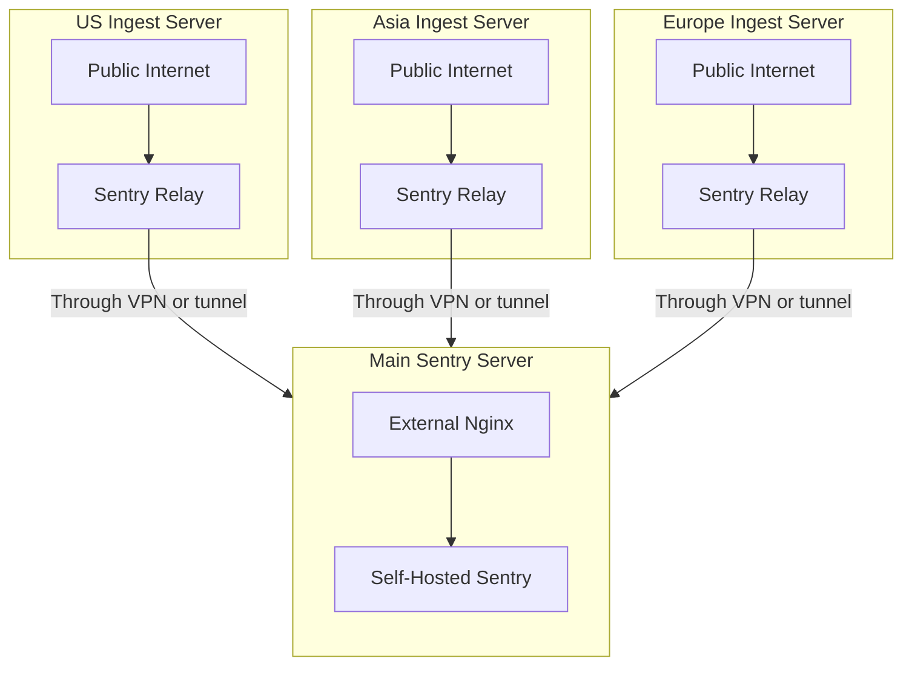

In addition to having a [separate domain](/self-hosted/experimental/reverse-proxy/#expose-only-ingest-endpoint-publicly) for viewing the web UI and ingesting data, you can deploy a dedicated server for data ingestion that relays information to your main server. This setup is recommended for high-traffic installations and environments with multiple data centers.

This architecture helps mitigate DDoS attacks by distributing ingestion across multiple endpoints, while your main Sentry instance with the web UI should be protected on a private network (accessible via VPN). Invalid payloads sent to your Relay instances will be dropped immediately. If your main server becomes unreachable, your Relay will continue attempting to send the data.

Note that the region names in the diagram below are used for illustration purposes.



To set up the relay, install Sentry Relay on your machine by following the [Relay Getting Started Guide](https://docs.sentry.io/product/relay/getting-started/). Configure the Relay to run in `managed` mode and point it to your main Sentry server. You can customize the port and protocol (HTTP or HTTPS) as needed.

After installing Relay (via Docker or executable) and running the `configure init` command, you can configure it with the following settings:

```yaml
# Please see the relevant documentation.
# Performance tuning: https://docs.sentry.io/product/relay/operating-guidelines/
# All config options: https://docs.sentry.io/product/relay/options/
relay:
  mode: managed
  instance: default
  upstream: https://sentry.yourcompany.com/
  host: 0.0.0.0
  port: 3000

limits:
  max_concurrent_requests: 20

# To avoid having Out Of Memory issues,
# it's recommended to enable the envelope spooler.
spool:
  envelopes:
    path: /var/lib/sentry-relay/spool.db # make sure this path exists
    max_memory_size: 200MB
    max_disk_size: 1000MB

# metrics:
#   statsd: "100.100.123.123:8125"

sentry:
  enabled: true
  dsn: "https://xxx@sentry.yourcompany.com/1"
```

While it's possible to run Relay on a different version than your self-hosted instance, we recommend keeping both Relay and Sentry on the same version. Remember to upgrade Relay whenever you upgrade your self-hosted Sentry installation.

<Alert level="info" title="Fun Fact">
  Sentry SaaS uses a similar setup for their ingestion servers, behind Google Anycast IP address.
</Alert>
