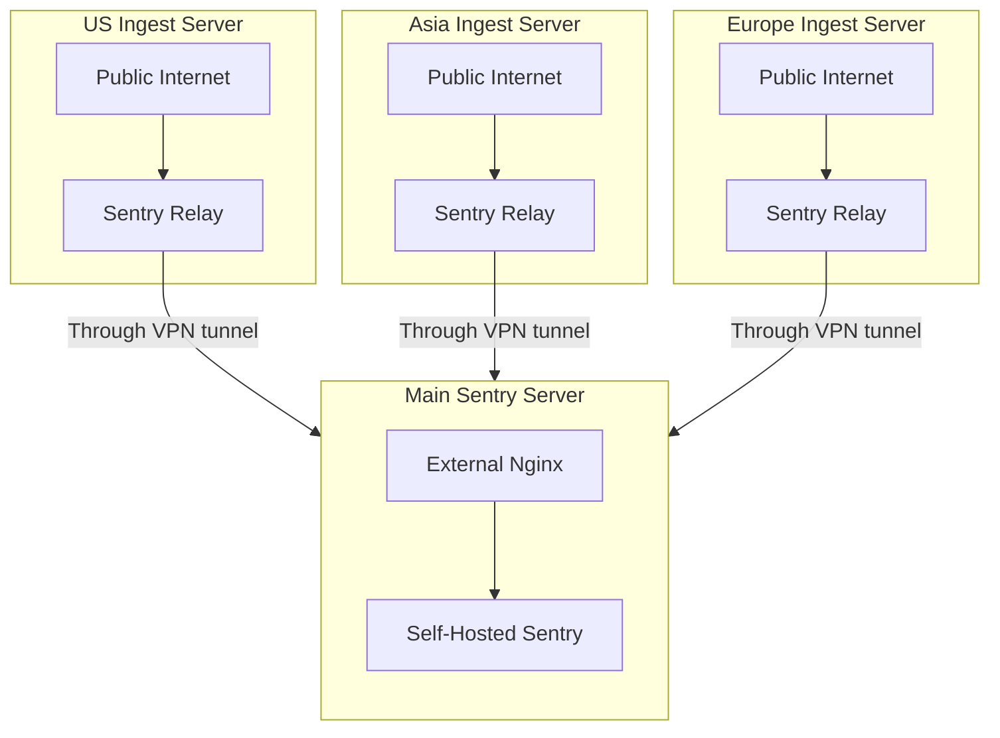

Other than having a [separate domain](/self-hosted/experimental/reverse-proxy/#expose-only-ingest-endpoint-publicly) to view the web UI and ingest data, you can also put a separate box (or server) for ingesting data, and have it relay data to the main box. This setup is recommended for high-traffic installations, and environment where you have multiple data centers.

Using this setup also prevents DDOS attacks against your Sentry installation, since we assume your main box can only be accessed using some kind of VPN. If there are any invalid payload being sent to your Relay instance, it will be dropped immediately. If your main box is not reachable, your Relay will keep retrying to send the data.

Please note that you don't need to have multiple data centers in different countries/regions. The region naming on the diagram is to make it easier to understand.



To configure the relay, you can install Sentry Relay on your machine through the [Relay Getting Started Guide](https://docs.sentry.io/product/relay/getting-started/). You should configure the Relay to run on `proxy` mode, and point it to the main Sentry server. You can also configure it to use a different port, or a different protocol (HTTP or HTTPS). Make sure you are using the same version of your self-hosted Sentry version.

A simple configuration for the relay would be:

```yaml
# Please see the relevant documentation.
# Performance tuning: https://docs.sentry.io/product/relay/operating-guidelines/
# All config options: https://docs.sentry.io/product/relay/options/
relay:
  mode: proxy
  instance: default
  upstream: https://sentry.yourcompany.com/
  host: 0.0.0.0
  port: 3000

limits:
  max_concurrent_requests: 20

# To avoid having Out Of Memory issues,
# it's recommended to enable the envelope spooler.
spool:
  envelopes:
    path: /var/lib/sentry-relay/spool.db # make sure this path exists
    max_memory_size: 200MB
    max_disk_size: 1000MB

# metrics:
#   statsd: "100.100.123.123:8125"

sentry:
  enabled: true
  dsn: "https://xxx@sentry.yourcompany.com/1"
```

Always remember to upgrade the Relay whenever you upgrade your self-hosted Sentry instance.

<Alert level="info" title="Fun Fact">
  Sentry SaaS use this similar setup for their ingestion servers, behind Google Anycast IP address.
</Alert>
