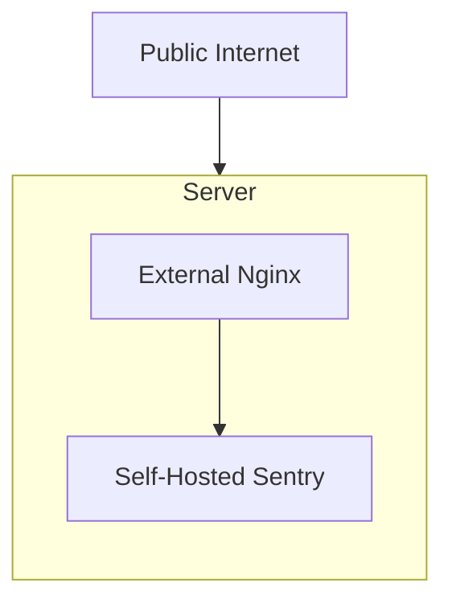

This is the simplest setup for self-hosted Sentry. It is recommended for small to medium-sized installations. This setup follows [the minimum requirements](/self-hosted/#required-minimum-system-resources) for running Sentry.

It is highly recommended to put an external load balancer (or reverse proxy) in front of your self-hosted Sentry deployment. That way, you can tweak on rate limiting, TLS termination, and other features that does not change the built-in nginx configuration file. It is recommended to install the load balancer on your host machine instead of as a Docker container. Doing this way helps you in the event of Docker engine failure.

If using external load balancer is not possible, you can put it as a Docker container, pointing to the `nginx` service at port `80`. Whatever value you put on your `SENTRY_BIND` environment variable won't matter.

For more information regarding configuring your external load balancer, please refer to the [External Load Balancer](/self-hosted/experimental/reverse-proxy/) section.
