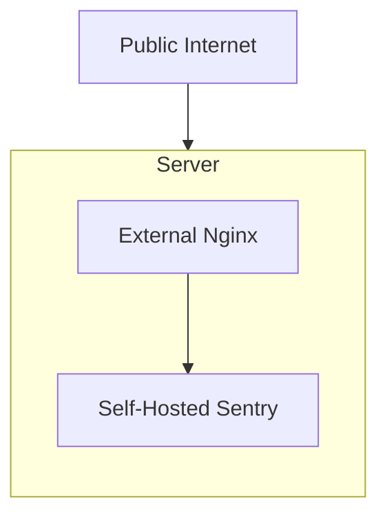

This is the simplest setup for self-hosted Sentry. It is recommended for small to medium-sized installations. This setup follows [the minimum requirements](/self-hosted/#required-minimum-system-resources) for running Sentry.

It is highly recommended to put an external load balancer (or reverse proxy) in front of your self-hosted Sentry deployment. That way, you can tweak rate limiting, TLS termination, and other features and do not change the default `nginx` configuration file. It is recommended to install the load balancer directly on your host machine instead of running in a Docker container. This protects you against a Docker engine failure.

For more information regarding configuring your external load balancer, please refer to the [External Load Balancer](/self-hosted/experimental/reverse-proxy/) section.
