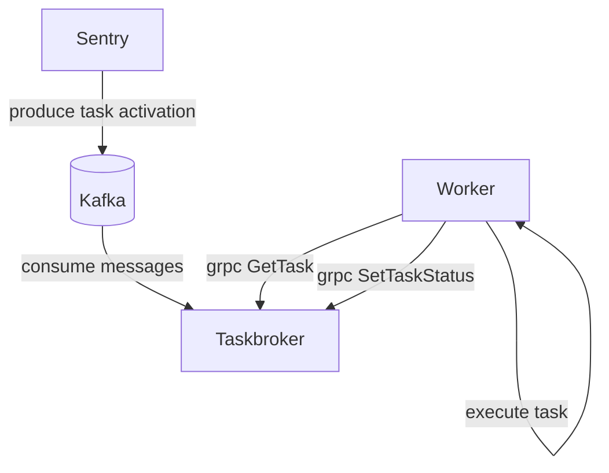
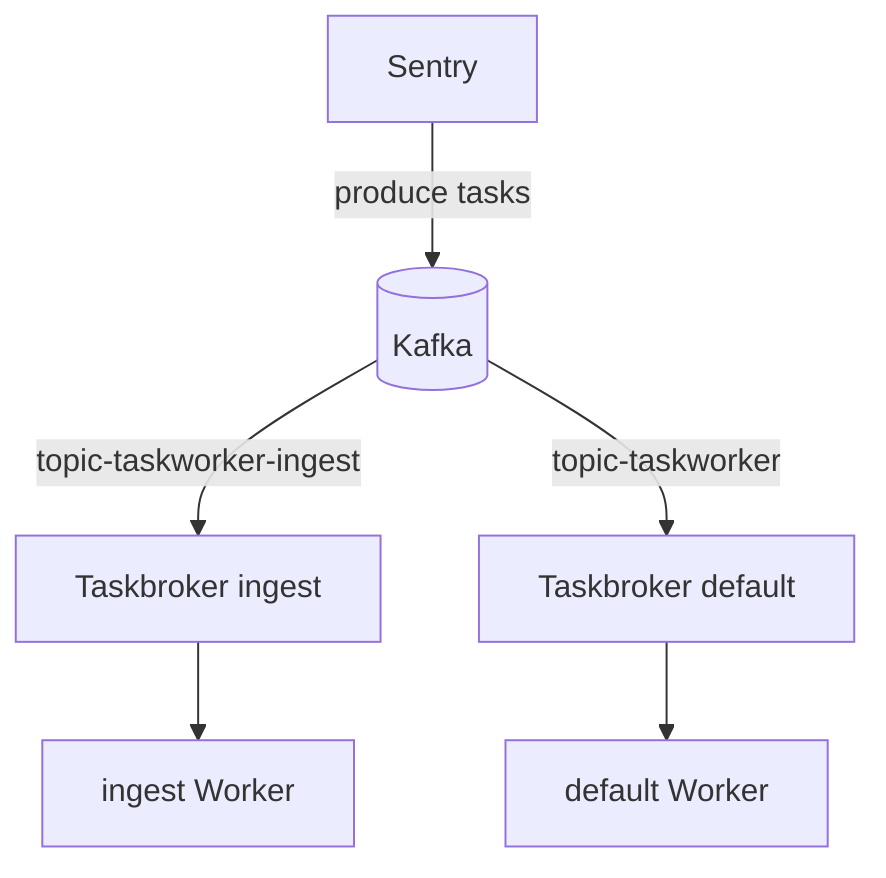

## System Architecture

Sentry's task platform is designed to scale horizontally to enable
high-throughput processing. The task platform is composed of a few components:



Brokers and workers are paired together to create 'processing pools' for tasks.
Brokers and workers can be scaled horizontally to increase parallelism.

## Scaling workers

By default, self-hosted installs come with a single broker & worker replica. You
can increase processing capacity by adding more concurrency to the single worker
(via the `--concurrency` option on the worker), or by adding additional worker, and broker
replicas. It is not recommended to go above 24 worker replicas per broker as
broker performance can degrade with higher worker counts.

If your deployment requires additional processing capacity, you can add
additional broker replicas and use CLI options to inform the workers of the
broker addresses:

```bash
sentry run taskworker --rpc-host-list=sentry-broker-default-0:50051,sentry-broker-default-1:50051
```

Workers use client-side loadbalancing to distribute load across the brokers they
have been assigned to.

## Running multiple brokers

In higher throughput installations, you may also want to isolate task workloads
from each other to ensure timely processing of lower volume tasks. For example,
you could isolate ingestion related tasks from other work:



To achieve this work separation we need to make a few changes:

1. Provision any additional topics. Topic names need to come from one of the
   predefined topics in `src/sentry/conf/types/kafka_definition.py`
2. Deploy the additional broker replicas. You can use the
   `TASKBROKER_KAFKA_TOPIC` environment variable to define the topic a
   taskbroker consumes from.
3. Deploy additional workers that use the new brokers in their `rpc-host-list`
   CLI flag.
4. Find the list of namespaces you want to shift to the new topic. The list of
   task namespaces can be found in the `sentry.taskworker.namespaces` module.
5. Update task routing option, defining the namespace -> topic mappings. e.g.
   ```yaml
   # in sentry/config.yml
   taskworker.routes:
      "ingest.errors": "taskworker-ingest"
      "ingest.transactions": "taskworker-ingest"
   ```
