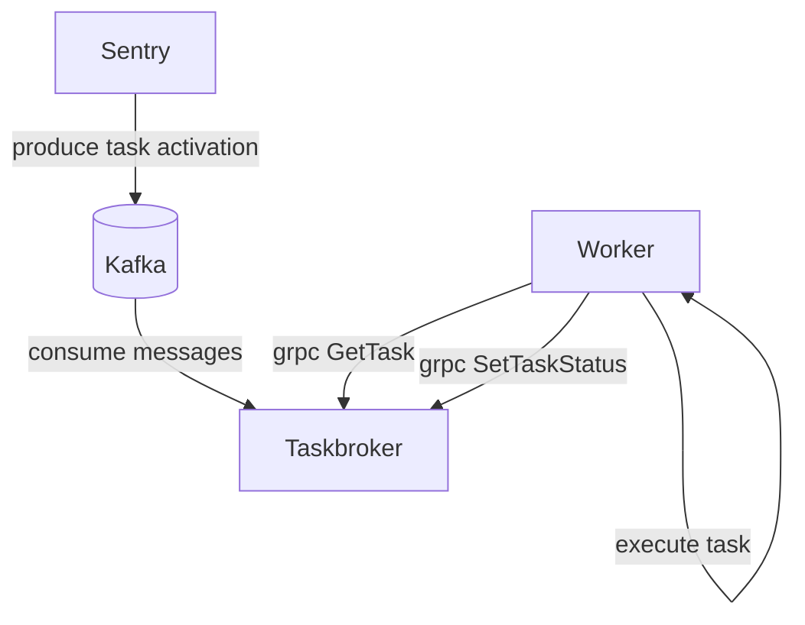
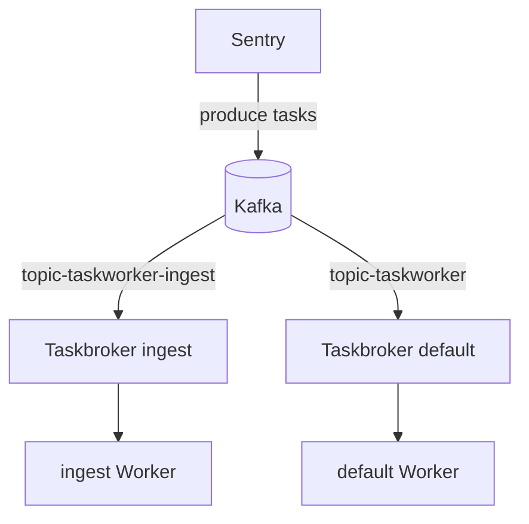

## System Architecture

Sentry's task platform is designed to scale horizontally to enable
high-throughput processing. The task platform is composed of a few components:



Brokers and workers are paired together to create 'processing pools' for tasks.
Brokers and workers can be scaled horizontally to increase parallelism.

## Scaling workers

By default, self-hosted installs come with a single broker & worker replica. You
can increase processing capacity by adding more concurrency to the single worker
(via the `--concurrency` option on the worker), or by adding additional worker,
and broker replicas. It is not recommended to go above 24 worker replicas
per broker as broker performance can degrade with higher worker counts.

If your deployment requires additional processing capacity, you can add
additional broker replicas and use CLI options to inform the workers of the
broker addresses:

```bash
sentry run taskworker --rpc-host-list=sentry-broker-default-0:50051,sentry-broker-default-1:50051
```

Workers use client-side loadbalancing to distribute load across the brokers they
have been assigned to.

If you only want to scale `taskworker` replicas and you have a single `taskbroker`,
you can easily increase it (up to 24 replicas) by modifying your `docker-compose.override.yml`
file:

```yaml
services:
  taskworker:
    deploy:
      replicas: 5
```

This will spawn 5 replicas of the `taskworker` service. Bear in mind that although
the processing capacity is increased, you will need to monitor and scale your
system resources (CPU and RAM) accordingly.

## Scaling brokers

If you have reached the maximum number of `taskworker` replicas, you can scale
your `taskbroker` replicas. First, you need to increase the number of partitions
on "taskworker" topic in Kafka, the number of partitions should be evenly divisible by
the number of `taskbroker` replicas that you're planning to scale to.
Then due to the limited capability of Docker Compose, you will need to manually
scale your `taskbroker` replicas. You can do this by adding more container
declarations to your `docker-compose.override.yml` file:

```yaml
services:
  taskbroker-beta:
    restart: "unless-stopped"
    image: "$TASKBROKER_IMAGE"
    environment:
      TASKBROKER_KAFKA_CLUSTER: "kafka:9092"
      TASKBROKER_KAFKA_DEADLETTER_CLUSTER: "kafka:9092"
      TASKBROKER_DB_PATH: "/opt/sqlite/taskbroker-activations-beta.sqlite"
    volumes:
      - sentry-taskbroker:/opt/sqlite
    depends_on:
      - kafka
  taskbroker-charlie:
    restart: "unless-stopped"
    image: "$TASKBROKER_IMAGE"
    environment:
      TASKBROKER_KAFKA_CLUSTER: "kafka:9092"
      TASKBROKER_KAFKA_DEADLETTER_CLUSTER: "kafka:9092"
      TASKBROKER_DB_PATH: "/opt/sqlite/taskbroker-activations-charlie.sqlite"
    volumes:
      - sentry-taskbroker:/opt/sqlite
    depends_on:
      - kafka
```

Note that each `taskbroker` replica needs their own SQLite database per replica, to prevent
issues contention and locks between replicas.

Finally, you need to modify `taskworker` command to have `rpc-host-list` pointing
to the new brokers:

```yaml
taskworker:
  <<: *sentry_defaults
  command: run taskworker --concurrency=4 --rpc-host-list=taskbroker:50051,taskbroker-beta:50051,taskbroker-charlie:50051 --health-check-file-path=/tmp/health.txt
  healthcheck:
    <<: *file_healthcheck_defaults
```

If you are running on Kubernetes, you can utilize `--rpc-host` and `--num-brokers`
instead if you are using StatefulSet. Otherwise, you can use `--rpc-host-list`
if you have a different host name pattern for the brokers.

## Isolate Workload Separation

In higher throughput installations, you may also want to isolate task workloads
from each other to ensure timely processing of lower volume tasks. For example,
you could isolate ingestion related tasks from other work:



To achieve this work separation we need to make a few changes:

1. Provision any additional topics. Topic names need to come from one of the
   predefined topics in [`src/sentry/conf/types/kafka_definition.py`](https://github.com/getsentry/sentry/blob/master/src/sentry/conf/types/kafka_definition.py).
   By default, any topics will automatically be created during `./install.sh`
   process.
2. Deploy the additional broker replicas. You can use the
   `TASKBROKER_KAFKA_TOPIC` environment variable to define the topic a
   taskbroker consumes from.
3. Deploy additional workers that use the new brokers in their `rpc-host-list`
   CLI flag.
4. Find the list of namespaces you want to shift to the new topic. The list of
   task namespaces can be found in the [`sentry.taskworker.namespaces`](https://github.com/getsentry/sentry/blob/master/src/sentry/taskworker/namespaces.py) module.
5. Update task routing option, defining the namespace -> topic mappings. e.g.
   ```yaml
   # in sentry/config.yml
   taskworker.route.overrides:
      "ingest.errors": "taskworker-ingest"
      "ingest.transactions": "taskworker-ingest"
   ```

### Separate Ingest Workers

Having separate ingest `taskbroker` and `taskworker` is useful for high-throughput
installations, therefore you can receive timely alerts and not have to wait for
ingest-related tasks to finish. As an implementation of the above steps,
you need to add a few new containers on your `docker-compose.override.yml` file:

```yaml
# Copy `x-sentry_defaults` and `file_healthcheck_defaults` section from
# `docker-compose.yml` to `docker-compose.override.yml` first. Put it on the
# top of the file.
services:
  taskbroker-ingest:
    restart: "unless-stopped"
    image: "$TASKBROKER_IMAGE"
    environment:
      TASKBROKER_KAFKA_TOPIC: "taskworker-ingest"
      TASKBROKER_KAFKA_CONSUMER_GROUP: "taskworker-ingest"
      TASKBROKER_KAFKA_CLUSTER: "kafka:9092"
      TASKBROKER_KAFKA_DEADLETTER_CLUSTER: "kafka:9092"
      TASKBROKER_DB_PATH: "/opt/sqlite/taskbroker-activations-ingest.sqlite"
    volumes:
      - sentry-taskbroker-ingest:/opt/sqlite
    depends_on:
      - kafka
  taskworker-ingest:
    <<: *sentry_defaults
    command: run taskworker --concurrency=4 --rpc-host-list=taskbroker-ingest:50051 --health-check-file-path=/tmp/health.txt
    healthcheck:
      <<: *file_healthcheck_defaults

volumes:
  sentry-taskbroker-ingest: {}
```

On your `sentry/config.yml` file, you need to append the following to the
bottom of the file:
```yaml
taskworker.route.overrides:
  "ingest.errors": "taskworker-ingest"
  "ingest.transactions": "taskworker-ingest"
  "ingest.profiling": "taskworker-ingest"
  "ingest.attachments": "taskworker-ingest"
  "ingest.errors.postprocess": "taskworker-ingest"
```

Any other tasks that are not defined on the routes override above will be
handled by the default `taskbroker` and `taskworker` service.
