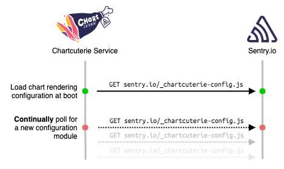
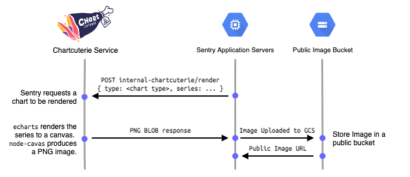

Sentry's frontend provides users with detailed and interactive charts of
various types, highly tailored to the look and feel of the Sentry product.
Historically these charts have been something we only have in the web
application.

There are however, cases where it would be very valuable to show a chart in
some context onside of the application. For example

 * Slack unfurling of Discover charts, Metric Alert notifications, Issue
   details, or any other link in Sentry where it may be useful to see a chart
   in Slack.

 * Notification and summary emails. Having trends visualized as charts.

Fortunately, Sentry has built-in functionality for the internal
[Chartcuterie](https://github.com/getsentry/chartcuterie) NodeJS service, which can
produce graphs in an image format via an HTTP API. The charts are generated
using the same [ECharts](https://github.com/apache/echarts) library that is
used on the frontend. Chartcuterie shares code with Sentry's frontend, meaning
the look-and-feel of the charts can be easily maintained between the frontend,
and charts generated by Chartcuterie on the backend.

## Using Chartcuterie in Sentry's backend

Generating charts using Chartcuterie is dead simple.

Import the `generate_chart` function, provided a chart type and data object, get a public image URL.

```python
from sentry.charts import generate_chart, ChartType

# The shape of data is determined by the RenderDescriptor in the
# configuration module for the ChartType being rendered.
data = {}

chart_url = generate_chart(ChartType.MY_CHART_TYPE, data)
```

## Configuring charts for rendering

Chartcuterie loads an external JavaScirpt module from sentry.io which
determines how it renders charts. This module directly configures EChart's
[`options`](https://echarts.apache.org/en/option.html) object, including
transformations on the series data provided to Chartcuterie upon a `POST /render`
call.

This module lives as part of getsentry/sentry, and can be found in
[static/app/chartcuterie/config.tsx](https://github.com/getsentry/sentry/blob/master/static/app/chartcuterie/config.tsx).

### Adding / removing chart types

Chart rendering is configured on a **per "chart type"** basis. For each type of
chart you will need to declare a well-known name in the frontend application as
well as in the backend charts module.

1. On the frontend add a `ChartType` in
[static/app/charctuerie/types.tsx](https://github.com/getsentry/sentry/blob/master/static/app/chartcuterie/types.tsx).

2. Register the `RenderDescriptor` for the chart, which describes the look and
   feel, as well as series transformations, in
   [static/app/chartcuterie/config.tsx](https://github.com/getsentry/sentry/blob/master/static/app/chartcuterie/config.tsx).
   You can use the `register` function for this.

3. In the backend add a matching `ChartType` in the
   [`sentry.charts.types`](https://github.com/getsentry/sentry/blob/master/src/sentry/charts/types.py)
   module.

4. Deploy your changes in Sentry. The configuration module will automatically
   propagate to Chartcuterie within a 5 minute window.

   You do not need to deploy Chartcuterie.

   <Alert level="warning">

   **Do NOT** deploy functionality that uses your new chart type at the same
   time as the configuration module. Because there is a propagation delay, the
   new chart type is not guaranteed to be available immediately after a
   deployment.

   </Alert>

   The configuration module includes the deployed sentry.io commit SHA, which
   allows Chartcuterie to check if it has received a new configuration module
   upon each poll tick.


## Running Chartcuterie in development

To enable Chartcuterie in your local developer environment first enable it in
your `config.yml`:

```yml
# Enable charctuerie
chart-rendering:
  enabled: true
```

Currently you need to manually build the configuration module in your development environment.

```shell
yarn build-chartcuterie-config
```

You can then boot the Chartcuterie devservice. If the devservice doesn't start
check that the chart-render.enabled key is correctly set to `true` (Use `sentry
config get chart-rendering.enabled`).

```shell
sentry devservices up chartcuterie
```

You can validate that the service has successfully started by checking the logs

```shell
docker logs -f sentry_chartcuterie
```

Which should look something like this

```
info: Using polling strategy to resolve configuration...
info: Polling every 5s for config...
info: Server listening for render requests on port 9090
info: Resolved new config via polling: n styles available. {"version":"xxx"}
info: Config polling switching to idle mode
info: Polling every 300s for config...
```

Your development environment is now ready make calls to a local instance of
Chartcuterie.

### Updating chart types locally

Currently you need to rebuild the configuration module using `yarn
build-chartcuterie-config` on every change. This may be improved in the future.

## How it works

Here are a couple service diagrams for the Chartcuterie service and how it
interacts with the Sentry application server.

### Chartcuterie bootup



### Render call from Sentry


