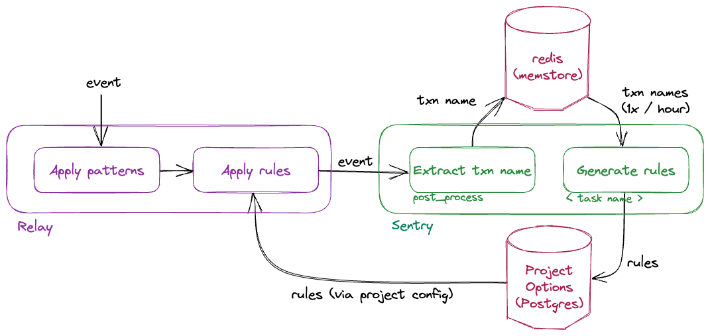

Sentry attempts to scrub high-cardinality identifiers from URL transactions
to aggregate performance data and provide more valuable insights.

In terms of user experience, this feature plays a similar role as [Issue Grouping](/grouping/).
In terms of technical implementation, it is similar to [Data Scrubbing](/pii/).

## The Problem

In our [Performance](https://docs.sentry.io/product/performance/) product, transactions are grouped by their name
(the [`event.transaction`](/sdk/event-payloads/#optional-attributes) field).
This works well as long as the cardinality of distinct transaction names that the SDK sends is low, for example
by using the [route of a web framework](https://docs.sentry.io/platforms/javascript/guides/react/configuration/integrations/react-router/) as the transaction name.

In some cases, however, the SDK does not have enough information to pick a meaningful group
like the name of a view or a route of a web transaction,
and it falls back to the raw URL (or rather,
[its path component](https://en.wikipedia.org/wiki/Uniform_Resource_Identifier#Syntax)).

This makes it harder for the user to extract insights from [Performance
metrics](https://docs.sentry.io/product/performance/metrics/), because instead of presenting averages, percentiles and distributions of groups of transactions that logically
belong together, we end up with a bunch of one-off transaction groups.

```URLs
/user/alice/
/user/bob/
/blog/1234567890/comments/
/hash/4c79f60c11214eb38604f4ae0781bfb2/diff/
```

### \<\< unparameterized \>\>

Secondly, ingesting a high number of one-off transaction names also does not scale to the required volume,
because with [metrics](https://getsentry.github.io/relay/relay_metrics/index.html), scalability is determined by _cardinality_ (the number of distinct groups), not volume (the number of events ingested).

An intermediate solution to the scale problem was to drop the transaction tag from Performance metrics
when the transaction name is a raw URL. This effectively groups _all_ URL transactions into one big group,
which also creates a bad user experience:


## The Solution

- In a first step, Relay strips common identifiers such as UUIDs, integer IDs and hashes
  from URL transactions.
- In a second step, we run automatic transaction clustering across a sample of observed transaction names.

### Overview



### Pattern-based Identifier Scrubbing

Relay tests all incoming URL transactions against a static regex, and replaces matched groups with `"*"` ([code](https://github.com/getsentry/relay/blob/897ca0e35ab981228274d0cb89ea050cc93e3632/relay-general/src/store/regexes.rs#L8-L52)).

For example:

```python
"/hash/4c79f60c11214eb38604f4ae0781bfb2/diff/"
# becomes
"/hash/*/diff/"
```

### Automatic Transaction Clustering

Some identifiers cannot be detected by looking at a single transaction. For example,
free-form user names cannot be distinguished from low-cardinality parts of a URL.

To detect high-cardinality segments in the URL, we accumulate a set of unique URL transaction names for each project, split them by `"/"`, and build a tree from its path segments (similar to a [trie](https://en.wikipedia.org/wiki/Trie) data structure):


If the number of children of a node surpass a threshold, we treat the path segment as high-cardinality, and fold its children into a single node:


For every merged segment, we create a glob-like replacement rule that can be used to scrub identifiers from new transactions. In the example above, the rule would be:

```
/user/*/**
```

If a transaction name matches this glob, the segment corresponding to `*` get replaced, thereby erasing the identifier.

Details:

- Steps:
  1.  In post processing, we add incoming transaction names of type `url` to a project-specific set in redis.
      Every set is capped with a maximum capacity. When the set is full, a random item is evicted.
      404 transactions are excluded from this data collection step as they can potentially contain any URL.
  1.  Every hour, a Celery task is spawned for every redis set, which
      a. builds the tree and derives rules from merged nodes.
      a. writes the rules into project options.
  1.  The derived rules are written into the project config submitted to Relay.
  1.  For every incoming transaction of type URL, Relay applies matching rules to scrub identifiers.
- **TTL:** In order to prune unused rules, we keep a copy of discovered rules in redis, and in post processing
  bump a `last_used` field on a rule if it was applied to the current event.
  The information which rule was applied is provided by Relay through the `_meta` field.
- Parameters:
  - The **merge threshold** which decides whether or not a path segment is considered an identifier is set at 200.
    We increased it from 100 because we noticed there are websites which have > 100 static pages.
  - The **sample size** of observed transactions, is currently set to 2000 (10x the merge threshold).
    A larger set increases the probability of discovering a rule.

Source code:

- [Transaction clusterer (Sentry)](https://github.com/getsentry/sentry/blob/9af20330c84b971882be9837d4e43e148af5a126/src/sentry/ingest/transaction_clusterer/tree.py).
- [Application of replacement rules (Relay)](https://github.com/getsentry/relay/blob/e543401086c556b769b67ccb96fbfaca411696c8/relay-general/src/store/transactions/processor.rs#L37-L46).

## Known Issues

### Accidental erasure of non-identifiers

Every level of the tree of URL path segments could contain a mixture of identifiers and static pages, for example

```

/user/alice
/user/bob
/user/settings <-
/user/carol
...

```

our current approach would replace `/user/settings` with `/user/*` because it detects high cardinality on the second level, even though `/settings` is a static route.

**Possible Solution using Weights**:

This could be fixed by assigning a weight to each node, proportional to the number of transactions that have this segment.
Nodes with large weights would then be encoded into the replacement rules as exceptions.

We decided against this because encoding exceptions into rules would bloat project configs on the wire and in Relay.

### Identifiers not scrubbed

The discovery of replacement rules is a best-effort approach: no matter how many rules the clusterer discovers, it might not detect all patterns. A project can always
introduce a new feature that brings more high-cardinality transactions, and it takes time until the clusterer discovers a new rule for those.

The consequence of this is again potentially high cardinality in our metrics ingestion and storage, up to the point where we might hit the [cardinality limiter](https://github.com/getsentry/sentry/blob/9af20330c84b971882be9837d4e43e148af5a126/src/sentry/ratelimits/cardinality.py#L93-L95).
