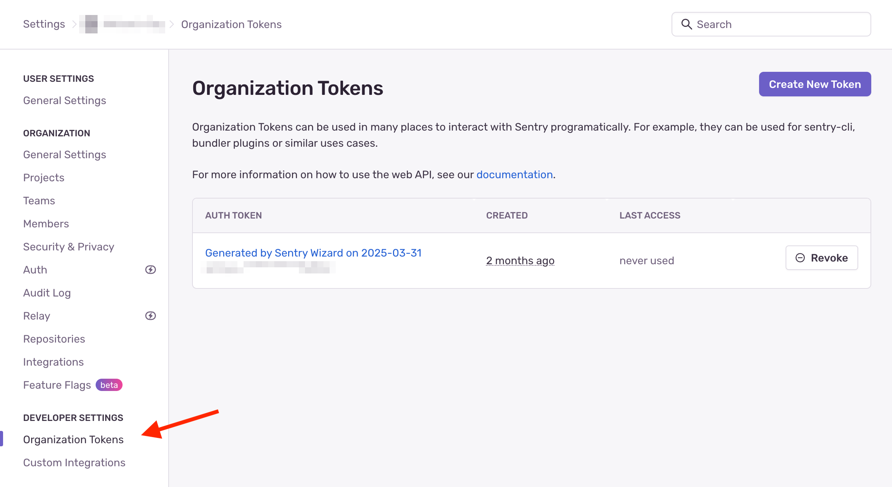
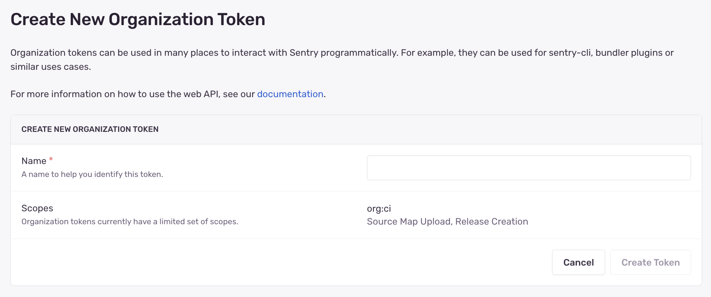
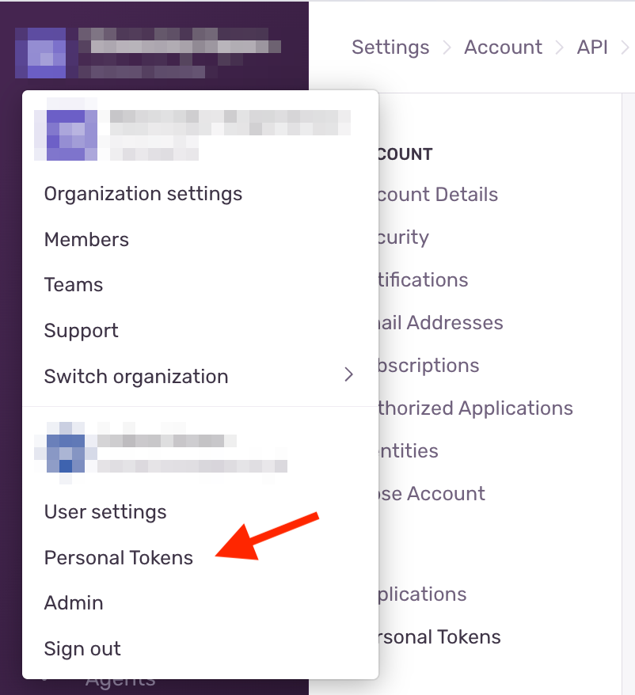
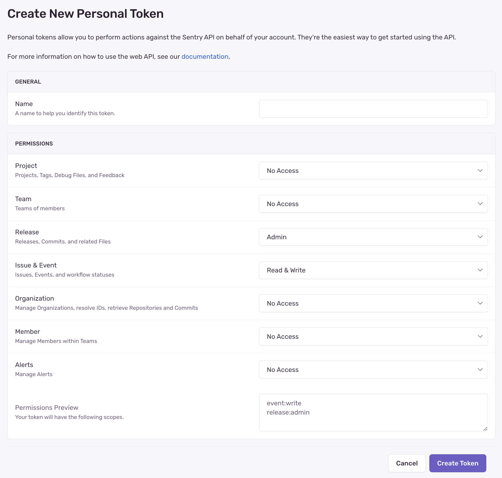
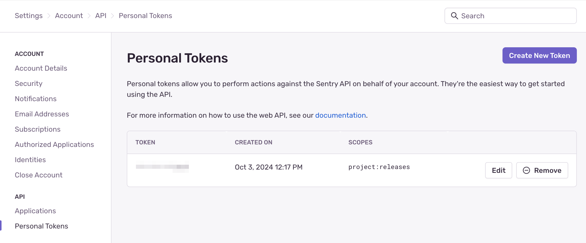

Auth tokens (short for _authentication tokens_) are a way to authenticate with Sentry. They are similar to passwords but are designed for programmatic interaction with Sentry. Some examples of what you would use auth tokens for include:

- Uploading Source Maps during your CI build
- Using [Sentry CLI](/cli/) to interact with Sentry
- Using the [Sentry API](/api/auth/)

Each auth token is created with a certain set of permissions and scopes which are mapped to the Sentry API's [Permissions & Scopes](/api/permissions/). Some types of auth tokens have set permissions that can't be edited, while others can be customized upon token creation and edited later.

We recommend using a separate auth token for each use case. For example, you would use a different auth token to upload source maps than the one you use with Sentry CLI. This has the benefit that if an auth token is compromised, you can revoke that auth token without impacting the rest of your workflow.

## Types of Auth Tokens

There are three key types of auth tokens in Sentry:

- [Organization Tokens](#organization-tokens):
  These tokens are bound to an organization, and have access to all projects within that organization. They have a limited set of permissions and are designed to be used in CI environments and with Sentry CLI.

- [Internal Integrations](#internal-integrations):
  These tokens are bound to an organization, and have access to all projects within that organization. They can be created with a custom set of permissions, and are designed to be used in cases where organization tokens don't have sufficient access rights.

- [Personal Tokens](#personal-tokens):
  These tokens are bound to a user, and have access to all organizations and projects that user has access to.

### When Should I Use Which?

For most scenarios, we recommend using [Organization Tokens](#organization-tokens). They are designed to be used in CI environments and have a limited set of permissions. This means that if the place you stored the auth token is compromised, the attacker can only do limited damage.

Organization tokens permissions aren't customizable. They are set to allow most CI-related tasks, without any unnecessary permissions.

[Internal Integrations](#internal-integrations) should be used when you need full API access (which the organization tokens cannot grant), and you want to interact with the Sentry API on behalf of an organization. For example, to programmatically create a new project, you would use an internal integration.

Permissions for auth tokens created as part of an internal integration are customizable and editable.

[Personal Tokens](#personal-tokens) should be used to interact with the Sentry API on behalf of a user. For example, to fetch all issues for a user, you would use a personal token. We don't recommend using personal tokens for CI tasks because if the user who created the token is removed from the Organization, the token will stop working.

Personal token permissions are customizable but cannot be edited later.

### Organization Tokens

[Organization tokens](https://sentry.io/orgredirect/organizations/:orgslug/settings/auth-tokens/) can be created in [sentry.io](https://sentry.io) on the **Auth Tokens** page under **Settings > Developer Settings > Auth Tokens**.

<Alert>

They can also be generated on certain pages of Sentry's docs if you're signed in, and by using the Sentry Wizard to configure uploading source maps.

</Alert>

Organization token names are generated for you unless you create the token through the Sentry UI. This name is only used for display purposes - it helps to identify an auth token in case you want to revoke it later. You can change the name for an organization token at [sentry.io](https://sentry.io) on the **Edit Auth Token** page under **Settings > Developer Settings > Auth Tokens**.

For security reasons, organization tokens are only visible _once_, right after you create them. If you lose the auth token, you will have to create a new one. This means you can't see the full token on the overview page or on the token detail page, you can only see the last characters of the token to help identify it.

Any user can create organization tokens for any of their organizations. This allows any user (not only organization owners) to configure a Sentry SDK and set up CI processes by creating and using organization tokens. Since organization tokens have limited access, there is limited potential for abuse.

All owners of the organization will receive a security email when a new organization token is created and can revoke these tokens at any point. _Only_ organization owners & managers can revoke organization tokens .

### Internal Integrations

We recommend only using an internal integration when you want to interact with the Sentry API on behalf of an organization. See Sentry's API [Authentication](/api/auth/) docs for more information on how to do this.

To get started, see our docs on [Internal Integrations](/organization/integrations/integration-platform/).

### Personal Tokens

[Personal tokens](https://sentry.io/settings/account/api/auth-tokens/) can be created in [sentry.io](https://sentry.io) on the **User Auth Tokens** page under the Account dropdown in the top left.

Personal tokens can be created by any user, and are bound to that user. The tokens can be given permissions to all organizations and projects that user has access to. This means a personal token's _maximum_ scope is all the scopes that the user has access to for a given organization. A personal token cannot exceed the permissions of the user who created it. See [Organization and User Management](/organization/membership/) for more details on how permissions work in Sentry.

When you create a new personal token, you can select which [scopes](/api/permissions/) the token should have in the UI:

Currently, you can view personal tokens in the UI after creating them. This is a legacy behavior that may change in the future. We recommend only using each personal token once, and creating a new token for each use case. Any user can always revoke any of their personal tokens.

We recommend only using a personal token to interact with the Sentry API on behalf of a user. See Sentry's API [Authentication](/api/auth/) docs for more information on how to do this.
