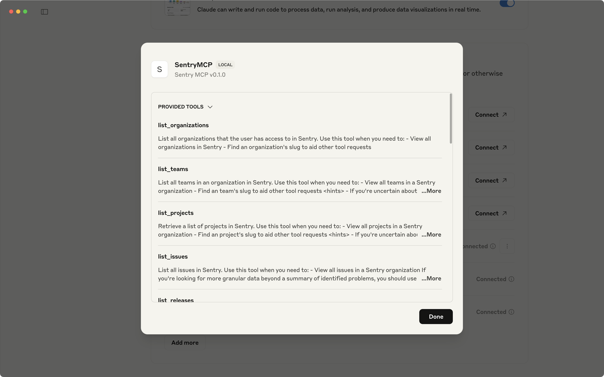
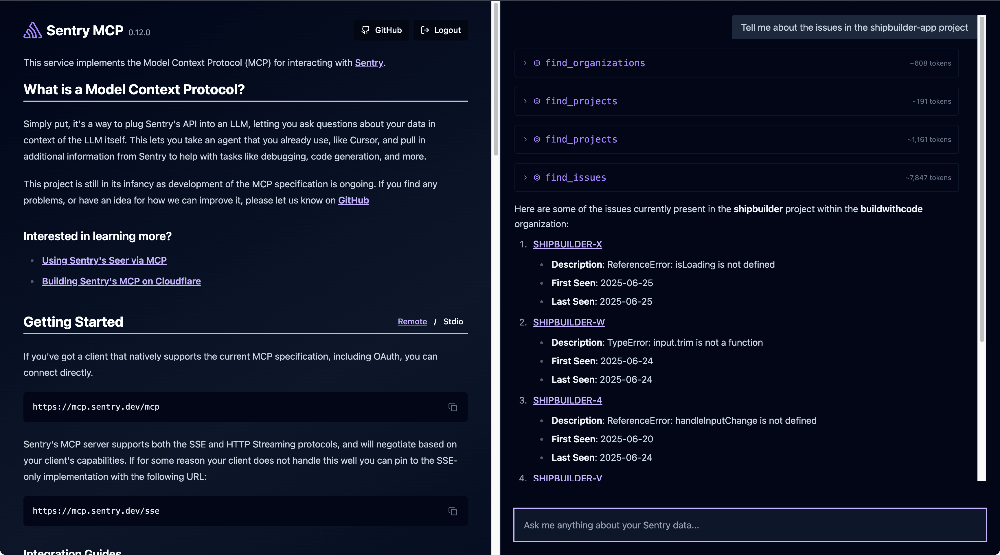
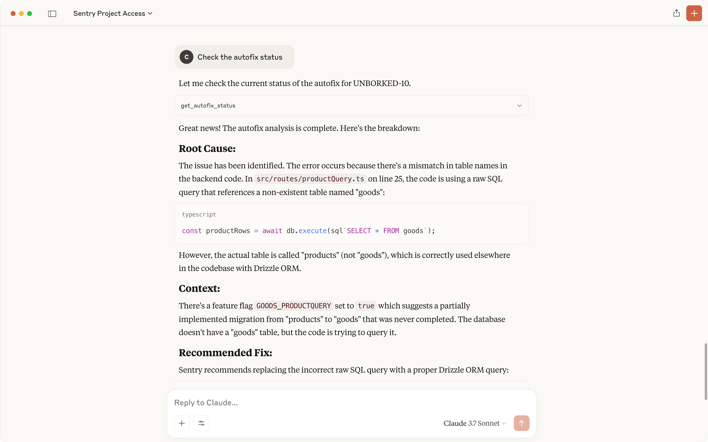

<Alert>
  The Sentry MCP Server has been released for production, however MCP is a
  developing technology and changes should be expected. There will be bugs.
  Please reach out on [GitHub](https://github.com/getsentry/sentry-mcp/issues)
  if you have any feedback or concerns.
</Alert>

The [Sentry MCP Server](https://mcp.sentry.dev) connects your LLM client to Sentry using the [Model Context Protocol (MCP)](https://modelcontextprotocol.io/introduction), giving your AI tools direct access to issues, errors, projects, and [Seer](/product/ai-in-sentry/seer/) analysis. Sentry hosts and manages a remote MCP server with OAuth authentication, so there's nothing to install.

## Getting Started

Add the Sentry MCP server to your client with this configuration:

```json {tabTitle: OAuth (Recommended)}
{
  "mcpServers": {
    "Sentry": {
      "url": "https://mcp.sentry.dev/mcp"
    }
  }
}
```

```bash {tabTitle: Self-Hosted (STDIO)}
npx @sentry/mcp-server@latest --access-token=YOUR_TOKEN --host=sentry.example.com
```

**Most clients support the OAuth configuration.** When you first connect, you'll be prompted to:

1. Log in with your Sentry organization
2. Accept the OAuth authorization
3. Grant access to the necessary permissions

Once authenticated, all 16+ tools become available in your client.



<Alert>
  If you've joined a new Sentry organization, log out of your LLM's MCP
  integration and log back in to refresh access.
</Alert>

<Expandable title="Self-Hosted STDIO Setup Details">

If you're running a self-hosted Sentry installation, use the STDIO transport instead. You'll need a Sentry User Auth Token with the following scopes:

- `org:read`
- `project:read`
- `project:write`
- `team:read`
- `team:write`
- `event:write`

You can also set these as environment variables:

```bash
SENTRY_ACCESS_TOKEN=your-token
SENTRY_HOST=your-sentry-host
```

</Expandable>

## Set Up Your Client

Select your client below for specific setup instructions. All clients use the remote OAuth server at `https://mcp.sentry.dev/mcp` unless noted otherwise.

### Claude Code

<Expandable title="Setup Instructions" group="clients">

Run the following command in your terminal:

```bash
claude mcp add --transport http sentry https://mcp.sentry.dev/mcp
```

Then launch Claude Code with `claude`. You'll be prompted to authenticate with OAuth to Sentry.

</Expandable>

### Cursor

<Expandable title="Setup Instructions" group="clients">

Go to `Cursor` → `Settings` → `Cursor Settings` → `MCP` and follow the prompts to add the Sentry MCP server. Cursor 1.0+ includes native OAuth and Streamable HTTP support.

You can also add the server manually by editing your `mcp.json` file:

```json
{
  "mcpServers": {
    "Sentry": {
      "url": "https://mcp.sentry.dev/mcp"
    }
  }
}
```

</Expandable>

### Claude for Desktop

<Expandable title="Setup Instructions" group="clients">

Open developer tools via `CMD + ,` → `Developer` → `Edit Config`, then add the Sentry server to your `claude_desktop_config.json`:

```json
{
  "mcpServers": {
    "Sentry": {
      "url": "https://mcp.sentry.dev/mcp"
    }
  }
}
```

Restart Claude Desktop to pick up the changes.

</Expandable>

### Claude.ai

<Expandable title="Setup Instructions" group="clients">

Navigate to `Settings` → `Profile` → scroll to `Integrations`, select `Add More`, and add the Sentry MCP server URL:

```
https://mcp.sentry.dev/mcp
```

</Expandable>

### VS Code and GitHub Copilot

<Expandable title="Setup Instructions" group="clients">

Open the Command Palette with `CMD+Shift+P` and select `MCP: Add Server`. Enter the Sentry MCP server URL:

```
https://mcp.sentry.dev/mcp
```

</Expandable>

### Codex

<Expandable title="Setup Instructions" group="clients">

Run the following command in your terminal:

```bash
codex mcp add sentry --url https://mcp.sentry.dev/mcp
```

Then launch Codex with `codex`. You'll be prompted to authenticate with Sentry using OAuth.

</Expandable>

### Windsurf

<Expandable title="Setup Instructions" group="clients">

Configure via the `Configure MCP` option in Cascade (`CMD + L`). Add the Sentry MCP server URL:

```
https://mcp.sentry.dev/mcp
```

</Expandable>

### Warp

<Expandable title="Setup Instructions" group="clients">

Go to `Settings` → `MCP Servers` → `+ Add` and select **Streamable HTTP or SSE Server (URL)**. Enter the following configuration:

```json
{
  "Sentry": {
    "url": "https://mcp.sentry.dev/mcp"
  }
}
```

Warp supports OAuth one-click installation and will open a browser window to authenticate with Sentry.

</Expandable>

### Amp

<Expandable title="Setup Instructions" group="clients">

**VS Code Extension:** Add the Sentry server via the Amp VS Code extension settings, or update your `settings.json`:

```json
"amp.mcpServers": {
    "sentry": {
        "url": "https://mcp.sentry.dev/mcp"
    }
}
```

**Amp CLI:** Add via the `amp mcp add` command:

```bash
amp mcp add sentry --url https://mcp.sentry.dev/mcp
```

</Expandable>

### Factory Droid

<Expandable title="Setup Instructions" group="clients">

Launch Factory Droid CLI and open the MCP menu with `/mcp`. Select `Add MCP Server from Registry` and search for `sentry`.

You can also add it manually using the Sentry MCP server URL `https://mcp.sentry.dev/mcp`.

</Expandable>

### Vercel v0

<Expandable title="Setup Instructions" group="clients">

Select `Prompt Tools` in the [v0.app](https://v0.app) UI, then select `Add MCP` and choose Sentry from the list.

</Expandable>

### Other Clients

<Expandable title="Setup Instructions" group="clients">

The Sentry MCP Server follows standard MCP protocols and works with any client that supports:

- **OAuth authentication** (recommended)
- **Streamable HTTP** with automatic SSE fallback

Use the server URL `https://mcp.sentry.dev/mcp` in your client's MCP configuration.

If your client doesn't yet support native OAuth or Streamable HTTP, you can use the [`mcp-remote`](https://www.npmjs.com/package/mcp-remote) bridge as a temporary workaround.

</Expandable>

### Test the Connection

The [Sentry MCP page](https://mcp.sentry.dev) provides a web-based interface where you can authenticate with your Sentry organization and test the MCP server directly in your browser.



<VimeoEmbed id="1080588938?h=1e437d4874" />

## Example Usage

Once connected, try these prompts to start using Sentry context in your LLM:

- Tell me about the issues in my `project-name`
- Check Sentry for errors in `components/UserProfile.tsx` and propose solutions
- Diagnose issue `PROJECT-123` and propose solutions
- Create a new project in Sentry for `new-service-name` and set up local instrumentation
- Use Sentry's Seer to analyze and propose a solution for issue `PROJECT-456`
- Show me the most recent releases for my organization
- Find all unresolved crashes in my React Native app



## Available Tools

The Sentry MCP Server provides 16+ tools for interacting with Sentry data:

**Core Tools** — Organizations, Projects, Teams, Issues, and DSN management

**Analysis Tools** — Error searching across files and projects, detailed issue investigation, and Seer integration for AI-powered root cause analysis

**Advanced Features** — Release management, performance monitoring, and custom queries

## Integration with Seer

The Sentry MCP Server provides seamless integration with [Seer](/product/ai-in-sentry/seer/), Sentry's AI agent. Through MCP, you can trigger Seer analysis, get AI-generated fix recommendations, and monitor fix status — all from within your LLM client.

MCP and Seer are complementary tools. MCP brings Sentry context into your LLM, while Seer is purpose-built for deep issue analysis and automated debugging. Use MCP to invoke Seer for complex debugging workflows.

## Troubleshooting

**OAuth Authentication Problems**

- Ensure your client supports OAuth authentication
- Check that you have the necessary permissions in your Sentry organization
- Try logging out of the MCP integration and logging back in

**Connection Issues**

- Verify the MCP server URL is correct: `https://mcp.sentry.dev/mcp`
- Check your client's MCP configuration syntax

**Missing Tools**

- Ensure authentication completed successfully
- Verify your Sentry organization access
- Check for error messages in your client's console

For additional support, visit the [GitHub repository](https://github.com/getsentry/sentry-mcp) or contact Sentry support.
