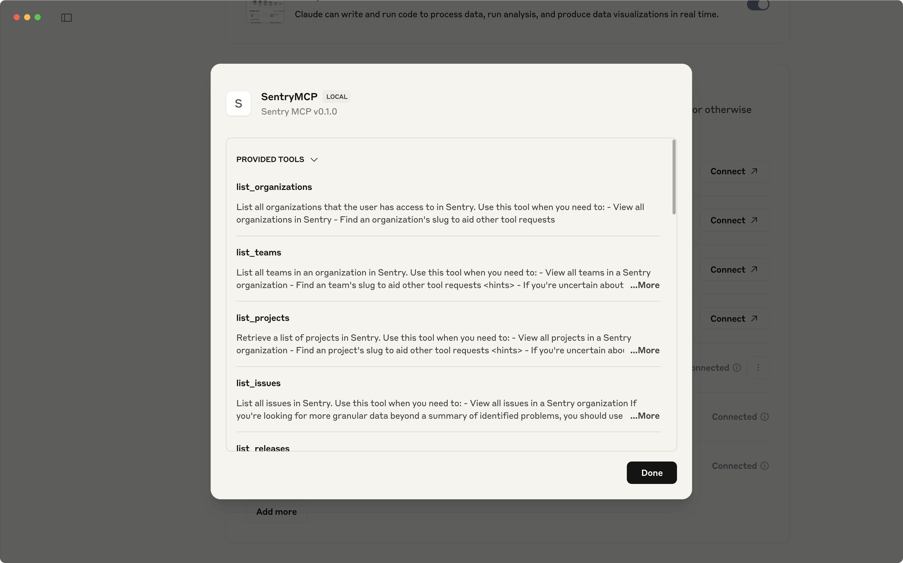
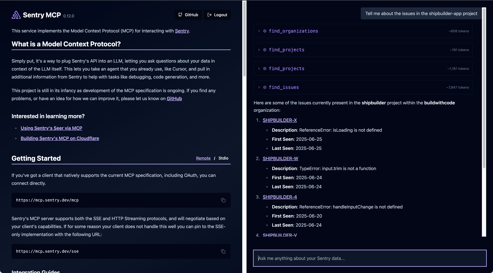

<Alert>
  The Sentry MCP Server is production-ready, but MCP is still evolving. Expect
  rough edges. File bugs on
  [GitHub](https://github.com/getsentry/sentry-mcp/issues).
</Alert>

The [Sentry MCP Server](https://mcp.sentry.dev) connects your AI coding tools to Sentry using the [Model Context Protocol (MCP)](https://modelcontextprotocol.io/introduction). It gives your agent direct access to issues, errors, projects, and [Seer](/product/ai-in-sentry/seer/) analysis.

## Setup

Sentry hosts the MCP server at `https://mcp.sentry.dev/mcp`. Your client connects over Streamable HTTP with OAuth — there's nothing to install.

Add the server automatically:

```bash
npx add-mcp https://mcp.sentry.dev/mcp
```

Or add it manually to your client's MCP configuration:

```json
{
  "mcpServers": {
    "Sentry": {
      "url": "https://mcp.sentry.dev/mcp"
    }
  }
}
```

When you first connect, you'll be prompted to log in with your Sentry organization and grant access. During authentication, you select which tool groups to expose — this keeps the context window focused on the tools you actually need.



See [Client Instructions](#client-instructions) for setup steps specific to your editor or IDE.

<Alert>
  If you've joined a new Sentry organization, log out of your LLM's MCP
  integration and log back in to refresh access.
</Alert>

### Stdio Transport

Alternatively, you can run the MCP server locally via `npx @sentry/mcp-server`. Your IDE spawns the process and communicates over stdin/stdout. This is required for [self-hosted Sentry](#self-hosted-sentry).

For sentry.io users, the server uses **device-code authentication**. On first run it opens your browser to log in — no manual token creation needed. The token is cached at `~/.sentry/mcp.json` for future sessions.

If you're in a non-interactive environment (CI, piped stdio), authenticate ahead of time:

```bash
npx @sentry/mcp-server@latest auth login
```

You can check or clear your auth state with `auth status` and `auth logout`.

Add the server to your client's MCP configuration:

```json
{
  "mcpServers": {
    "Sentry": {
      "command": "npx",
      "args": ["@sentry/mcp-server@latest"]
    }
  }
}
```

<Alert>
  When using stdio, the AI-powered search tools (`search_events`,
  `search_issues`) require an `OPENAI_API_KEY` environment variable for natural
  language query translation. The Cloud transport handles this automatically.
</Alert>

## Configuration

### Scope to an Organization or Project

Restrict the MCP session to a specific organization or project to keep context focused.

**Cloud:** Append the slug to the URL path:

- `https://mcp.sentry.dev/mcp/my-org` — one organization
- `https://mcp.sentry.dev/mcp/my-org/my-project` — one project

**Stdio:** Use CLI flags:

- `--organization-slug=my-org`
- `--project-slug=my-project`

When scoped, redundant discovery tools are hidden automatically.

## Self-Hosted Sentry

Self-hosted instances use the stdio transport with an access token. The Cloud endpoint and device-code OAuth are only available for sentry.io.

Create a token in **User Settings → Auth Tokens** with these scopes:

- `org:read`
- `project:read`
- `project:write`
- `team:read`
- `team:write`
- `event:write`

Configure the server with your hostname:

```bash
npx @sentry/mcp-server@latest --access-token=YOUR_TOKEN --host=sentry.example.com
```

Or as environment variables:

```bash
SENTRY_ACCESS_TOKEN=YOUR_TOKEN
SENTRY_HOST=sentry.example.com
```

JSON config for clients that support it:

```json
{
  "mcpServers": {
    "Sentry": {
      "command": "npx",
      "args": [
        "@sentry/mcp-server@latest",
        "--access-token=YOUR_TOKEN",
        "--host=sentry.example.com"
      ]
    }
  }
}
```

Some cloud-only features like Seer aren't available on self-hosted. Disable them:

```bash
npx @sentry/mcp-server@latest --access-token=YOUR_TOKEN --host=sentry.example.com --disable-skills=seer
```

<Alert>
  The MCP server targets the cloud service. Some tools may call APIs that aren't
  available in your self-hosted version yet.
</Alert>

## Common Workflows

### Debug an Issue from a Link

Paste a Sentry issue URL into your agent. The MCP server pulls the stack trace, event details, and tags so the agent can investigate and propose a fix. Try prompts like:

- "Fix this issue: `https://sentry.io/issues/6811213890/`"
- "What's the root cause of `https://my-org.sentry.io/issues/PROJECT-123/`?"

### Analyze Incidents with Search

Ask questions in plain English. The `search_issues` and `search_events` tools translate your queries into Sentry's search syntax:

- "What are the top unresolved errors in production this week?"
- "Show me errors that started after the last deploy."
- "Compare error rates between v2.3 and v2.4 for my-project."

## Client Instructions

Setup steps for specific editors and IDEs. All instructions default to the Cloud transport — see [Stdio Transport](#stdio-transport) if you need the local server.

### Claude Code

<Expandable title="Setup Instructions" group="clients">

```bash
claude mcp add --transport http sentry https://mcp.sentry.dev/mcp
```

Launch Claude Code with `claude`. You'll be prompted to authenticate via OAuth.

</Expandable>

### Cursor

<Expandable title="Setup Instructions" group="clients">

Go to `Cursor` → `Settings` → `Cursor Settings` → `MCP` and add the Sentry MCP server. Cursor 1.0+ supports OAuth and Streamable HTTP natively.

You can also edit your `mcp.json` directly:

```json
{
  "mcpServers": {
    "Sentry": {
      "url": "https://mcp.sentry.dev/mcp"
    }
  }
}
```

</Expandable>

### Claude for Desktop

<Expandable title="Setup Instructions" group="clients">

Open `CMD + ,` → `Developer` → `Edit Config`, then add to `claude_desktop_config.json`:

```json
{
  "mcpServers": {
    "Sentry": {
      "url": "https://mcp.sentry.dev/mcp"
    }
  }
}
```

Restart Claude Desktop to pick up the changes.

</Expandable>

### Claude.ai

<Expandable title="Setup Instructions" group="clients">

Go to `Settings` → `Profile` → `Integrations` → `Add More`, and add:

```
https://mcp.sentry.dev/mcp
```

</Expandable>

### VS Code and GitHub Copilot

<Expandable title="Setup Instructions" group="clients">

Open the Command Palette (`CMD+Shift+P`) → `MCP: Add Server` and enter:

```
https://mcp.sentry.dev/mcp
```

</Expandable>

### Codex

<Expandable title="Setup Instructions" group="clients">

```bash
codex mcp add sentry --url https://mcp.sentry.dev/mcp
```

Launch Codex with `codex`. You'll be prompted to authenticate via OAuth.

</Expandable>

### Windsurf

<Expandable title="Setup Instructions" group="clients">

Open Cascade (`CMD + L`) → `Configure MCP` and add:

```
https://mcp.sentry.dev/mcp
```

</Expandable>

### Warp

<Expandable title="Setup Instructions" group="clients">

Go to `Settings` → `MCP Servers` → `+ Add` → **Streamable HTTP or SSE Server (URL)**:

```json
{
  "Sentry": {
    "url": "https://mcp.sentry.dev/mcp"
  }
}
```

</Expandable>

### Amp

<Expandable title="Setup Instructions" group="clients">

**VS Code Extension** — update `settings.json`:

```json
"amp.mcpServers": {
    "sentry": {
        "url": "https://mcp.sentry.dev/mcp"
    }
}
```

**CLI:**

```bash
amp mcp add sentry --url https://mcp.sentry.dev/mcp
```

</Expandable>

### Factory Droid

<Expandable title="Setup Instructions" group="clients">

Open the MCP menu with `/mcp` → `Add MCP Server from Registry` → search for `sentry`.

</Expandable>

### Vercel v0

<Expandable title="Setup Instructions" group="clients">

In the [v0.app](https://v0.app) UI: `Prompt Tools` → `Add MCP` → select Sentry.

</Expandable>

### OpenCode

<Expandable title="Setup Instructions" group="clients">

Add to your `opencode.jsonc`:

```json
{
  "$schema": "https://opencode.ai/config.json",
  "mcp": {
    "sentry": {
      "type": "remote",
      "url": "https://mcp.sentry.dev/mcp",
      "oauth": {}
    }
  }
}
```

Then authenticate:

```bash
opencode mcp auth sentry
```

</Expandable>

### Other Clients

<Expandable title="Setup Instructions" group="clients">

The Sentry MCP Server works with any client that supports **OAuth** and **Streamable HTTP** (with SSE fallback). Use `https://mcp.sentry.dev/mcp` in your client's config.

If your client doesn't support OAuth or Streamable HTTP yet, use the [`mcp-remote`](https://www.npmjs.com/package/mcp-remote) bridge as a workaround.

</Expandable>

### Test the Connection

The [Sentry MCP page](https://mcp.sentry.dev) has a web interface where you can authenticate and test the server directly in your browser.



<VimeoEmbed id="1080588938?h=1e437d4874" />

## Troubleshooting

**OAuth Authentication Problems**

- Ensure your client supports OAuth
- Check that you have the right permissions in your Sentry organization
- Try reauthenticating (see below)

**Reauthenticating in Claude Code**

1. Type `/mcp` in the Claude Code prompt
2. Select the **Sentry** server
3. Choose **"Clear authentication"** or **"Authenticate"** to re-trigger OAuth

**Reauthenticating in OpenCode**

1. `opencode mcp auth list` — check status
2. `opencode mcp logout sentry` — log out
3. `opencode mcp auth sentry` — log back in

**Reauthenticating in Factory Droid**

1. Type `/mcp` → select **Sentry** → **"Reauthenticate"**

**Connection Issues**

- Verify the URL: `https://mcp.sentry.dev/mcp`
- Check your client's MCP config syntax

**Missing Tools**

- Verify authentication completed
- Check your Sentry org access
- Look for errors in your client's console

For additional help, visit the [GitHub repository](https://github.com/getsentry/sentry-mcp) or contact Sentry support.
