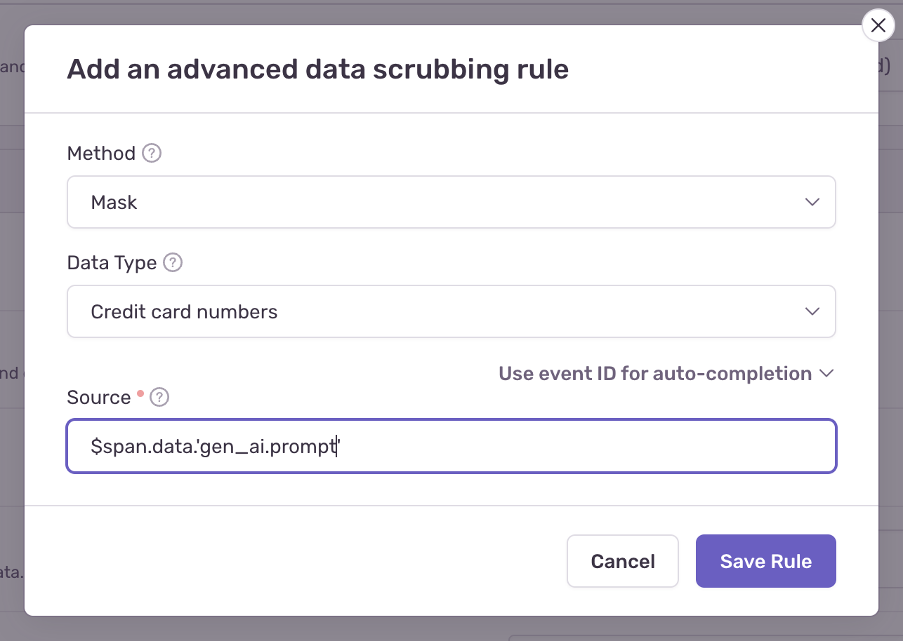

## SDK PII Settings

By default, Sentry AI agent integrations respect your [SDK's PII settings](/platforms/javascript/guides/nextjs/data-management/data-collected/):

- `sendDefaultPii: false` - Only metadata like model names, token counts, tool names, and execution times are collected
- `sendDefaultPii: true` - Full inputs, outputs, prompts, and responses from AI models and tools are captured.

You can override this by configuring it on a function call level. For more details see [Configuration](/platforms/javascript/guides/nextjs/configuration/integrations/vercelai/#configuration).

## Server side PII Scrubbing

<Alert level="info">

Sentry has built-in [Server-Side Data Scrubbing](/security-legal-pii/scrubbing/server-side-scrubbing/) that automatically detects and removes common sensitive data like credit card numbers, social security numbers, and passwords from most event data.

However, the following AI agent span attributes are not protected by default:

- `gen_ai.input.messages`
- `gen_ai.tool.call.arguments`
- `gen_ai.tool.call.result`
- `gen_ai.output.messages`
- `gen_ai.response.object`

</Alert>
If you wish to enable Data Scrubbing for any of these fields you can add Organization or Project-level [Advanced Data Scrubbing](/product/data-management-settings/scrubbing/advanced-datascrubbing/) rule in **Security & Privacy** [settings](https://sentry.io/orgredirect/organizations/:orgslug/settings/organization/security-and-privacy) in the following format: `$span.data.'<span attribute>'`.



## Stripping Images and Media from Messages

AI messages can carry inline media: base64-encoded images, audio, or files
embedded directly in the input and output. If this media might contain
sensitive information, you can scrub it before it's sent to Sentry while
keeping the rest of the conversation — roles, text, and tool calls — intact.

Use [`beforeSendSpan`](/platforms/javascript/configuration/options/#beforeSendSpan),
which runs on every span before it's sent, to replace inline media with a
placeholder. The example below walks each AI message and scrubs the media it
finds. Adjust `isInlineMedia` to match how your AI provider embeds media.

```javascript
const MEDIA_PLACEHOLDER = "[media stripped]";

// Span attributes whose values are JSON-encoded AI messages.
const AI_MESSAGE_ATTRIBUTES = [
  "gen_ai.input.messages",
  "gen_ai.output.messages",
  "gen_ai.system_instructions",
];

// Decide what should be treated as media. This default catches `data:` URIs
// and large base64 blobs; replace it with whatever matches your data best.
function isInlineMedia(value) {
  if (typeof value !== "string") return false;
  if (value.startsWith("data:")) return true;
  return value.length > 1024 && /^[A-Za-z0-9+/=\s]+$/.test(value);
}

// Replace anything isInlineMedia flags, keeping roles, text, and tool calls.
function stripInlineMedia(node) {
  if (typeof node === "string") {
    return isInlineMedia(node) ? MEDIA_PLACEHOLDER : node;
  }
  if (Array.isArray(node)) {
    return node.map(stripInlineMedia);
  }
  if (node && typeof node === "object") {
    return Object.fromEntries(
      Object.entries(node).map(([key, value]) => [key, stripInlineMedia(value)])
    );
  }
  return node;
}

Sentry.init({
  // ...
  beforeSendSpan(span) {
    for (const key of AI_MESSAGE_ATTRIBUTES) {
      const raw = span.data?.[key];
      if (typeof raw !== "string") continue;

      try {
        span.data[key] = JSON.stringify(stripInlineMedia(JSON.parse(raw)));
      } catch {
        // Not JSON or an unexpected shape — leave the value as-is.
      }
    }

    return span;
  },
});
```
