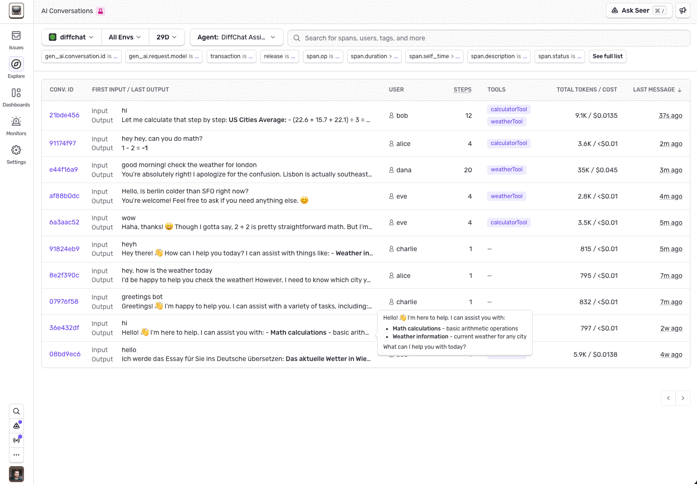

Sentry's Conversations view lets you observe the interactions users have had with your chat-based AI assistants. It provides a user-like view into past conversations, showing the full exchange of messages and tool calls so you can understand exactly what happened during each session.

## Prerequisites

Conversations are built on top of [AI Agent Monitoring](/ai/monitoring/agents/). Before you can use them, you need:

1. **Tracing enabled** with the Sentry SDK configured for your AI agent project. Follow the [Agent Monitoring getting started guide](/ai/monitoring/agents/getting-started/) if you haven't already.

2. **A conversation ID on your spans.** Sentry groups spans into conversations using the `gen_ai.conversation.id` attribute. You can set this manually, or some SDK integrations infer it automatically.

## Setting the Conversation ID

A conversation is a collection of spans that share the same `gen_ai.conversation.id`. This is typically the ID of the chat session in your application (for example, the session ID you store in your database).

### Auto-Instrumented

The following integrations automatically infer the conversation ID from the underlying AI SDK:

- **OpenAI Agents SDK** (Python)
- **OpenAI SDK** (Node)

If you're using one of these, no additional setup is needed.

### Manual

For all other integrations, set the conversation ID at the start of each conversation:

```python
import sentry_sdk

# Call this at the start of each conversation
sentry_sdk.ai.set_conversation_id("my-conversation-123")
```

```javascript
import * as Sentry from "@sentry/node";

// Call this at the start of each conversation
Sentry.setConversationId("my-conversation-123");
```

Use whatever identifier your application already uses for the chat session. All spans created after calling this method will be tagged with the given conversation ID.

### Conversations and Traces

Conversations and traces are independent concepts. A single conversation can span multiple traces. For example, if a user refreshes the page mid-conversation, the browser starts a new trace, but the conversation continues with the same ID.

The reverse is also true: a single trace can contain spans from different conversations. For example, if a user starts a new chat session without refreshing the page, the new conversation's spans appear in the same trace as the previous one.

## Conversations List

The [Conversations](https://sentry.io/orgredirect/organizations/:orgslug/insights/ai/conversations/) page shows the most recent conversations that match your filters.

{/* TODO: Add screenshot of conversations list */}
{/*  */}

Each row in the list displays:

- **First input** — the first user message in the conversation
- **Last output** — the most recent assistant response
- **Cost** — estimated dollar cost and token usage
- **LLM calls** — number of LLM generation requests
- **Tool calls** — number of tool executions

Use the filters at the top of the page to narrow results by project, date range, or agent.

## Conversation Detail

Click any conversation to open the detail view in a drawer.

{/* TODO: Add screenshot of conversation detail drawer */}
{/*  */}

The detail view shows a chat-like interface with the full message history: user inputs, assistant responses, and tool calls. Click on any message to see the underlying spans, including individual LLM generations and tool executions, with timing and error information.

This makes it straightforward to trace a conversation from start to finish and pinpoint where things went wrong.
