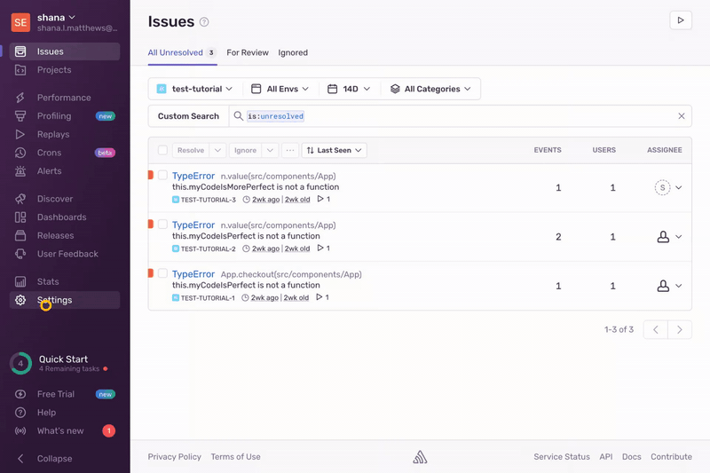

To use Sentry's APIs, you must have an authentication token. This tutorial walks you through creating an organizational auth token through an internal integration. Sentry recommends using organizational auth tokens whenever possible, as they aren't linked to specific user accounts.

See our documentation on [authentication](/api/auth/) to learn more about the different types of authentication tokens available.

## Prerequisites

- A Sentry account with an organization-level role of Manager or Admin.

## Create an Internal Integration

[Internal integrations](/product/integrations/integration-platform/internal-integration/) are used to create custom Sentry integrations for your organization. They can also be used to create and manage your organization auth tokens.

1. Open [sentry.io](https://sentry.io/)

1. Click "Settings" in the left menu to open the **Organization Settings** page.

1. Click "Custom Integrations" in the left side panel to create a new internal integration and org-level auth token.

1. Press the "Create New Integration" button.

1. Make sure "Internal Integration" is selected in the modal and press "Next".

1. Enter a name for your integration.

## Create a API Authentication Token

1. Under "Permissions" select the permissions required for the APIs you wish to call.

   Each API endpoint docs page lists the required permissions, in the "Scopes" section. For example, the [Create a New Project](/api/projects/create-a-new-project/) endpoint requires project:write permissions or higher.

1. Click "Save Changes".

1. Scroll down to the bottom of the page and copy the generated token under "Tokens".

Keep your auth token around on your clipboard or in an environment variable to use in API calls.
