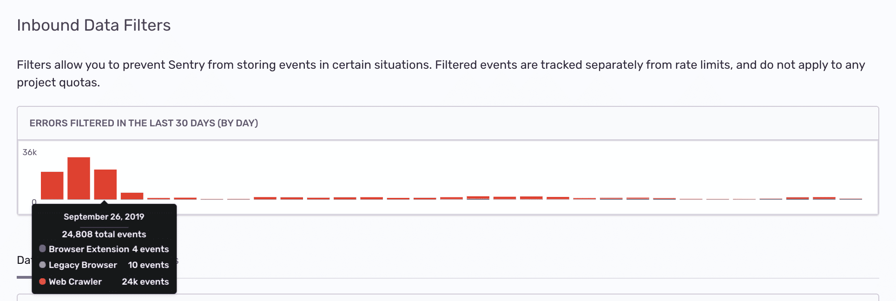

Sentry provides several methods to filter data in your project. Using sentry.io to filter events is a simple method since you don't have to [configure and deploy your SDK to filter projects](/platform-redirect/?next=/configuration/filtering/).

## Inbound Data Filters

Inbound data filters allow you to determine which errors, if any, Sentry should ignore. Explore these by navigating to [**Project Settings > Inbound Filters**](https://sentry.io/orgredirect/organizations/:orgslug/settings/projects/:projectId/filters/data-filters/).

These filters are exclusively applied at ingest time and not later in processing. This, for instance, lets you discard an error by error message when the error is ingested through the JSON API. On the other hand, this filter doesn't apply to ingested minidumps. Filtered events do not consume quota, as discussed in [What Counts Toward My Quota](/pricing/quotas/#what-counts-toward-my-quota-an-overview).

Inbound filters include:

- Common browser extension errors
- Transactions coming from health checks and ping requests
- Events coming from legacy browsers
- Events coming from localhost
- Errors from known web crawlers
- React hydration errors
- ChunkLoadErrors
- Events from certain IP addresses
- Events from non-allowed domains (origin-based; see [Allowed Domains](#allowed-domains))
- [Custom filters](#custom-filters) on error messages, error types, log messages, metric names, releases, and IP addresses

### Legacy Browser Filters

The legacy browser filters allow you to filter out certain legacy versions of browsers that are known to cause problems.

Legacy browser filters were updated in December 2025 and will be periodically evaluated to include additional legacy versions.

If you had a legacy browser filter on before the update, the old filter will appear in your settings as "Deprecated". Deprecated legacy browser filters still work. However, if you turn them off, you won't be able to turn them on again and will need to use the new filters instead.

### Browser Extension Errors

Some browser extensions are known to cause errors. You can filter these out using the browser extension filter, which checks the error message and event source to see if it's a known error coming from a browser extension. To see the full list of errors filtered out by the browser extension filter, see the [source code in relay](https://github.com/getsentry/relay/blob/master/relay-filter/src/browser_extensions.rs#L9-L76).

### Web Crawler Errors

Due to their nature, web crawlers often encounter errors that normal users won't see. You can use the web crawler filter to filter out errors from web crawlers, determined by the event's user-agent, from the following sites: Baidu, Yahoo, Sogou, Facebook, Alexa, Slack, Google Indexing, Pingdom, Lytics, AWS Security Scanner, Hubspot, Bytedance, and other generic bots and spiders. Errors from Slack's Slackbot web crawler will not be filtered.

### IP Addresses

Filters events based on the **originating IP address of the client making the request**, not the user IP contained within the user data inside the request. This ensures that filtering decisions rely on the actual source of the request, as determined by network-level information, rather than data provided in the event payload.

Sentry attempts to identify the request's origin using the **forwarded IP address**. If no forwarded IP is available, it falls back to the **direct IP** of the client connecting to Sentry's servers.

The supported IP address formats are:

- **IPv4 Addresses**: Standard dotted-decimal notation (e.g., 1.2.3.4, 122.33.230.14, 127.0.0.1).
- **IPv6 Addresses**: Standard colon-separated hexadecimal notation (e.g., aaaa:bbbb::cccc, a:b:c::1).
- **IPv4 Network Ranges (CIDR Notation)**: IPv4 address with a subnet mask (e.g., 122.33.230.0/30, 127.0.0.0/8).
- **IPv6 Network Ranges (CIDR Notation)**: IPv6 address with a subnet mask (e.g., a:b:c::0/126).

### Allowed Domains

Sentry checks the `Origin` or `Referer` HTTP header of each inbound request against your project's allowed domain list. Requests from unrecognized origins are rejected and appear as **Disallowed Domain** in your [Stats](/product/stats/).

This filter only applies to requests that include an `Origin` or `Referer` header. Requests without one — common for server-side SDKs and direct API submissions — are always accepted, even when an allowed domain list is configured. To restrict server-side ingestion, use a [project rate limit](/pricing/quotas/#rate-limits) or an allowlist at the network level.

### Transactions Coming from Health Check

In essence, the health check filter serves the purpose of excluding transactions that are generated as a part of health check procedures.

By applying this filter, you effectively bypass transactions that, while crucial for app stability assessment, hold limited value for you beyond their designated function.

We consider a transaction to be a health check if its name matches one of the following glob patterns:

- `*healthcheck*`
- `*health-check*`
- `*heartbeat*`
- `*/health`
- `*/healthy`
- `*/healthz`
- `*/_health`
- `*/[_health]`
- `*/live`
- `*/livez`
- `*/ready`
- `*/readyz`
- `*/ping`
- `*/up`

## Session Replay Filtering

Inbound data filters have partial support for [Session Replay](/product/session-replay/). Only a subset of the available inbound filters apply to Session Replays.

The following inbound filters **do** apply to Session Replays:

- **IP Addresses** - Filters replays based on the originating IP address
- **Releases** - Filters replays from specific release versions
- **Request URLs** - Filters replays based on the URL where the replay was captured
- **User-Agents** - Filters replays based on the browser's user-agent string

The following inbound filters **do not** apply to Session Replays:

- Error messages
- Browser extension errors
- Web crawler errors
- Legacy browser filters
- React hydration errors
- ChunkLoadErrors
- Health check transactions

**Note**: Because filtered outcomes are emitted per **segment** whereas successful outcomes are emitted per **replay** (a replay being a collection of segments), you may see a noticeable increase in filtered outcomes on your [Stats](https://sentry.io/orgredirect/organizations/:orgslug/stats) page when Session Replay filtering is active. This is expected behavior and not an error.

<hr />

<Alert title="Note" level="warning">

Error messages from minidumps do not yet apply.

</Alert>

Once applied, you can track the filtered events (numbers and cause) using the graph provided at the top of the Inbound Data Filters view.



## Logs Filtering

Inbound data filters have partial support for [Logs](/product/logs/). Only a subset of the available inbound filters apply to Logs.

The following inbound filters **do** apply to Logs:

- **Log Message** - Filters logs based on the log message match
- **Releases** - Filters logs from specific release versions

The following inbound filters **do not** apply to Logs:

- Error messages
- Browser extension errors
- Web crawler errors
- Legacy browser filters
- React hydration errors
- ChunkLoadErrors
- Health check transactions
- IP Address
- Request URLs
- User-Agents

## Application Metrics Filtering

Inbound data filters have partial support for [Application Metrics](/product/metrics/). The following inbound filters **do** apply to Application Metrics:

- **Application Metrics** - Filters Application Metrics by metric name (supports glob pattern matching, for example `my_metric.*`)
- **Releases** - Filters Application Metrics from specific release versions

## Custom Filters

<Include name="feature-available-for-plan-trial-business.mdx" />

A custom filter drops data that matches all of its conditions. Use it for noise the built-in filters do not cover, such as a flaky error message, traffic from one IP range, or logs from an old release. Like every inbound filter, a custom filter runs at ingest time, and filtered data does not count toward your quota.

Create and manage custom filters under **Filter Rules** in [**Project Settings > Inbound Filters**](https://sentry.io/orgredirect/organizations/:orgslug/settings/projects/:projectId/filters/data-filters/), or with the [API](#custom-filter-api). A filter has:

- A **name** that identifies it in the table and in its statistics.
- A **data type** that selects the kind of data the filter inspects.
- One or more **conditions**. The filter drops data only when every condition matches.
- An **active** toggle. An inactive filter is kept but has no effect.

The Releases, Error Message, Log Message, and Application Metrics lists from the previous version of this page appear in the table as custom filters. They keep their statistics.

### Data Types

| Data type      | What the filter inspects                                               |
| -------------- | ---------------------------------------------------------------------- |
| Errors         | Error and message events                                               |
| Logs           | [Logs](/product/logs/)                                                 |
| Metrics        | [Application Metrics](/product/metrics/)                               |
| Spans          | Spans                                                                  |
| All Data Types | Every kind of data Sentry ingests, including kinds added in the future |

A filter on **All Data Types** only accepts the conditions that every data type carries: **Release** and **IP Address**.

### Conditions

A condition names a property and lists the values to match. Enter one value per line. The condition matches when any of its values matches. Values are [glob patterns](#glob-matching), except for IP addresses.

| Condition     | Data types | Matches                                                                    |
| ------------- | ---------- | -------------------------------------------------------------------------- |
| Error Message | Errors     | The exception type, the exception value, or the message of the event       |
| Error Type    | Errors     | The exception type alone, such as `TypeError`                              |
| Log Message   | Logs       | The body of the log                                                        |
| Metric Name   | Metrics    | The name of the metric, such as `checkout.*`                               |
| Release       | All        | The release the data was sent from                                         |
| IP Address    | All        | The IP address the data was sent from, as a single address or a CIDR range |

Conditions in one filter combine with AND. To drop data that matches either of two patterns, put both patterns in one condition. To drop data that matches both, use two conditions. A filter has at most 10 conditions, and a project has at most 50 filters. The values of one filter add up to at most 4000 characters.

Custom filters are not case-sensitive.

#### Error Message

- The condition checks the exception type, the exception value, and the message of the event separately. It does not check the combined `{exception.type}: {exception.value}` description, so match with wildcards. For example, to drop any "ConnectionError", use `*ConnectionError*`.
- On message events, the condition matches the fully formatted message.
- Transactions are never matched by this condition.

To find the text to match, open the JSON of an event in the issue. The condition matches the data found in the `exception` values and in the `logentry` field.

<Alert title="Note" level="warning">

Matching on the deobfuscated `{exception.type}` is not supported for <PlatformLink to="/enhance-errors/proguard/">ProGuard</PlatformLink> events, because deobfuscation of class names happens after ingestion. See [Troubleshooting](#error-message-filters-do-not-match-deobfuscated-exception-types).

</Alert>

#### Error Type

The condition checks the exception type alone. An event with several chained exceptions matches when any of their types matches. Use it to narrow a filter to one type without also matching events that only mention that type in their message.

#### Release

- The condition matches the full release name provided during SDK initialization. If you provide the recommended package prefix, the release is in the format `package@version`, for example: `my-example@1.4.0-beta.1`.
- Globbing rules apply and there is no special casing for SemVer. This allows for matching prefixes, such as `my-example@1.*`.
- The condition never matches data without a release.

While you edit a release condition, Sentry warns you about a pattern that matches no release of the project. The filter still saves, because the pattern may be meant for a release that has not shipped yet.

#### Log Message

The condition matches the body of the log. Match with wildcards instead of the full message. For example, to drop any "Connection timeout asbq33q", use `*Connection timeout*`.

#### Metric Name

The condition matches the name of the metric. For example, to drop all metrics under the `my_metric` namespace, use `my_metric.*`.

#### IP Address

The condition matches the originating IP address of the request, with the same rules as the built-in [IP Addresses](#ip-addresses) filter. Enter a single address or a network range in CIDR notation, such as `203.0.113.7` or `10.0.0.0/8`. Sentry rejects a value that is not a valid address or range.

### Filter Statistics

The **Trend** and **Filtered** columns of the table show how much data each filter dropped in the last 30 days, split by data category. The [Stats](/product/stats/) page counts this data as filtered.

### Custom Filter API

You can manage custom filters with the API. The requests need an auth token with the `project:write` scope.

| Operation                     | Endpoint                                                                                                                |
| ----------------------------- | ----------------------------------------------------------------------------------------------------------------------- |
| List the filters of a project | [`GET /projects/{org}/{project}/custom-inbound-filters/`](/api/projects/list-a-projects-custom-inbound-filters/)        |
| Create a filter               | [`POST /projects/{org}/{project}/custom-inbound-filters/`](/api/projects/create-a-custom-inbound-filter/)               |
| Retrieve a filter             | [`GET /projects/{org}/{project}/custom-inbound-filters/{filter_id}/`](/api/projects/retrieve-a-custom-inbound-filter/)  |
| Update a filter               | [`PUT /projects/{org}/{project}/custom-inbound-filters/{filter_id}/`](/api/projects/update-a-custom-inbound-filter/)    |
| Delete a filter               | [`DELETE /projects/{org}/{project}/custom-inbound-filters/{filter_id}/`](/api/projects/delete-a-custom-inbound-filter/) |

The `dataType` field takes `error`, `log`, `metric`, `span`, or `all`. Each condition has a `type` of `error_message`, `error_type`, `log_message`, `metric_name`, `release`, or `ip_address`, and a list of values. For example, this request creates a filter that drops errors whose message mentions a refused connection:

```bash
curl https://sentry.io/api/0/projects/{organization_id_or_slug}/{project_id_or_slug}/custom-inbound-filters/ \
  -H 'Authorization: Bearer <auth_token>' \
  -H 'Content-Type: application/json' \
  -d '{
    "name": "Ignore flaky connection errors",
    "dataType": "error",
    "conditions": [
      {"type": "error_message", "value": ["*connection refused*", "*ECONNRESET*"]}
    ]
  }'
```

The built-in filters on this page, such as the browser extension or web crawler filters, use the separate [data filters](/api/projects/list-a-projects-data-filters/) endpoints.

### Glob Matching

The error message, error type, log message, metric name, and release conditions use glob patterns. Globs are case insensitive and allow you to specify wildcards to match variable input. For example, `*panic*` matches any error that contains the words "panic", "PANIC" or "PaNiC".

Some symbols, such as the `*` character, receive special meaning as meta characters. To match a literal asterisk, escape it with a backslash: `\*`. Inbound data filters use the following meta characters:

- `?` matches any single character.
- `*` matches zero or more characters.
- `\` escapes the next character making it literal. If it precedes a non-meta character, the backslash is ignored.
- `[`, `]`, `{`, and `}` are reserved meta characters.
- `!` works for negation, but only within brackets, such as in `[!1-4]` to match any character that is not `[1-4]`.

Generally, `bash`'s out-of-the-box behavior for globbing is close to what Sentry supports:

```bash
touch 1.2.3
touch 1.2.4
echo 1.2.*
echo 1.2.[!3]
```

## Troubleshooting

### Error Message Filters Do Not Match Deobfuscated Exception Types

Inbound filters run immediately after Sentry receives an event. They do not wait for later processing such as symbolication, deobfuscation, or ProGuard mapping. For error events, Sentry matches the filter against `{exception.type}: {exception.value}` from the ingested event.

If an error message filter does not filter an event, compare the filter against the event as Sentry received it, not only the issue title shown after processing. To find the original exception type, open the event JSON by clicking **{} View JSON** in the event header, then check `exception.values.raw_type`.

For example, a filter such as `MyExceptionType: *` only matches events whose incoming exception type is `MyExceptionType`. If the app sent an obfuscated exception type, such as `x`, and Sentry later deobfuscated it to `MyExceptionType`, the event JSON may show `raw_type: "x"` while the issue title shows `MyExceptionType`. In that case, filter on the incoming exception type or configure your obfuscator to keep that exception type unchanged.
