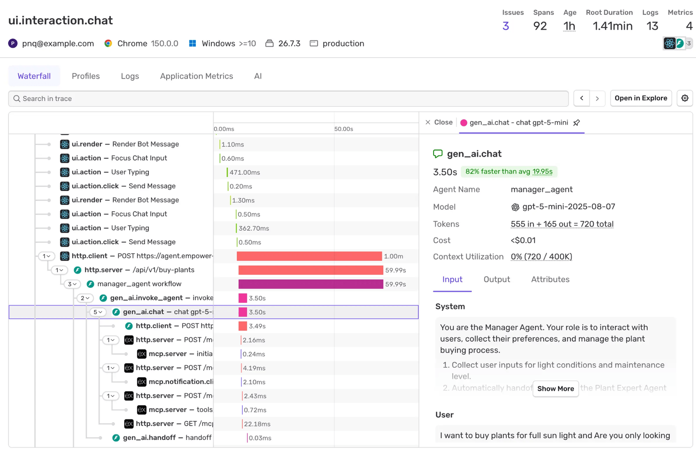
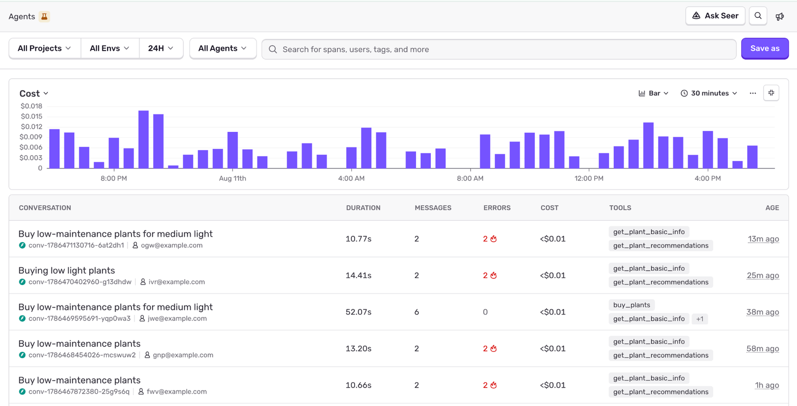
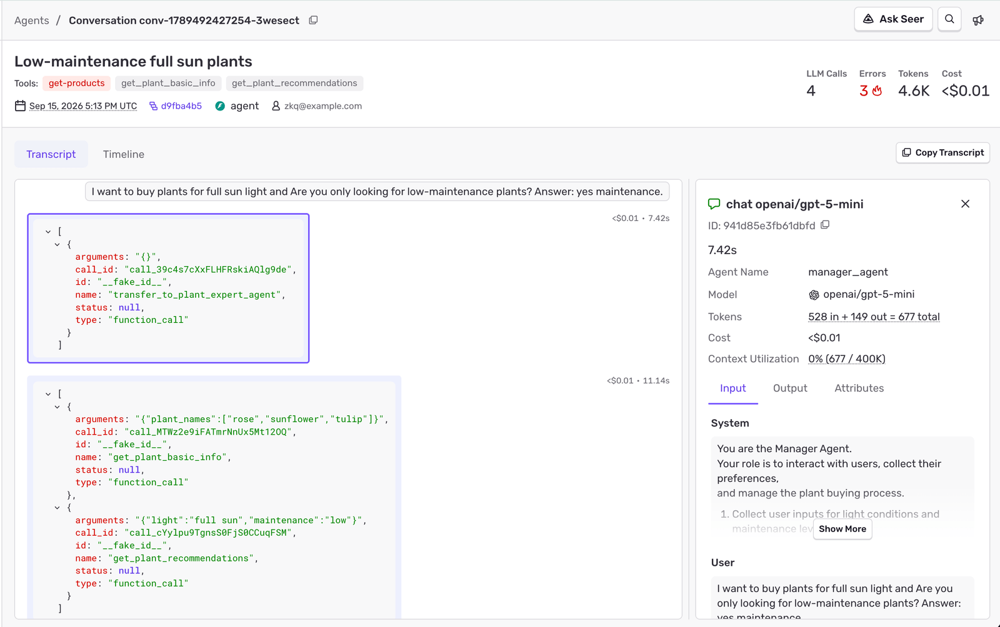
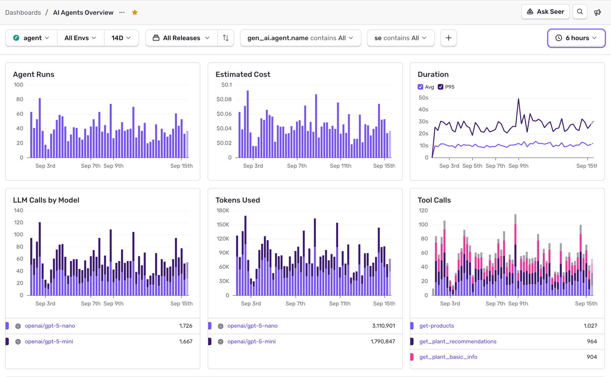

## What Is Agent Tracing?

[**Agent tracing**](/product/agents/) follows an agent throughout an entire run. It captures every model call, tool call, and handoff as a sequence of [spans](/concepts/key-terms/tracing/#whats-a-span) within a single [trace](/concepts/key-terms/tracing/#whats-a-trace). It shows you input, output, latency, and cost at each step of its workflow. Instead of looking at a single isolated LLM request, agent tracing gives you the entire chain of events from first input to final response.

Agent tracing uses the standard distributed tracing model from modern observability. Agent spans show up beside HTTP, database, and queue spans in the same trace. This combined view is what makes agent observability most valuable: understanding whether the agent was successfully deployed, and what happened along the way.

If you want to jump to how Sentry brings this data together to help you fix or improve your agents, skip to [How Agent Tracing Can Help You Debug](#how-agent-tracing-can-help-you-debug).

### How Agent Tracing Differs From LLM Monitoring

Both LLM monitoring and agent tracing are part of AI observability. They are used to track your AI-powered systems in production. While LLM monitoring often tracks one call to a model, and converts that into monitoring tools like dashboards, agent tracing tracks a full agent run, including LLM monitoring data, to provide everything you need to not only monitor, but debug and improve your agents. 

1. Data you see in AI Observability.

   - **LLM monitoring**: prompt, completion, tokens, latency, cost, model version.
   - **Agent tracing**: the full decision path. Which tools the agent called, in which order, with which inputs and outputs, and where each LLM call fits in that path.

2. Failure diagnosis.

   - **LLM monitoring** helps you find problems in one call (a bad prompt, a slow response, a high cost).
   - **Agent tracing** helps you find problems in the flow (the agent called the wrong tool, the agent looped, or one step passed bad data to the next step).

3. Data structure.

   - **LLM monitoring** data is a flat list of calls.
   - **Agent tracing** data is a span hierarchy or tree, as a part of [distributed tracing](/concepts/key-terms/tracing/distributed-tracing/), with agent-specific spans (for example: "tool call", "planning step", "LLM call").

### What's an Agent Run?

An **agent run** is the lifespan of an agent: from user input to its final response. A single run can include many model calls, tool calls, and handoffs. Agent tracing captures every step of the agent run, so you can see whether anything went wrong along the way. For example, when asked to fix a failing test:

1. **User inputs** "*Fix the failing test in test_auth.py*".
2. **Model call**: The agent figures out what to check first.
3. **Tool call**: The agent reads the test file to understand what's failing.
4. **Model call**: The agent reasons about the cause of the failure.
5. **Tool call**: The agent edits the file to apply the fix.
6. **Tool call**: The agent runs the test suite to confirm the fix.
7. **Final response to user**: "*The failing test has been fixed. Tests now pass.*".

This whole sequence is one agent run, from user input to final confirmation response. All of this gets captured as one agent trace: several model call spans, tool call spans, connected end to end.

### What's a Model Call Span?

A **model call span** is a type of span that records a single request to an LLM. This is the same data used in LLM monitoring. It tells you what model was called, the input and output, token usage, cost, and duration. For instance, in the previous agent run example where the agent tries to figure out what to check first:

|              |                                            |
| ------------ | ------------------------------------------ |
| **Model**    | sonnet-5                                   |
| **Input**    | *User request and system prompt*            |
| **Output**   | *The model's reasoning about what to check* |
| **Tokens**   | 340                                        |
| **Cost**     | $0.002                                     |
| **Duration** | 800ms                                      |

If something went wrong, like it is the wrong model, there's a missing piece of context in the prompt, or an answer is offered that didn't match the prompt, a model call span like this would show you exactly what was sent to the model and what it returned.

### What's a Tool Call Span?

A **tool call span** is a type of [span](/concepts/key-terms/tracing/#whats-a-span) that's part of the agent run. It records a single function or tool call made by an agent. The span tells you which tool was called, its input, output, and how long it took. It's often one of the first things to look at when a run goes wrong. For example, when an agent reads a file, like `test_auth.py`, the tool call span for that would look something like this:

|              |                              |
| ------------ | ---------------------------- |
| **Tool**     | `read_file`                  |
| **Input**    | `{ "path": "test_auth.py" }` |
| **Output**   | *The file contents*          |
| **Duration** | 42ms                         |

If something went wrong, like the wrong file got called, a bad argument got passed, or there is a silent tool failure, a tool call span like this would tell you what was requested and what was returned at that one step. Having this span within a trace will give visibility into not only the agent's actions, but what else was happening in your application for this session. 

### What's an Agent Handoff?

An **agent handoff** is the process where an agent delegates tasks to other agents, enabling multi-agent systems where more than one agent works on a single request. Some agents are better suited for certain tasks than others, so depending on the context or user request, a different sub-agent specialized in handling one part of the task, can take over and complete the task on its own. For example, customer support triage can look like this:

1. User messages a support bot: "*Can I get a refund for my last order?*".
2. A generic triage agent receives the message. Its only job is to figure out the type of request.
3. It recognizes that it's a billing query, and hands it off to the specialized billing agent.
4. The billing agent has the tools available to look up the order and process the refund.

To the user, this happens seamlessly. But behind the scenes, control and context are passed around from one agent to another.

### What's an Agent Conversation?

An agent [**conversation**](/product/agents/conversations/) is a collection of spans that share the same `gen_ai.conversation.id`, providing a single, chat-like view into a user's full session. While an agent run covers a single exchange, a conversation can contain multiple runs. Sending messages in a chat can trigger multiple agent runs, each producing their own set of spans. `gen_ai.conversation.id` stitches those separate spans into a single connected view. A conversation can exist across multiple traces, and multiple conversations can exist inside one trace.

## How to Use Agent Tracing in Sentry

### Agent Runs - Trace View

Every agent run shows up in Sentry as spans in a distributed trace, the same connected view used for any request in your app. Reviewing an agent run's trace shows you the full waterfall of spans that made it up, in the order they happened:

- **Model calls**: which model was used, plus its tokens, cost, and duration.
- **Tool calls**: which tool was called, its input and output, and how long it took.
- **Handoffs**: where one agent passed the work to another.

Because these spans sit inside the same trace as your regular application, you can see the entire request end to end.

### Explore Agent Conversations

[**Conversations**](/product/agents/conversations/) let you review past conversations with your agents. You can see a list of conversations, filtering by project, agent, environments, time range, and attributes. At a high level, the list will show:

- **Conversation**: Title, project, conversation ID, and user. The title comes from the first user message, uses that message text until a generated title is available, or shows **Untitled conversation** when there are no user messages.
- **Duration**: Total time spent in model-generation spans.
- **Messages**: Number of recorded model interactions.
- **Errors**: Number of spans that ended with an error.
- **Cost**: Estimated cost of the conversation.
- **Tools**: Names of tools used during the conversation.
- **Age**: How long ago the conversation was last active.

Digging into a specific conversation gives you a full chat-like view with the full transcript, including:

- **User inputs**
- **Model calls**
- **Tool calls**
- **Handoffs**
- **Agent responses**
- **Side by side view of the calls and their span data**

For each agent step, you can see things like which model was used, token usage, context utilization, and cost.

### Agents Dashboard

The [**agents dashboard**](/product/agents/dashboards/) gives you a high-level overview of most of your agents' activities:

- **Agent Runs**: Shows agent runs over time and releases to track overall activity.
- **Duration**: Displays average and P95 response times for your agent executions.
- **LLM Calls by Model**: Breakdown of LLM calls per model.
- **Tokens Used**: Token usage by top models.
- **Tool Calls**: Tool call volume and trends.
- **Estimated Cost**: Estimated cost of the agent runs.

Click into a specific model for a detailed dashboard view, or scroll through the list of traces to investigate specific agent runs.

### What About Sensitive Data Input?

Depending on the data your agents handle, some of it may be sensitive and shouldn't be recorded in a span. Prompts and agent output aren't recorded by default in Sentry. This is an opt-in feature you can enable by setting `recordInputs`, `recordOutputs`, or both, to true in your Sentry SDK integration options.

[Here is an example from our JavaScript SDK using the Vercel AI SDK →](/platforms/javascript/guides/cloudflare/agent-tracing/vercelai/#record-inputs-and-outputs)

You can explore <PlatformLink to="/agent-tracing/">agent tracing for your SDK here</PlatformLink>.

## How Agent Tracing Can Help You Debug

Agents tend to fail differently than most applications. These quiet failures are usually several steps removed from the user and don't throw an error at all. Here are a few scenarios where agent tracing helps you find out what *really* happened behind the scenes.

### Debug Silent Tool Failures

Tool calls don't have to fail loudly to fail. Most of the time they happen silently without you (or the user) noticing. For example:

1. An agent calls a search tool to look up a customer's order status.
2. The search tool requires a customer ID, but the agent passes an invalid one.
3. The tool call doesn't error. It just returns nothing.
4. The agent has two choices:

   1. Hallucinate an answer that sounds plausible.
   2. Claim that no orders could be found.

Nothing in your error monitoring would ever catch that.

The tool call span for that step shows you exactly what was requested and what came back, so you can see the actual cause instead of guessing from the final response alone. Since agents are non-deterministic, re-creating a silent tool failure can be nearly impossible. The next time it runs, it might pass the correct customer ID, and find the order without any issues.

### Find the Slow Step in a Multi-Step Workflow

An agent run taking several seconds doesn't tell you where that time was spent. For example:

1. A support agent needs to answer a few billing questions.
2. It looks up the customer's account.
3. It checks their subscription status.
4. It pulls their most recent invoices before responding.
5. The whole run feels slow, but it isn't clear which step caused the delay.

It could be any of the three tool calls, or any of the model calls, or something else within the trace.

An agent trace breaks the run into its individual spans, showing you the duration of each. That's how you'd find out that the subscription check alone accounts for 75% of the time spent, while every other step finishes almost instantly.

Agents work within a distributed ecosystem. The issue doesn't have to be inside the tool's or the agent's logic. If that tool queries a database, the query shows up as its own span nested inside that tool call. Everything is within the same distributed trace, so you can tell whether the real bottleneck is the agent, the tool, or a slow database query underneath it.

### Track Token Cost Per Run

It's easy to estimate costs for a single expensive model call. A multi-step agent run is a more complicated story. Every model call in a multi-step run has its own tokens and costs, so when the agent produces its final response, you'll end up with a combined bill rather than one line item. For example:

1. An agent run usually makes two model calls that cost a few cents.
2. One day, that same run costs 10 times more.
3. Without insight, all you'd see is a larger bill at the end of the month.

With agent tracing, each model call span shows you exactly how much it costs and how many tokens it consumed. You'd be able to see that one step called an expensive model several times in a row instead of just once, or that a tool returned a block of text big enough that the agent was forced to reprocess it.

[Learn how to build an agent spend dashboard with alerts →](https://sentry.io/cookbook/monitor-ai-agent-spend-with-dashboards-and-alerts/)

### Debug Multi-Agent Handoffs

Agent handoffs can sometimes go wrong despite getting routed to the right agent. For example:

1. A user in need of a refund tells the triage agent their order number.
2. The triage agent sees that it's a billing question and hands it off to the billing agent.
3. The billing agent receives the handoff, but the order number is missing.
4. The billing agent has two choices:

   1. Ask for the order number again.
   2. Guess which order number the user meant.

Because a handoff gets captured as its own span within the run, marking the exact point where one agent passes its work to another, you can see exactly what context got passed on, and compare it to what the billing agent *actually* used. If the order number was in the initial message from the user, but then ended up missing by the time the billing agent took over, you've found the culprit.

Once your checks are defined, you never have to run them by hand. By creating a scheduled routine that reviews every agent conversation daily and flags tool errors, latency spikes, and cost anomalies in advance, you can have agent issues triaged directly to your team, with all the context you're capturing with agent tracing.

[See how to automate agent triage →](https://sentry.io/cookbook/automate-ai-agent-triage-claude-routines/)

**Get started with agent tracing today by** <PlatformLink to="/agent-tracing/">**setting it up in your SDK**</PlatformLink>.