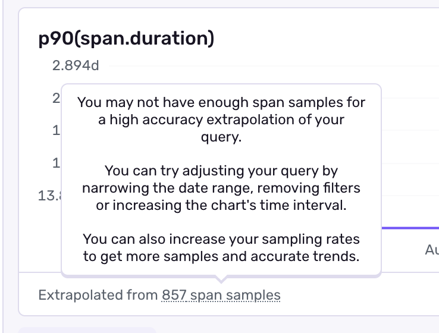

When you use [sampling](/concepts/key-terms/sample-rates/) to control the volume of data sent to Sentry, you're only capturing a portion of your app's actual traffic. For example, if you sample 10% of 1000 requests, Sentry receives 100 spans. But how do you easily see the actual traffic and performance metrics for your app? 

That's where extrapolation comes in. Sentry automatically uses extrapolation to calculate accurate metrics from your sampled data, giving you a realistic view of your application's behavior without requiring you to capture every single event, or do the math yourself.

## Why Extrapolation Matters

When you sample data, you need a way to understand what the full picture looks like. Extrapolation solves three key problems:

- **See real-world numbers**: View metrics that reflect your actual traffic volume, not just the sampled portion. If you sample 10% of 1000 requests, Sentry shows you metrics for all 1000 requests — no mental math required.

- **Consistent data when sample rates change**: If you adjust your sample rate from 10% to 1%, your graphs and alerts stay stable. Without extrapolation, you'd see a sudden drop in all your metrics that has nothing to do with actual performance changes.

- **Accurate aggregates across different sample rates**: Different parts of your application might have different sample rates. Extrapolation correctly combines data from an endpoint sampled at 1% with another at 100%, giving you accurate percentiles and averages across your entire app.

## How Extrapolation Works

Every span sent to Sentry includes its sampling rate. Sentry uses this to calculate a **sampling weight** — the number of original spans that each sample represents.

For example:
- At a sampling rate of 10%, the weight is 10
- At a sampling rate of 50%, the weight is 2  
- At a sampling rate of 100%, the weight is 1

When you run queries, Sentry uses these weights to give you accurate counts, averages, and percentiles.

### Example

Let's say you query for database spans (`span.op:db`) and Sentry returns 2 sampled spans:

| span_id | span.op | span.duration | sampling_factor | sampling_weight |
| --- | --- | --- | --- | --- |
| a1b2c3 | db | 100ms | 0.1 | 10 |
| d4e5f6 | db | 200ms | 0.5 | 2 |

Even though you only see 2 spans, extrapolation helps Sentry calculate metrics for all the spans they represent:

**Count**: `10 + 2 = 12` estimated spans

**Sum**: `(10 × 100ms) + (2 × 200ms) = 1,400ms`

**Average**: `(100ms × 10 + 200ms × 2) / (10 + 2) = 117ms`

Sentry weights the metrics by the sampling rates so you get accurate results that reflect your application's true performance.

## What Can Be Extrapolated

Most common aggregates can be extrapolated:

| Aggregate | Can be extrapolated? |
| --- | --- |
| count | Yes |
| avg | Yes |
| sum | Yes |
| percentiles (p50, p75, p90, p95, p99) | Yes |
| min | No |
| max | No |
| count_unique | No |

Extreme values like `min` and `max` aren't extrapolated because they're less stable when sampling — a single outlier can have an outsized impact.

## When to Turn Off Extrapolation

While extrapolation is usually helpful, if you are exclusively looking to confirm your sampling usage or look exclusively at sampled data, you can turn off extrapolation.

You can disable extrapolation using the settings icon above charts in tools like Trace Explorer. Note that with extrapolation off, your metrics will only reflect the sampled data, not your full traffic.

<Alert>
If Sentry displays a **low confidence warning**, it means there isn't enough sampled data for reliable extrapolation. Consider increasing your sample rate or widening your query filters.
</Alert>

