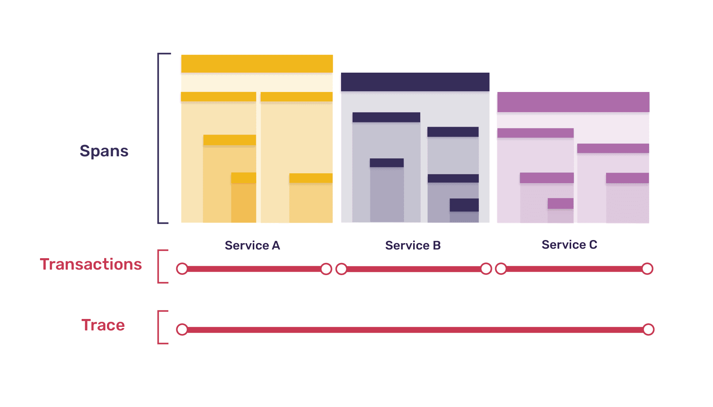
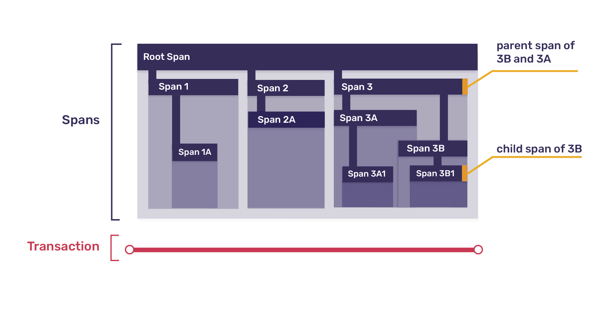
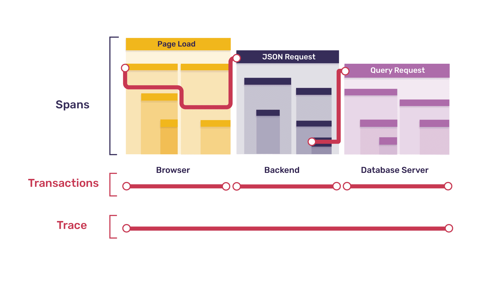

Distributed tracing provides a connected view of your application from frontend to backend. It helps track software performance, measure [metrics](/product/performance/metrics/) like throughput and latency, and display the impact of errors across multiple systems. This makes Sentry a more complete [performance monitoring](/product/performance/) solution, aiding in diagnosing problems and measuring your application's overall health.

[Tracing](/concepts/key-terms/tracing/distributed-tracing/) in Sentry provides insights such as:

- What occurred for a specific error event or issue
- The conditions causing bottlenecks or latency issues
- The endpoints or operations consuming the most time

## What Is Distributed Tracing?

A tracing tool focuses on what happened (and when), logging events during a program's execution across multiple systems. Traces often include timestamps, allowing durations to be calculated, but their purpose is broader, showing how interconnected systems interact and how problems in one can affect another. While tracing can be useful if instrumented in just the frontend or backend, it's most powerful when set up for your full stack (distributed tracing).

It's important to note that tracing is not [profiling](/product/explore/profiling/). A profiler measures various aspects of an application's operation, resulting in a statistical summary. While both diagnose application problems, they differ in what they measure and how data is recorded.

Learn more in this [Tracing: Frontend issues with backend solutions](https://sentry.io/resources/tracing-frontend-issues-with-backend-solutions/?original_referrer=https%3A%2F%2Fblog.sentry.io%2F) workshop.

### The Tracing Data Model

Ultimately, any data structure is defined by the kind of data it contains, and relationships between data structures are defined by how links between them are recorded. Traces, transactions, and spans are no different.

#### Traces

Traces are defined as the collection of all transactions that share a `trace_id` value.

#### Transactions

Transactions share most properties (start and end time, tags, and so on) with their root spans. They also have a `transaction_name` property, used in the UI to identify the transaction. Common examples include endpoint paths for backend request transactions, task names for cron job transactions, and URLs for page-load transactions.

Before the transaction is sent, the `tags` and `data` properties will get merged with data from the global scope. (Global scope data is set in `Sentry.init()` or by using `Sentry.configureScope()`, `Sentry.setTag()`, `Sentry.setUser()`, or `Sentry.setExtra()`.)

<Alert>

Transaction names can contain **sensitive data**. See [Scrubbing Sensitive Data](/platforms/javascript/data-management/sensitive-data/#scrubbing-data) for more information.

</Alert>

#### Spans

Span data includes:

- `parent_span_id`: ties the span to its parent span
- `op`: short string identifying the type or category of operation the span is measuring
- `start_timestamp`: when the span was opened
- `end_timestamp`: when the span was closed
- `description`: longer description of the span's operation
- `status`: short code indicating operation's status
- `tags`: key-value pairs holding additional data about the span
- `data`: arbitrarily-structured additional data about the span

An example use of the `op` and `description` properties together is `op: db.query` and `description: SELECT * FROM users WHERE last_active < %s`. The `status` property indicates the success or failure of the span's operation, or a response code for HTTP requests. `Tags` and `data` attach further contextual information to the span, such as `function: middleware.auth.is_authenticated` for a function call or `request: {url: ..., headers: ... , body: ...}` for an HTTP request.
To search span data see [Searchable Properties](/concepts/search/searchable-properties/spans/)

### What Can Tracing Help With?

Applications consist of interconnected components or services. For example, a modern web application may include:

- Frontend (Single-Page Application)
- Backend (REST API)
- Task Queue
- Database Server
- Cron Job Scheduler

Each component can be instrumented individually using a Sentry SDK to capture error data or crash reports, but this doesn't provide the full picture. Distributed tracing ties all the data together.

Distributed tracing allows you to follow a request from the [frontend](/product/sentry-basics/integrate-frontend/) to the [backend](/product/sentry-basics/integrate-backend/) and back, pulling in data from any background tasks or notification jobs that request creates. This helps correlate Sentry error reports and gain insights into which services may negatively impact your application's performance.

## Traces, Transactions, and Spans

A **trace** represents the record of the entire operation you want to measure or track, like page load or a user action. When a trace includes work in multiple services, it's called a **distributed trace**.

Each trace consists of one or more tree-like structures called [**transactions**](/product/performance/transaction-summary/), with nodes called **spans**. Each transaction represents a single instance of a service being called, and each span represents a single unit of work. Here's an example trace, broken down into transactions and spans:

Top-level spans can be broken down into smaller spans, mirroring the way one function may call others. Every span may be the **parent span** to multiple **child spans**. One span in every transaction represents the transaction itself, with all other spans descending from that root span. Here's a zoomed-in view of one of the transactions from the diagram above:

### Tracing Example: Investigating Slow Page Load

Suppose your web application is slow to load. A lot has to happen for your app to get to a usable state: multiple requests to your backend, calls to your database or external APIs, and browser processing. Which part is slowing things down?

In this simplified example, when a user loads the app in their browser, the following happens:

- _Browser_
  - 1 request each for HTML, CSS, and JavaScript
  - 1 rendering task, which sets off 2 requests for JSON data
- _Backend_
  - 3 requests to serve static files (HTML, CSS, JS)
  - 2 requests for JSON data - 1 requiring a database call, 1 requiring an external API call and processing
- _Database Server_
  - 1 request requiring 2 queries (authentication and data retrieval)

_Note:_ The external API is not listed as it's external and can't be seen inside.

The entire page-loading process is represented by a single **trace**. That trace consists of the following **transactions**:

- 1 browser transaction (for page load)
- 5 backend transactions (one for each request)
- 1 database server transaction (for the single DB request)

Each transaction is broken down into **spans**:

- _Browser Page-load Transaction_: 7 spans
  - 1 root span for the entire page load
  - 1 span each (3 total) for HTML, CSS, and JS requests
  - 1 span for the rendering task, containing 2 child spans for each JSON request

Some spans in the browser transaction correspond to backend transactions. When a span in one service gives rise to a transaction in another, the original span is a parent span to both the transaction and its root span. In the diagram below, squiggly lines represent this parent-child relationship.

In our example, every transaction other than the initial browser page-load transaction is the child of a span in another service. In a fully-instrumented system, this pattern always holds true. The only parentless span is the root of the initial transaction; every other span has a parent. Parents and children live in the same service, except when the child span is the root of a child transaction, in which case the parent span lives in the calling service and the child transaction/child root span lives in the called service.

A fully-instrumented system creates a trace which is a connected tree, with each transaction a subtree. The boundaries between subtrees/transactions are the boundaries between services. The diagram above shows one branch of our example's full trace tree.

Now, back to our spans:

- _Backend HTML/CSS/JS Request Transactions_: 1 span each
  - 1 root span for the entire request (child of a browser span)
- _Backend Request with DB Call Transaction_: 2 spans
  - 1 root span for the entire request (child of a browser span)
  - 1 span for querying the database (parent of the database server transaction)
- _Backend Request with API Call Transaction_: 3 spans
  - 1 root span for the entire request (child of a browser span)
  - 1 span for the API request (not a parent span, as the API is external)
  - 1 span for processing the API data
- _Database Server Request Transaction_: 3 spans
  - 1 root span for the entire request (child of the backend span above)
  - 1 span for the authentication query
  - 1 span for the data retrieval query

After instrumenting all services, you might discover that the auth query in your database server is causing the slowdown. Tracing can't tell you _why_ it's happening, but now you know where to look!

### Further Examples of Tracing, Transactions & Spans

#### Measuring a Specific User Action

For an e-commerce application, you might measure the time between a user clicking "Submit Order" and the order confirmation appearing. This process is one trace, with transactions (_T_) and spans (_S_) for:

- Browser's full process (_T_ and root span _S_)
  - XHR request to backend\* (_S_)
  - Rendering confirmation screen (_S_)
- Backend's processing of the request (_T_ and root span _S_)
  - Function call to compute total (_S_)
  - DB call to store order\* (_S_)
  - API call to payment processor (_S_)
  - Queuing of email confirmation\* (_S_)
- Database's work updating the customer's order history (_T_ and root span _S_)
  - Individual SQL queries (_S_)
- Queued task of sending the email (_T_ and root span _S_)
  - Function call to populate email template (_S_)
  - API call to email-sending service (_S_)

\* Starred spans are parents of later transactions (and their root spans).

#### Monitoring a Background Process

For a backend periodically polling for data from an external service, processing it, caching it, and forwarding it to an internal service, each instance is a trace, with transactions (_T_) and spans (_S_) for:

- Cron job completing the entire process (_T_ and root span _S_)
  - API call to external service (_S_)
  - Processing function (_S_)
  - Call to caching service\* (_S_)
  - API call to internal service\* (_S_)
- Work done in your caching service (_T_ and root span _S_)
  - Checking cache for existing data (_S_)
  - Storing new data in cache (_S_)
- Internal service's processing of the request (_T_ and root span _S_)
  - Handling the request (_S_)

\* Starred spans are parents of later transactions (and their root spans).

### Important Information About Tracing, Spans & Transactions

#### Trace Duration

A trace begins when the earliest transaction starts, and ends when the last transaction ends. You can't "start" or "end" a trace, but you can initiate a transaction which will triggers a trace. Completing all transactions ends a trace.

#### Async Transactions

Child transactions may outlive the transactions containing their parent spans. For example, if a backend API call sets off a long-running task and then immediately returns a response, the backend transaction will finish long before the async task transaction does. Asynchronicity means that the order in which transactions are sent to Sentry won't depend on the order they were created. However, order of receipt for transactions in the same trace is correlated with order of completion.

#### Orphan Transactions

In a fully instrumented system, each trace should contain only one transaction and one span (the transaction's root) without a parent. However, you may not have tracing enabled in every service, or an instrumented service may fail to report a transaction. This can result in gaps in your trace hierarchy, with non-originating, parentless transactions called **orphan transactions**.

#### Nested Spans

There's no set limit to how deep the nesting of spans can go, but practical limits exist: transaction payloads sent to Sentry have a maximum allowed size, and there's a balance between data granularity and usability.

#### Zero-duration Spans

A span can have equal start and end times which will be recorded as taking no time. This can occur if the span is being used as a marker, for example, in the browser's [performance API](https://developer.mozilla.org/en-US/docs/Web/API/Performance/mark), or if the operation's duration is less than the measurement resolution (which will vary by service).

#### Clock Skew

Collecting transactions from multiple machines may result in **clock skew**, where timestamps in one transaction don't align with timestamps in another. To reduce this, use Network Time Protocol (NTP) or your cloud provider's clock synchronization services.

#### How Data is Sent

Individual spans aren't sent to Sentry; the entire transaction is sent as one unit. No span data is recorded by Sentry's servers until the transaction is closed and dispatched. Transactions are still valid and sent even if they only contain their root span.

## Data Sampling

When you enable sampling, you choose a percentage of collected transactions to send to Sentry. For example, a sampling rate of `0.25` for an endpoint receiving 1000 requests per minute results in approximately 250 transactions being sent to Sentry each minute. Sampling helps manage the number of events sent to Sentry and balances performance and volume concerns with data accuracy.

### Consistency Within a Trace

Sentry uses a "head-based" approach: a sampling decision is made in the originating service and passed to subsequent services. For example, if a browser makes requests to your backend, it includes the sampling decision in the headers. The backend collects transaction and span data if the decision is "yes" and passes the decision to subsequent services. This ensures either all transactions for a given trace are collected, or none are.

<Alert level="warning">

Dynamic sampling ensures complete traces by retaining all transactions associated with a trace if the head transaction is preserved. However, transactions or other items may still be missing from a trace when rate limiting or quota enforcement drops them.

</Alert>

## Viewing Trace Data

Use the [Trace Explorer](/product/explore/traces/) to search for traces containing spans that meet your specific query conditions. This helps you find distributed traces that give you a connected view of your application and can help you debug and optimize your code.

Through [Performance](/product/performance/) and [Discover](/product/explore/discover-queries/), you can also view trace data in the [Trace View](/concepts/key-terms/tracing/trace-view/) page.
