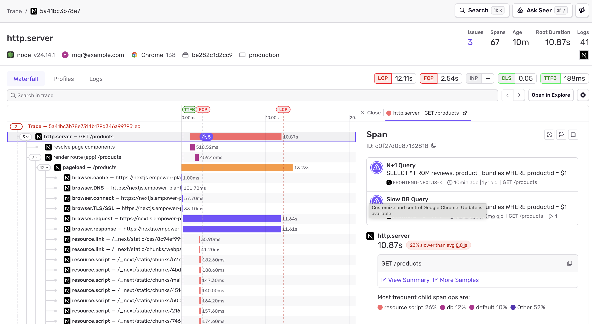

The Trace View page is designed to be your one-stop-shop when debugging performance or errors. It gives you full context on what was happening when an error or performance issue occurred, all in one place. The waterfall Trace View allows you to see everything that may have occurred during a trace, including errors, performance issues, logs, and any profiles that may have been collected.

In addition, looking at the Trace View allows you to drill down into a single trace so you can visualize the high-level spans that took place within that trace. This makes debugging slow services, identifying related errors, and rooting out bottlenecks easier and faster, since you no longer have to navigate around multiple pages of the Sentry product.

## Product Walkthrough: Trace View Page

Sentry's default visualization of a [trace](/concepts/key-terms/tracing/) is a waterfall-like structure, where the entries in the list are organized chronologically and through ancestry (child spans will fall under their parents). This allows you to follow the order of operations and drill into sub-operations.

On the left side is a list of operations, and on the right is their duration and any events, such as errors, which may have occurred in that timeframe.

<Arcade src="https://demo.arcade.software/u9sthw4r7MH1jehzjLuP?embed" />

### Previous and Next Traces

As users interact with an application, they generate multiple traces. For example, when a user loads a page in their browser and then navigates to another page, this creates two separate traces: one for the initial pageload and another for the subsequent navigation. By default, Sentry will link the traces together.

If linked traces are available, you will see "Previous" or "Next" buttons next to the search bar and "Open in Explore" button, near the top of the trace view. These buttons allow you to navigate between traces that occurred before or after the current one.

### Helpful Tips

Because debugging often involves multiple people or teams, Sentry makes it easy to draw attention to specific areas of the trace and share a link that shows what you've highlighted with your colleagues. To do this, click on the row you'd like to draw attention to and share the resulting URL. Your colleague will see exactly what you want them to.

Whatever you highlight will also be saved if you navigate away from the page and will still be there when you use your browser's back and forward buttons.

If you're doing a comparison and want an easy way to go back and forth between highlighted areas of interest in your trace, you can pin the tabs. When a tab is pinned, the view will be persistent throughout your session.

## Troubleshooting

### Orphan Traces and Broken Subtraces

In a fully instrumented system, a span in one service will connect to a transaction in a subsequent service. For a variety of reasons, a transaction in a service may not arrive in Sentry. When Sentry encounters these types of transactions within a trace, the transactions are linked with a dashed line since they can no longer be directly connected to the root, creating an orphan trace.

In addition, broken subtraces can occur when Sentry receives an error for a trace, but the corresponding transaction does not exist. Such errors are linked using dashed lines and clicking on the row takes you to the corresponding **Issue Details** page.

Also, in these cases you can click "Open In Discover" to see all the events in the trace.

Broken subtraces may be caused by:

- SDK sampling. Setting a sample rate that's too low may prevent the SDK from sending a transaction. We recommend [sending us all of your transaction data](/organization/dynamic-sampling/#deciding-on-your-sdk-sample-rate).
- [Ad blockers](/platforms/javascript/troubleshooting/#dealing-with-ad-blockers) may prevent transactions in browsers being sent, but HTTP requests to backend projects will still create child transactions
- [Rate-limiting](/pricing/quotas/#limiting-events) on a project may cause only some events to be sent to Sentry
- [Project permissions](/organization/membership/#restricting-access) may mean you do not have access to transactions in another project
- [Differences in quota limits](/pricing/quotas/) between transactions and errors. When a quota limit is reached - for example, for transactions - an error is received, but corresponding transaction is not.
- Exceeding the span limit. Transactions are associated via the child spans of the parent transaction, but if the number of spans exceed the limit, the association cannot be made

### Multiple Roots

Each trace ID should have only one root, a transaction without any parents. Automatic instrumentation should prevent multiple roots; however, if the trace ID of your transactions is being set using custom instrumentation, you may encounter multiple roots.
