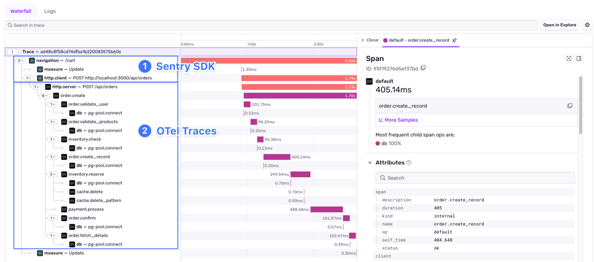

If you're using both Sentry SDKs and OpenTelemetry instrumentation, you can link them together for end-to-end [distributed tracing](/concepts/key-terms/tracing/distributed-tracing/).

## Linking Sentry and OTLP Traces

If you have a Sentry SDK on your frontend or mobile app making requests to an OTLP-instrumented backend, enable `propagateTraceparent` in your SDK initialization to link them into a single distributed trace. This sends the W3C `traceparent` header with outgoing requests, which your OTLP-instrumented backend will pick up and continue.

This gives you end-to-end visibility:

The following SDKs support the `propagateTraceparent` option:

  

  ### JavaScript

  - <LinkWithPlatformIcon platform="javascript.browser" label="Browser JavaScript" url="/platforms/javascript/configuration/options/#propagateTraceparent" />
  - <LinkWithPlatformIcon platform="javascript.angular" label="Angular" url="/platforms/javascript/guides/angular/configuration/options/#propagateTraceparent" />
  - <LinkWithPlatformIcon platform="javascript.astro" label="Astro" url="/platforms/javascript/guides/astro/configuration/options/#propagateTraceparent" />
  - <LinkWithPlatformIcon platform="javascript.ember" label="Ember" url="/platforms/javascript/guides/ember/configuration/options/#propagateTraceparent" />
  - <LinkWithPlatformIcon platform="javascript.gatsby" label="Gatsby" url="/platforms/javascript/guides/gatsby/configuration/options/#propagateTraceparent" />
  - <LinkWithPlatformIcon platform="javascript.nextjs" label="Next.js" url="/platforms/javascript/guides/nextjs/configuration/options/#propagateTraceparent" />
  - <LinkWithPlatformIcon platform="javascript.nuxt" label="Nuxt" url="/platforms/javascript/guides/nuxt/configuration/options/#propagateTraceparent" />
  - <LinkWithPlatformIcon platform="javascript.react" label="React" url="/platforms/javascript/guides/react/configuration/options/#propagateTraceparent" />

  

  

  ### &nbsp;

  - <LinkWithPlatformIcon platform="javascript.react-router" label="React Router" url="/platforms/javascript/guides/react-router/configuration/options/#propagateTraceparent" />
  - <LinkWithPlatformIcon platform="javascript.remix" label="Remix" url="/platforms/javascript/guides/remix/configuration/options/#propagateTraceparent" />
  - <LinkWithPlatformIcon platform="javascript.solid" label="Solid" url="/platforms/javascript/guides/solid/configuration/options/#propagateTraceparent" />
  - <LinkWithPlatformIcon platform="javascript.solidstart" label="SolidStart" url="/platforms/javascript/guides/solidstart/configuration/options/#propagateTraceparent" />
  - <LinkWithPlatformIcon platform="javascript.svelte" label="Svelte" url="/platforms/javascript/guides/svelte/configuration/options/#propagateTraceparent" />
  - <LinkWithPlatformIcon platform="javascript.sveltekit" label="SvelteKit" url="/platforms/javascript/guides/sveltekit/configuration/options/#propagateTraceparent" />
  - <LinkWithPlatformIcon platform="javascript.vue" label="Vue" url="/platforms/javascript/guides/vue/configuration/options/#propagateTraceparent" />
  - <LinkWithPlatformIcon platform="javascript.wasm" label="Wasm" url="/platforms/javascript/guides/wasm/configuration/options/#propagateTraceparent" />

  

  

  ### Mobile

  - <LinkWithPlatformIcon platform="android" label="Android" url="/platforms/android/configuration/options/#propagateTraceparent" />
  - <LinkWithPlatformIcon platform="dart.flutter" label="Flutter" url="/platforms/dart/guides/flutter/configuration/options/#propagateTraceparent" />
  - <LinkWithPlatformIcon platform="native" label="Native" url="/platforms/native/configuration/options/#propagate_traceparent" />
  - <LinkWithPlatformIcon platform="react-native" label="React Native" url="/platforms/react-native/configuration/options/#propagateTraceparent" />

  

## OTLP Integration

If you're running both a Sentry SDK and OTel instrumentation in the same backend service, use the OTLP Integration. This forces Sentry and OTel to share the same trace ID internally, so errors captured by Sentry are automatically linked to your OTLP traces.

- <LinkWithPlatformIcon
    platform="python"
    label="Python"
    url="/platforms/python/integrations/otlp"
  />
Coming Soon:
- <LinkWithPlatformIcon
    platform="ruby"
    label="Ruby"
    url="#otlp-integration"
  />
- <LinkWithPlatformIcon
    platform="go"
    label="Go"
    url="#otlp-integration"
  />
- <LinkWithPlatformIcon
    platform="php"
    label="PHP"
    url="#otlp-integration"
  />
