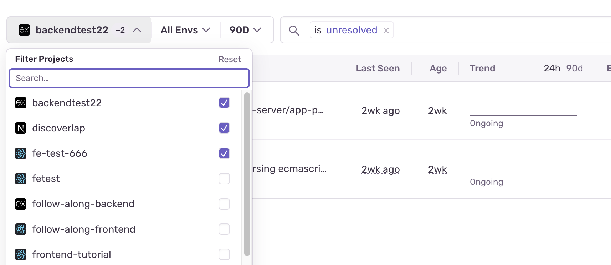

Search is available on several features throughout [sentry.io](https://sentry.io), such as **Issues**, **Discover** and **Dashboards**.

## Query Syntax

Search queries are constructed using a `key:value` pattern, with an optional raw search at the end. Each `key:value` pair is a `token` and the optional raw search is itself a single `token`. The `key:value` pair `tokens` are treated as issue or event properties. The optional raw search is treated as a single `token` and searches event titles/messages.

For example:

```
is:resolved user.username:"Jane Doe" server:web-8 example error
```

In the example above, there are three keys (`is:`, `user.username:`, `server:`), but four tokens:

- `is:resolved`
- `user.username:"Jane Doe"`
- `server:web-8`
- `example error`

The tokens `is:resolved` and `user.username:"Jane Doe"` are standard search tokens because both use reserved keywords. See [Issue Properties](/concepts/search/searchable-properties/#issue-properties) and [Event Properties](/concepts/search/searchable-properties/#event-properties) for appropriate keyword usage. The token `server:web-8` is pointing to a custom tag sent by the Sentry SDK. See [Custom Tags](/concepts/search/searchable-properties/#custom-tags) for more information on how to set tags.

The token `example error` is utilizing the optional raw search and is passed as part of the issue search query (which uses a CONTAINS match similar to SQL). When using the optional raw search, you can provide _one_ string, and the query uses that entire string.

Search terms should auto-complete, and when they don't, that means your term is incompatible with the dataset. If you complete the term and tap the Return/Enter key, an error message is displayed.

### Comparison Operators

Sentry search supports the use of comparison operators:

- greater than (**`>`**)
- less than (**`<`**)
- greater than or equal to (**`>=`**)
- less than or equal to (**`<=`**)

Typically, when you search using properties that are numbers or durations, you should use comparison operators rather than just a colon (`:`) to find exact matches, since an exact match isn't likely to exist.

Here are some examples of valid comparison operator searches:

- `event.timestamp:>2023-09-28T00:00:00-07:00`
- `count_dead_clicks:<=10`
- `transaction.duration:>5s`

### Using `OR` and `AND`

<Note>

`OR` and `AND` search conditions are only available for [Discover](/product/explore/discover-queries/), [Performance](/product/performance/), and [Metric Alerts](/product/alerts-notifications/metric-alerts/).

</Note>

Use `OR` and `AND` between tokens, and use parentheses `()` to group conditions. `AND` can also be used between non-aggregates and aggregates. However, `OR` cannot.

- Non-aggregates filter data based on specific tags or attributes. For example, `user.username:jane` is a non-aggregate field.

- Aggregates filter data on numerical scales. For example, `count()` is an aggregate function and `count():>100` is an aggregate filter.

Some examples of using the `OR` condition:

```
# a valid `OR` query
browser:Chrome OR browser:Opera

# an invalid `OR` query
user.username:janedoe OR count():>100
```

Also, the queries prioritize `AND` before `OR`. For example, "x `AND` y `OR` z" is the same as "(x `AND` y) `OR` z". Parentheses can be used to change the grouping. For example, "x `AND` (y `OR` z)".

### Multiple Values on the Same Key

You can search multiple values for the same key by putting the values in a list. For example, "x:[value1, value2]" will find the the same results as "x:value1 `OR` x:value2". When you do this, the search returns issues/events that match any search term.

An example of searching on the same key with a list of values:

```
release:[12.0, 13.0]
```

Currently, you can't use this type of search on the keyword `is` and you can't use wildcards with this type of search.

### Explicit Tag Syntax

We recommend you never use reserved keywords (such as `project_id`) as tags. But if you do, you must use the following syntax to search for it:

```
tags[project_id]:tag_value
```

### Advanced

Sentry also offers the following advanced search options:

#### Exclusion

By default, search terms use the `AND` operator; that is, they return the intersection of issues/events that match all search terms.

To change this, you can use the negation operator `!` to _exclude_ a search parameter.

```
is:unresolved !user.email:example@customer.com
```

In the example above, the search query returns all Issues that are unresolved _and_ have not affected the user with the email address `example@customer.com`.

#### Wildcards

Search supports the wildcard operator `*` as a placeholder for specific characters and strings.

```
browser:"Safari 11*"
```

In the example above, the search query will match on `browser` values like `"Safari 11.0.2"`, `"Safari 11.0.3"`, etc.

You may also combine operators like so:

```
!message:"*Timeout"
```

In the above example, the search query returns results which do not have message values like `ConnectionTimeout`, `ReadTimeout`, etc.

## Page Filters

Page filters allow you to narrow down the results shown on a page by selecting specific projects, environments, and date ranges. After you've set your filters, they'll persist as you navigate across pages in Sentry.



If you want to see data for all your projects, click "Clear" in the project selector to clear any project filters.

## Learn more

<PageGrid />
