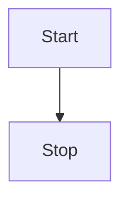

You can render charts and diagrams in you MDX files using [Mermaid](https://mermaid.js.org):

````txt {tabTitle:Example}

````

Will turn into this:


See the [Mermaid documentation](https://mermaid.js.org/intro/) to learn what types of charts and diagrams can be rendered.
