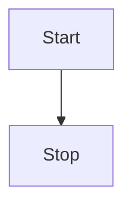
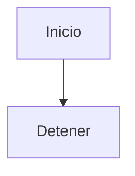

Puedes representar gráficos y diagramas en tus archivos MDX con [Mermaid](https://mermaid.js.org):

````txt {tabTitle:Example}

````

Se convertirá en lo siguiente:



Consulta la [documentación de Mermaid](https://mermaid.js.org/intro/) para saber qué tipos de gráficos y diagramas pueden renderizarse.
