El SDK de Sentry para Python hace un gran trabajo al instrumentar automáticamente tu aplicación. Si usas uno de los frameworks populares, estás cubierto, porque operaciones comunes como llamadas HTTP y consultas a bases de datos se instrumentan de forma predeterminada. El SDK de Sentry también revisa los paquetes de Python que tienes instalados y habilita automáticamente las integraciones del SDK correspondientes. Si quieres habilitar el tracing en una sección del código que realiza otras operaciones, agrega el decorador `@sentry_sdk.trace`.

<div id="add-a-transaction">
  ## Añadir una transacción
</div>

Añadir transacciones te permitirá instrumentar y capturar determinadas partes de tu código.

<Alert>
  Si usas una de las integraciones del SDK de Sentry, las transacciones se crearán automáticamente por ti.
</Alert>

El siguiente ejemplo crea una transacción para una operación costosa (en este caso, `eat_pizza`) y luego envía el resultado a Sentry:

```python
import sentry_sdk

def comer_rebanada(rebanada):
    ...

def comer_pizza(pizza):
    with sentry_sdk.start_transaction(op="task", name="Comer Pizza"):
        while pizza.slices > 0:
            comer_rebanada(pizza.slices.pop())
```

La [referencia de la API](https://getsentry.github.io/sentry-python/api.html#sentry_sdk.api.start_transaction) documenta `start_transaction` y todos sus parámetros.

<Alert>
  Ten en cuenta que `sentry_sdk.start_transaction()` está pensado para usarse como un gestor de contexto. Esto garantiza que la transacción se establezca correctamente como activa y que cualquier span creado dentro se asocie a ella.
</Alert>

<div id="add-spans-to-a-transaction">
  ## Agregar spans a una transacción
</div>

Si quieres un monitoreo de rendimiento más detallado, puedes agregar spans secundarios a tu transacción, lo cual puedes hacer de las siguientes maneras:

* Usando un administrador de contexto
* Usando un decorador (esto funciona en funciones síncronas y asíncronas)
* Iniciando y finalizando un span manualmente

Al llamar a `sentry_sdk.start_span()`, se encontrará la transacción activa y se le adjuntará el span.

<div id="using-a-context-manager">
  ### Uso de un administrador de contexto
</div>

```python
import sentry_sdk

def eat_slice(slice):
    ...

def eat_pizza(pizza):
    with sentry_sdk.start_transaction(op="task", name="Comer pizza"):
        while pizza.slices > 0:
            with sentry_sdk.start_span(name="Comer porción"):
                eat_slice(pizza.slices.pop())
```

<Alert title="Cambios en la 2.15.0">
  El parámetro `name` en `start_span()` antes se llamaba `description`. En la versión 2.15.0, `description` quedó obsoleto y, a partir de la 2.15.0, solo debe usarse `name`. `description` se eliminará en la `3.0.0`.
</Alert>

<div id="using-a-decorator">
  ### Uso de un decorador
</div>

```python
import sentry_sdk

@sentry_sdk.trace
def comer_porcion(porcion):
    ...

def comer_pizza(pizza):
    with sentry_sdk.start_transaction(op="task", name="Comer pizza"):
        while pizza.slices > 0:
            eat_slice(pizza.slices.pop())
```

Consulta la [sección sobre el decorador @sentry&#95;sdk.trace](#sentry_sdktrace-decorator) a continuación para más detalles.

<Alert title="Métodos estáticos y de clase">
  Al trazar un método estático o de clase, **debes** agregar el decorador `@sentry_sdk.trace` **después** de `@staticmethod` o `@classmethod` (es decir, **más cerca** de la definición de la función). De lo contrario, ¡la función fallará!
</Alert>

<div id="manually-starting-and-finishing-a-span">
  ### Inicio y finalización manual de un span
</div>

```python
import sentry_sdk

def eat_slice(slice):
    ...

def eat_pizza(pizza):
    with sentry_sdk.start_transaction(op="task", name="Comer pizza"):
        while pizza.slices > 0:
            span = sentry_sdk.start_span(name="Comer porción")
            eat_slice(pizza.slices.pop())
            span.finish()
```

<Alert title="Cambios en 2.15.0">
  El parámetro `name` en `start_span()` antes se llamaba `description`. En la versión 2.15.0 se declaró obsoleto `description` y, a partir de la 2.15.0, solo debe usarse `name`. `description` se eliminará en la `3.0.0`.
</Alert>

Cuando crees un span manualmente, asegúrate de llamar a `span.finish()` después del bloque de código que quieras envolver en un span para finalizarlo. Si no finalizas el span, no se enviará a Sentry.

<div id="nested-spans">
  ## Spans anidados
</div>

Los spans se pueden anidar para formar un árbol de spans. Si quieres saber más, consulta nuestra documentación sobre [trazabilidad distribuida](/es/product/sentry-basics/tracing/distributed-tracing/).

### Uso de un gestor de contexto

```python
import sentry_sdk

def chew():
    ...

def eat_slice(slice):
    with sentry_sdk.start_span(name="Comer porción"):
        with sentry_sdk.start_span(name="Masticar"):
            chew()
```

<Alert title="Cambios en 2.15.0">
  El parámetro `name` de `start_span()` antes se llamaba `description`. En la versión 2.15.0, `description` se marcó como obsoleto y, a partir de la 2.15.0, solo debe usarse `name`. `description` se eliminará en la `3.0.0`.
</Alert>

<div id="using-a-decorator">
  ### Uso de un decorador
</div>

```python
import sentry_sdk

@sentry_sdk.trace
def masticar():
    ...

@sentry_sdk.trace
def comer_rebanada(rebanada):
    masticar()
```

Consulta la [sección sobre el decorador @sentry&#95;sdk.trace](#sentry_sdktrace-decorator) a continuación para más detalles.

<div id="manually">
  ### Manualmente
</div>

```python
import sentry_sdk

def chew():
    ...

def eat_slice(slice):
    parent_span = sentry_sdk.start_span(name="Comer porción")

    child_span = parent_span.start_child(name="Masticar")
    chew()
    child_span.finish()

    parent_span.finish()
```

<Alert title="Cambiado en la 2.15.0">
  El parámetro `name` en `start_span()` antes se llamaba `description`. En la versión 2.15.0, `description` se declaró obsoleto y, a partir de la 2.15.0, solo debe usarse `name`. `description` se eliminará en la 3.0.0.
</Alert>

Los parámetros de `start_span()` y `start_child()` son los mismos. Consulta la [referencia de la API](https://getsentry.github.io/sentry-python/api.html#sentry_sdk.api.start_span) para más detalles.

Cuando crees un span manualmente, asegúrate de llamar a `span.finish()` después del bloque de código que quieras envolver en un span para finalizarlo. Si no finalizas el span, no se enviará a Sentry.

## Decorador @sentry&#95;sdk.trace

Puedes establecer los parámetros `op`, `name` y `attributes` en el decorador `@sentry_sdk.trace` para personalizar tus spans. Los valores de los atributos solo pueden ser tipos primitivos (como `int`, `float`, `bool`, `str`) o una lista de esos mismos tipos sin mezclar.

Al instrumentar un método estático o de clase, **debes** añadir el decorador `@sentry_sdk.trace` **después** de `@staticmethod` o `@classmethod` (es decir, **más cerca** de la definición de la función). De lo contrario, la función fallará.

<Alert title="Novedad en la 2.35.0">
  Los parámetros `op`, `name` y `attributes` se añadieron al decorador `@sentry_sdk.trace` en la versión 2.35.0.
</Alert>

```python {diff}
 import sentry_sdk

+@sentry_sdk.trace(op="mi_op", name="Paul", attributes={"x": True})
 def my_function(i):
     ...

 @sentry_sdk.trace
 def root_function():
     for i in range(3):
         my_function(i)

 root_function()
```

El código anterior personalizará los elementos span de `my_function` de esta manera:


<div id="span-templates">
  ### Plantillas de spans
</div>

En el decorador `@sentry_sdk.trace` también puedes especificar una `template`. Esto ayuda a crear spans que sigan una plantilla determinada. Actualmente, esto solo está disponible para los spans creados para la [instrumentación de AI Agents](/es/platforms/python/tracing/instrumentation/custom-instrumentation/ai-agents-module/#spans) de Sentry.

Las plantillas disponibles son `AI_AGENT`, `AI_TOOL` y `AI_CHAT`.

```python {diff}
 import sentry_sdk
 from sentry_sdk.consts import SPANTEMPLATE

+@sentry_sdk.trace(template=SPANTEMPLATE.AI_AGENT)
 def my_function(i):
     ...

 @sentry_sdk.trace
 def root_function():
     for i in range(3):
         my_function(i)

 root_function()
```

Esto tratará a `my_function` como un agente de IA y creará el siguiente árbol de spans compatible con las [OpenTelemetry Semantic Conventions](https://opentelemetry.io/docs/specs/semconv/gen-ai/gen-ai-agent-spans/) y con las convenciones de Sentry para la [instrumentación de agentes de IA](/es/platforms/python/tracing/instrumentation/custom-instrumentation/ai-agents-module/#spans). Según la plantilla, también se establecerán de forma predeterminada un par de atributos, pero se omiten en el gráfico siguiente para facilitar la lectura:

```mermaid
gantt
    dateFormat DD
    todayMarker off
    axisFormat %
    SPAN(op=function, name=root_function)   :a1, 01, 7d
    SPAN(op=gen_ai.invoke_agent, name="invoke_agent mi_función")    :a2, 02, 2d
    SPAN(op=gen_ai.invoke_agent, name="invoke_agent mi_función")    :a3, 04, 2d
    SPAN(op=gen_ai.invoke_agent, name="invoke_agent mi_función")    :a4, 06, 2d
```



Para conocer los atributos de span definidos para las distintas plantillas disponibles, consulta la documentación de instrumentación de AI Agents:

* `SPANTEMPLATE.AI_AGENT` -&gt; [Span de invocación del agente](/es/platforms/python/tracing/instrumentation/custom-instrumentation/ai-agents-module/#invoke-agent-span)
* `SPANTEMPLATE.AI_CHAT` -&gt; [Span del cliente de IA](/es/platforms/python/tracing/instrumentation/custom-instrumentation/ai-agents-module/#ai-client-span)
* `SPANTEMPLATE.AI_TOOL` -&gt; [Span de ejecución de la herramienta](/es/platforms/python/tracing/instrumentation/custom-instrumentation/ai-agents-module/#execute-tool-span)

Actualmente no es posible definir plantillas de span personalizadas.

<div id="define-span-creation-in-a-central-place">
  ## Define la creación de spans en un lugar central
</div>

Para evitar tener código personalizado de instrumentación de rendimiento disperso por toda tu base de código, pasa el parámetro <PlatformIdentifier name="functions-to-trace" /> a la llamada `sentry_sdk.init()`.

```python
import sentry_sdk

functions_to_trace = [
    {"qualified_name": "myrootmodule.eat_slice"},
    {"qualified_name": "myrootmodule.swallow"},
    {"qualified_name": "myrootmodule.chew"},
    {"qualified_name": "myrootmodule.someothermodule.another.some_function"},
    {"qualified_name": "myrootmodule.SomePizzaClass.some_method"},
]

sentry_sdk.init(
    dsn="___PUBLIC_DSN___",
    functions_to_trace=functions_to_trace,
)
```

Ahora, cada vez que se ejecute una función indicada en `functions_to_trace`, se creará un span y se adjuntará como hijo del span que se esté ejecutando en ese momento.

<Alert title="Importante">
  Para habilitar el monitoreo del rendimiento de las funciones especificadas en `functions_to_trace`, el SDK debe cargar los módulos de esas funciones. Ten en cuenta que podría ejecutarse código de los módulos durante su carga. Para evitarlo, usa el método descrito arriba para trazar tus funciones.
</Alert>

<div id="accessing-the-current-transaction">
  ## Acceso a la transacción actual
</div>

La propiedad `sentry_sdk.get_current_scope().transaction` devuelve la transacción activa o `None` si no hay ninguna transacción activa. Puedes usar esta propiedad para modificar datos de la transacción.

```python
import sentry_sdk

def comer_pizza(pizza):
    transaction = sentry_sdk.get_current_scope().transaction

    if transaction is not None:
        transaction.set_tag("num_de_porciones", len(pizza.slices))

    while pizza.slices > 0:
        comer_porcion(pizza.slices.pop())
```

<div id="accessing-the-current-span">
  ## Acceder al span actual
</div>

Para modificar datos en el span actual, usa `sentry_sdk.get_current_span()`. Esta función devolverá un span si hay uno en ejecución; de lo contrario, devolverá `None`.

En este ejemplo, estableceremos una etiqueta en el span creado por el decorador `@sentry_sdk.trace`.

```python
import sentry_sdk

@sentry_sdk.trace
def eat_slice(slice):
    span = sentry_sdk.get_current_span()

    if span is not None:
        span.set_tag("slice_id", slice.id)
```

<div id="improving-data-on-transactions-and-spans">
  ## Mejora de los datos en transacciones y spans
</div>

Puedes añadir atributos de datos a tus transacciones. Estos datos son visibles en el explorador de trazas de Sentry. Los atributos de datos pueden ser de tipo `string`, `number` o `boolean`, así como arreglos (no mixtos) de esos tipos:

```python
with sentry_sdk.start_transaction(name="mi-transacción") as transaction:
    transaction.set_data("mi-atributo-de-datos-1", "valor1")
    transaction.set_data("mi-atributo-de-datos-2", 42)
    transaction.set_data("mi-atributo-de-datos-3", True)

    transaction.set_data("mi-atributo-de-datos-4", ["valor1", "valor2", "valor3"])
    transaction.set_data("mi-atributo-de-datos-5", [42, 43, 44])
    transaction.set_data("mi-atributo-de-datos-6", [True, False, True])
```

Puedes agregar atributos de datos a tus elementos span de la misma manera, con las mismas restricciones de tipo descritas arriba.

```python
with sentry_sdk.start_span(name="my-span") as span:
    span.set_data("my-data-attribute-1", "value1")
    span.set_data("my-data-attribute-2", 42)
    span.set_data("my-data-attribute-3", True)

    span.set_data("my-data-attribute-4", ["value1", "value2", "value3"])
    span.set_data("my-data-attribute-5", [42, 43, 44])
    span.set_data("my-data-attribute-6", [True, False, True])
```

Para añadir atributos de datos a la transacción y a todos sus spans, puedes usar <PlatformLink to="/configuration/filtering/#using-before-send-transaction">`before_send_transaction`</PlatformLink>:

```python
import sentry_sdk
from sentry_sdk.types import Event, Hint

def before_send_transaction(event: Event, hint: Hint) -> Event | None:
    # Establece el atributo de datos "foo" en "bar" para cada span que pertenece a este
    # evento de transacción
    for span in event["spans"]:
        span["data"]["foo"] = "bar"

    # Establece los datos en la transacción misma también
    event["contexts"]["trace"]["data"]["foo"] = "bar"

    return event

sentry_sdk.init(
    traces_sample_rate=1.0,
    before_send_transaction=before_send_transaction,
)
```

<div id="update-current-span-shortcut">
  ## Atajo para actualizar el span actual
</div>

Puedes actualizar los datos del span que se está ejecutando actualmente usando la función `sentry_sdk.update_current_span()`. Puedes establecer `op`, `name` y `attributes` para actualizar tu span. Los valores de los atributos solo pueden ser tipos primitivos (como `int`, `float`, `bool`, `str`) o una lista de esos tipos sin mezclar tipos.

```python {diff}
 import sentry_sdk

 @sentry_sdk.trace(op="my_op", name="Paul", attributes={"x": True})
 def my_function(i):
+    sentry_sdk.update_current_span(
+        op="myOp",
+        name=f"Paul{i}",
+        attributes={"y": i},
+    )
     ...

 @sentry_sdk.trace
 def root_function():
     for i in range(3):
         my_function(i)

 root_function()
```

El código anterior actualizará los spans de `my_function` (ahora `my_op`) con datos personalizados como estos:

```mermaid
gantt
    dateFormat DD
    todayMarker off
    axisFormat %
    SPAN(op=function, name=root_function)   :a1, 01, 7d
    SPAN(op=myOp, name=Paul0, x=True, y=0)    :a2, 02, 2d
    SPAN(op=myOp, name=Paul1, x=True, y=1)    :a3, 04, 2d
    SPAN(op=myOp, name=Paul2, x=True, y=2)    :a4, 06, 2d
```


