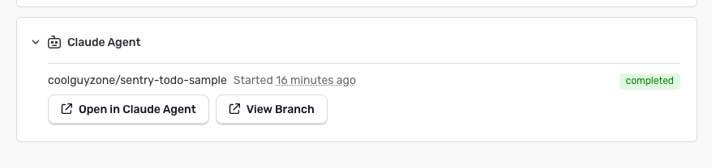
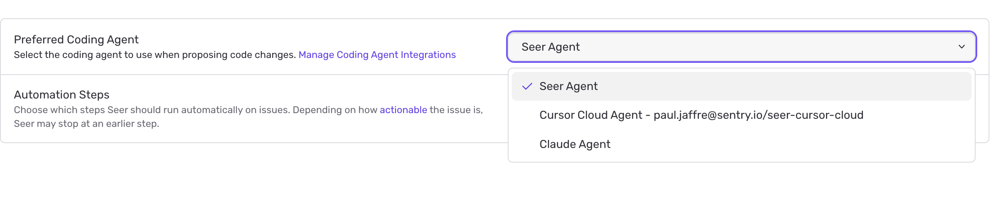

You can trigger Claude agents from your [Seer Autofix](/product/ai-in-sentry/seer/autofix/) tab. The agent is provided with Seer's root cause analysis output and issue context, so it can understand the problem and generate a fix — including opening a branch with the changes.

## Install and Configure

<Alert>

Sentry Owner, Manager, or Admin permissions are required to install this integration. You must also have an existing Claude workspace and environment set up before connecting to Sentry.

</Alert>

1. Go to [platform.claude.com/dashboard](https://platform.claude.com/dashboard) and create an API key for your workspace.

2. In Sentry, navigate to **Settings > Integrations** and search for **Claude Agent**.

3. Enter your API key. If your workspace isn't "default" or you want to use a specific environment, update those fields here, then save.
<Alert level="warning">

If you connect your own Claude environment, it needs access to GitHub so the agent can push a branch with the generated fix.

 In your Claude workspace environment settings, either:

- Add **api.githubcopilot.com** to the list of allowed network hosts
- Allow **MCP server network access**.

Without one of these, the agent session will not run.

</Alert>
 

    <Arcade src="https://demo.arcade.software/GmQwOB82wAeELf3lr43h?embed&show_copy_link=true" width="75%" />

## Using the Integration

Once installed, you can send any Seer root cause analysis to a Claude agent.

1. Go to a Sentry issue and click **Start Root Cause Analysis**.

2. Once root cause analysis completes, open the dropdown and select **Send to Claude Agent**.

    <Arcade src="https://demo.arcade.software/ozuv7mNBShFX0HtrbaWB?embed&show_copy_link=true" width="75%" />

3. A card will appear in the drawer for the active session. While the session is running, you can follow along in the Claude Console. Once complete, a button linking to the created branch will appear in the card.

### Triggering via Automation

You can trigger Claude Agents automatically via Seer Automation.

Go to your [Seer settings](https://sentry.io/orgredirect/organizations/:orgslug/settings/seer/), select your project, and configure Claude Agent as the coding agent in the "Coding Agent" section.

