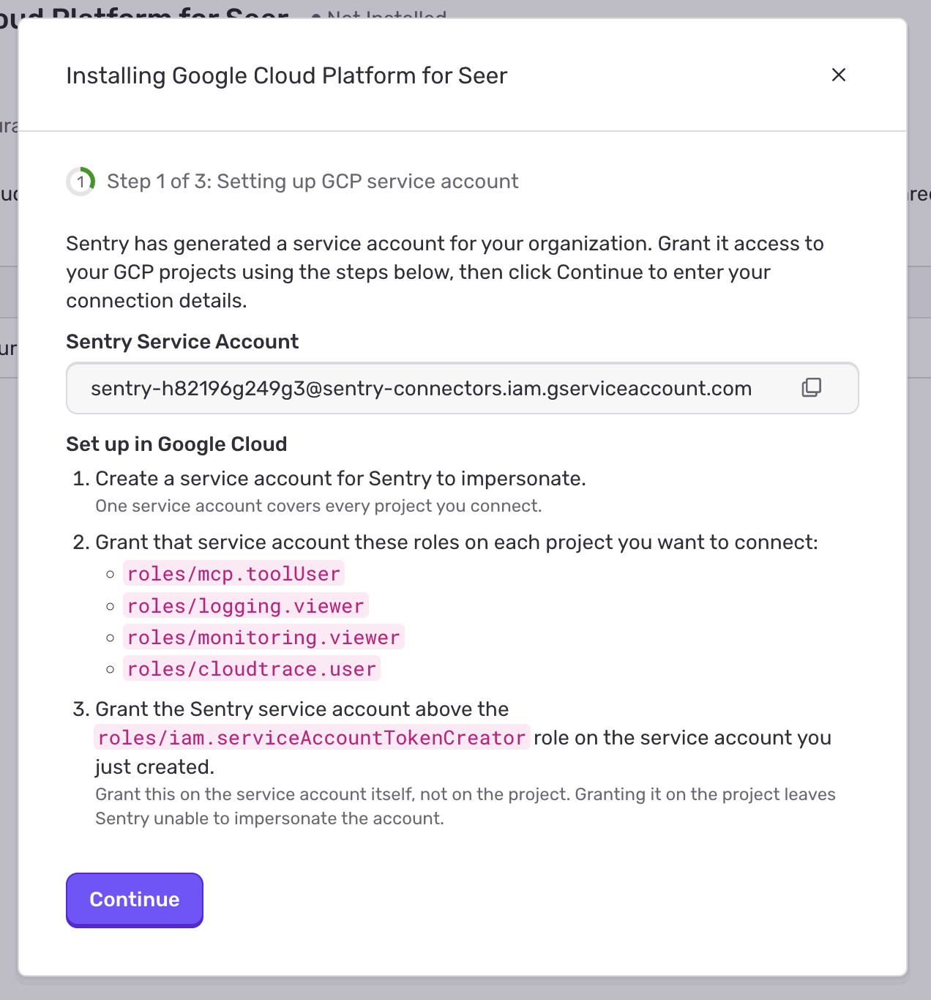
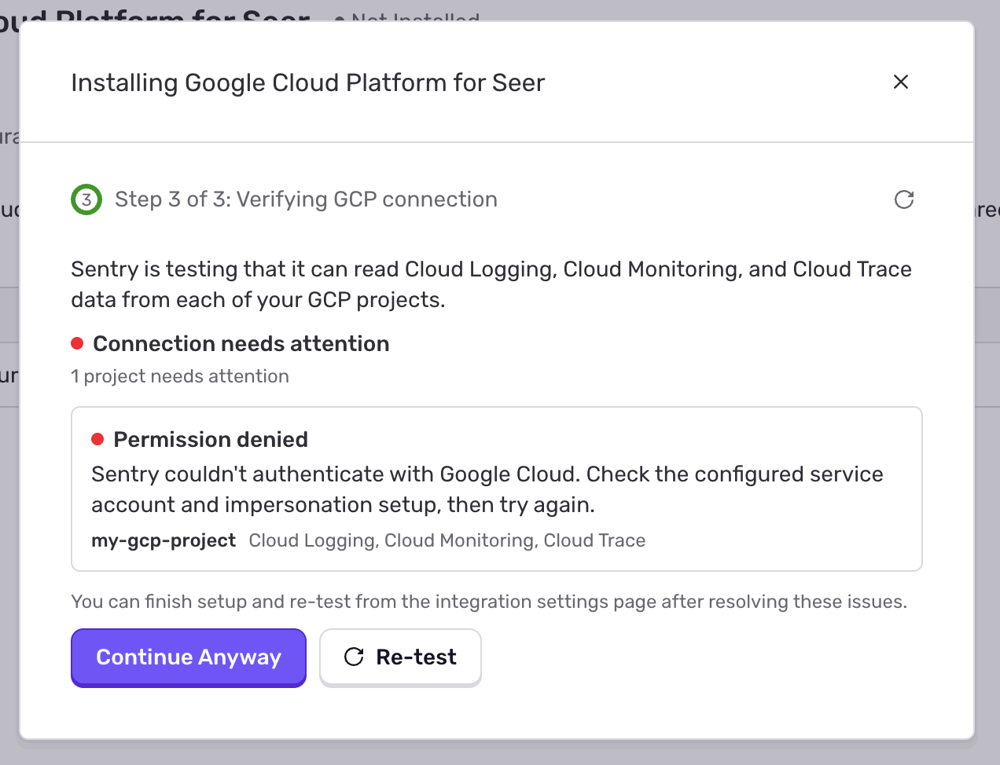

<Include name="feature-stage-beta.mdx" />

The Google Cloud Platform for Seer integration gives [Seer Agent](/product/ai-in-sentry/seer/#seer-agent) access to Cloud Logging, Cloud Monitoring, and Cloud Trace data. Seer can then use Google Cloud data to enhance or supplement Sentry telemetry in issue analysis or investigations.

The connection is shared across your Sentry organization. You configure one GCP integration with one customer service account that can access multiple projects. Sentry authenticates by impersonating that account. You do not need to create or upload a service account key.

## Install the Google Cloud Platform for Seer Integration

<Alert>

Sentry Owner, Manager, or Admin permissions are required to install this integration.

You also need Google Cloud permissions to create a service account, grant roles on each project you want to connect, manage access to that service account, and enable the required APIs. A Google Cloud administrator can complete these steps for you.

</Alert>

1. Navigate to [Seer Connector Settings](https://sentry.io/orgredirect/organizations/:orgslug/settings/seer/connectors/)
2. Select the Google Cloud Platform for Seer integration and click **Add Organization**
3. In the setup modal, you will see a **Sentry Service Account** email address. Sentry generates this account for your organization.

    **There are two service accounts in this setup:** the Sentry Service Account shown in the dialog, and a service account you create in your own Google Cloud project. You will use both email addresses in the steps below.
    

4. In the Google Cloud console, open **IAM & Admin > Service Accounts** and select the project where you want to create your service account. Click **Create service account**, enter a name such as `gcp-sentry`, and complete creation. You can customize its access in the [configuration steps](#configure).

 <Alert>
    For IDs to be compatible with Sentry's setup, they must be between 6–30 characters, use lowercase letters, digits, and hyphens, start with a letter, and end with a letter or digit.
 </Alert>

    The name will also generate an email address. Copy your new service account's email, for example `gcp-sentry@your-project.iam.gserviceaccount.com`. One service account can cover every project you connect, even projects outside of the one where you created the service account.

    For Google's creation instructions, including the IAM API prerequisite, see [Create service accounts](https://cloud.google.com/iam/docs/service-accounts-create). If your organization uses an Infrastructure as Code (IaC) provider such as Terraform, you can use that in place of the Google Cloud console.

5. On *each GCP project you want Seer to query*, give **your service account** four roles:

    1. In Google Cloud, open **IAM & Admin > IAM**, and select the project.
    1. Click **Grant access**. Enter **your service account's email** as the principal.
    1. Add the following four roles and click **Save**. If the account already has access, edit its existing entry to add the missing roles. Repeat for each project.
        - MCP Tool User — `roles/mcp.toolUser`
        - Logs Viewer — `roles/logging.viewer`
        - Monitoring Viewer — `roles/monitoring.viewer`
        - Cloud Trace User — `roles/cloudtrace.user`

    For more details, see [Manage access to projects](https://cloud.google.com/iam/docs/granting-changing-revoking-access).

6. Make sure the **Cloud Logging API** (`logging.googleapis.com`), **Cloud Monitoring API** (`monitoring.googleapis.com`), and **Cloud Trace API** (`cloudtrace.googleapis.com`) are enabled on each project you want to connect. In Google Cloud, select the project, open **APIs & Services > Library**, find each API, and enable it.

    Google's remote MCP endpoints are available when the corresponding product APIs are enabled. See [Enable supported products](https://docs.cloud.google.com/mcp/supported-products).

7. Authorize the **Sentry Service Account** to impersonate **your service account**.

    In Google Cloud, open **IAM & Admin > Service Accounts**, open the project that owns your service account. Find **Principals with access** (or the **Principals with access to this service account** section under **Permissions**), then click **Grant access**.

    Copy the **Sentry Service Account email** from the Sentry integration setup modal, and apply it as the principal. Assign the **Service Account Token Creator** role (`roles/iam.serviceAccountTokenCreator`) and click **Save**.

    **Grant this role on your service account itself.** This limits the impersonation grant to the account you created for the integration.

    For more details, see [Manage access to service accounts](https://cloud.google.com/iam/docs/manage-access-service-accounts).

8. Return to the Sentry setup modal and click **Continue**. Fill in the connection details:
    - **Service Account Email:** Enter the service account email you created in Google Cloud, such as `gcp-sentry@my-gcp-project.iam.gserviceaccount.com`.
    - **GCP Project IDs:** Enter each project ID you wish to connect and press Enter to add it. **Use project IDs, rather than display names or numeric project numbers.** 
    
    <Alert>
    The setup form accepts up to 20 projects.
    </Alert>

9. Click **Continue**. Sentry automatically tests access to **Cloud Logging, Cloud Monitoring, and Cloud Trace for every project** you entered. Wait for the results.

    When all checks pass, the status is **Connected**, with your projects listed under **Connected projects**.

    If a check fails, Sentry shows the affected projects and services with error details. Correct the setup in Google Cloud, then click **Re-test**. IAM changes can take a few minutes to propagate.

    You can also click **Continue Anyway** to finish installation and resolve the errors from the integration settings page. 
    **Finishing installation with an error does not mean access has been verified.**
    
    

10. Once verification succeeds, click **Continue** to finish setup.

## Configure

You can update your connector settings by clicking the **Configurations** tab on the [Google Cloud Platform for Seer settings page](https://sentry.io/orgredirect/organizations/:orgslug/settings/integrations/gcp/), then clicking `Configure` for the connector you wish to update.

Update **Customer Service Account** and/or **GCP Project IDs** under **Organization Integration Settings**. 

To add a project, first grant the service account the four required roles on that project and enable its APIs in Google Cloud, then add the project ID in Sentry. To change service accounts, add the required project roles to the new account and give the Sentry Service Account the Service Account Token Creator role on the new account.

The **Sentry Service Account** field is managed by Sentry and cannot be edited. You can update your service account and projects without reinstalling the integration.

Changes save automatically. After a successful save, Sentry runs a connection check using the saved settings. Review **Connection Status** and the **Last checked** time. You can click **Re-test** at any time to check the current configuration again.

If the check cannot complete, your saved changes remain in place. Resolve the issue and re-test.

## Troubleshooting

If the connection needs attention:

- **Permission denied or authentication failed:** Confirm that the **Customer Service Account** contains your account's email, that it has all four roles on each selected project, and that Sentry's generated account has Service Account Token Creator on your account. Check the project IDs too: Google Cloud may report a permissions error when a project does not exist or is inaccessible.
- **API disabled:** Enable the API named in the error for each affected project, then click **Re-test**.
- **Not verified:** Run **Re-test** to check the saved configuration.
- **The check could not be completed:** Try **Re-test** again. If the problem persists after you confirm the setup, contact Sentry support with the affected project and service names and the error shown.

If you just created an account or changed its IAM grants, allow time for Google Cloud to apply the changes before re-testing. See [Google's access change propagation documentation](https://cloud.google.com/iam/docs/access-change-propagation) for details.
