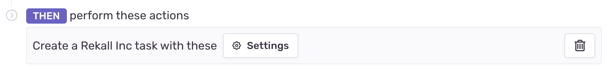
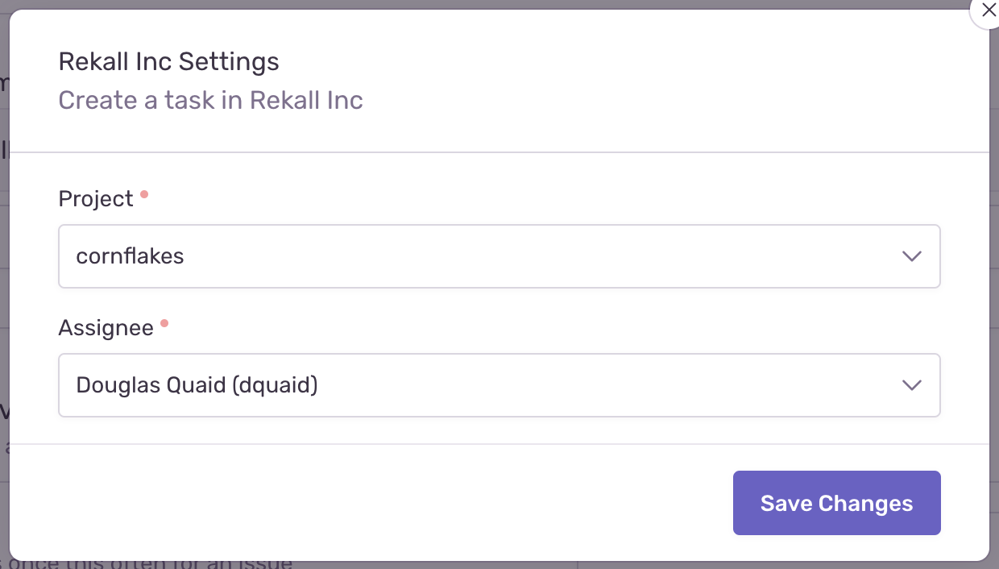

An alert action component allows users to specify details specific to your service that can help route alerts when they're triggered in Sentry. The schema is defined on the integration details page, and when users set up an alert action with your integration, the associated UI components will be presented to them. The details they provide will be included in the following alert webhook payloads, when the alerts fire:

- [Issue Alert](/integrations/integration-platform/webhooks/issue-alerts)
- [Metric Alert](/integrations/integration-platform/webhooks/metric-alerts)
- [Activity Alert](/integrations/integration-platform/webhooks/activity-alerts)





## Schema

```json {filename:schema.json}
{
  "elements": [
    {
      "type": "alert-rule-action",
      "title": <String>,
      "settings": {
        "type": "alert-rule-settings",
        "uri": <URI>,
        "required_fields": <Array<FormField>>,
        "optional_fields": <Array<FormField>>,
        "description": <String>
      }
    }
  ]
}
```

## Attributes

- `title` - (Required) The title shown in the UI component.
- `uri` - (Required) Sentry will make a POST request to the URI when the User submits the form. If the services fails to process the request (status code >= 400), this component will bubble up the error to the User with the provided response text. Check out our [URI Guidelines](/integrations/integration-platform/ui-components/#uri-guidelines) documentation for formatting help.
- `required_fields` - (Required) List of [FormField](/integrations/integration-platform/ui-components/formfield) components the User is required to complete.
- `optional_fields` - (Optional) List of [FormField](/integrations/integration-platform/ui-components/formfield) components the User may complete.
- `description` - (Optional) Text that will be displayed above the form. Limited to 140 characters.

## Example

```json {filename:schema.json}
{
  "elements": [
    {
      "type": "alert-rule-action",
      "title": "Create a kanban item for MyApp",
      "settings": {
        "type": "alert-rule-settings",
        "uri": "/sentry/alert-action",
        "required_fields": [
          {
            "type": "select",
            "label": "Ticket Type",
            "name": "ticket_type",
            "options": [
              ["feat", "Feature"],
              ["bug", "Bug"],
              ["task", "Task"]
            ]
          },
          {
            "name": "runbook",
            "type": "text",
            "label": "Runbook"
          },
          {
            "type": "select",
            "label": "Assignee",
            "name": "assignee",
            "uri": "/sentry/alert-action/options/teams/"
          }
        ]
      }
    }
  ]
}
```

## Issue Alert Request Format

When an issue alert fires, your service will need to read the settings from the alert payload. The `settings` are in `data.issue_alert.settings`. Check out the full [Issue Alert webhook documentation](/integrations/integration-platform/webhooks/issue-alerts) for more information.

```json
{
  ...
  "data": {
    ...
    "issue_alert": {
      ...
      "settings": [
        {
          "name": "ticket_type",
          "value": "feat"
        },
        {
          "name": "runbook",
          "value": "Follow up in #triage-feature-requests with sales if this is actionable."
        },
        {
          "name": "assignee",
          "value": "team:789"
        },
      ]
    }
  }
}
```

## Metric Alert Request Format

When a metric alert fires, your service will need to read the settings from the alert payload. The `settings` in this example are nested in `data.metric_alert.alert_rule.triggers[1].actions[0].settings`. You will have to identify which trigger and action contains your settings based on the webhook type, so `triggers[1]` and `actions[0]` may not be accurate in your case. Check out the full [Metric Alert webhook documentation](/integrations/integration-platform/webhooks/metric-alerts) for more information.

```json
{
  ...
  "data": {
    ...
    "metric_alert": {
      ...
      "alert_rule": {
        ...
        "triggers": [
          ...
          {
            ...
            "actions": [
              {
                ...
                "settings": [
                  {
                    "name": "ticket_type",
                    "value": "bug"
                  },
                  {
                    "name": "runbook",
                    "value": "Check the docs (https://example.com/runbook/456) before picking this one up."
                  },
                  {
                    "name": "assignee",
                    "value": "team:123"
                  },
                ]
              }
            ]
          }
        ]
      }
    }
  }
}
```

## Activity Alert Request Format

When an activity alert fires, your service will need to read the settings from the alert payload. The `settings` are in `data.alert.settings`. Check out the full [Activity Alert webhook documentation](/integrations/integration-platform/webhooks/activity-alerts) for more information.

```json
{
  ...
  "data": {
    ...
    "alert": {
      ...
      "settings": [
        {
          "name": "ticket_type",
          "value": "task"
        },
        {
          "name": "runbook",
          "value": "Check if this issue is related to mobile exclusively."
        },
        {
          "name": "assignee",
          "value": "team:456"
        },
      ]
    }
  }
}
```

<Include name="integration-platform-surfacing-errors.mdx" />
