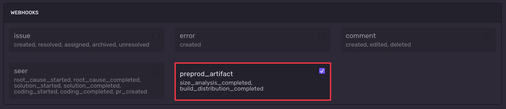

When you subscribe to preprod artifact webhooks, your integration receives notifications when mobile build processing completes. Use these to track size analysis results and build distribution status for your mobile artifacts.

To enable preprod artifact webhooks:

1. Navigate to **Settings > Developer Settings > New Internal Integration**
2. Fill out required Integration Details
3. Enable `project:read` permission or higher
4. Select `preprod_artifact` for webhook type



## Sentry-Hook-Resource Header

`'Sentry-Hook-Resource': 'preprod_artifact'`

## Webhook Types

Preprod artifact webhooks support two event types:

- `preprod_artifact.size_analysis_completed` - Triggered when size analysis completes or fails
- `preprod_artifact.build_distribution_completed` - Triggered when build distribution processing completes or fails

## Common Attributes

All preprod artifact webhooks share these common attributes:

### action

- type: string
- description: The specific event that occurred (`size_analysis_completed` or `build_distribution_completed`)

### data['buildId']

- type: string
- description: Unique identifier for the build artifact

### data['organizationSlug']

- type: string
- description: The slug of the organization that owns the build

### data['projectSlug']

- type: string
- description: The slug of the project that owns the build

### data['platform']

- type: string (nullable)
- description: The target platform (for example, `APPLE`, `ANDROID`)

### data['state']

- type: string
- description: The processing result, either `COMPLETED` or `FAILED`

### data['appInfo']

- type: object
- description: Metadata about the application

| Field | Type | Description |
|---|---|---|
| `appId` | string (nullable) | Application bundle identifier |
| `name` | string (nullable) | Application name |
| `version` | string (nullable) | Application version string |
| `buildNumber` | integer (nullable) | Build number |
| `artifactType` | string (nullable) | Type of artifact (for example, `XCARCHIVE`, `AAB`, `IPA`, `APK`) |
| `dateAdded` | string (nullable) | ISO 8601 timestamp when the artifact was uploaded |
| `dateBuilt` | string (nullable) | ISO 8601 timestamp when the artifact was built |

### data['gitInfo']

- type: object (nullable)
- description: Git repository and branch metadata. Present when the build is associated with a source code repository.

| Field | Type | Description |
|---|---|---|
| `headSha` | string (nullable) | Commit SHA of the head branch |
| `baseSha` | string (nullable) | Commit SHA of the base branch |
| `provider` | string (nullable) | Source code provider (for example, `github`) |
| `headRepoName` | string (nullable) | Full repository name of the head branch |
| `baseRepoName` | string (nullable) | Full repository name of the base branch |
| `headRef` | string (nullable) | Head branch name |
| `baseRef` | string (nullable) | Base branch name |
| `prNumber` | integer (nullable) | Associated pull request number |

### data['errorCode']

- type: string (nullable)
- description: Error code if processing failed. Possible values depend on the webhook type:

**Size analysis error codes:**
- `PROCESSING_ERROR` - Analysis processing failed
- `TIMEOUT` - Analysis timed out
- `UNSUPPORTED_ARTIFACT` - The artifact type is not supported for size analysis
- `NO_QUOTA` - Organization has no remaining analysis quota

**Build distribution error codes:**
- `PROCESSING_ERROR` - Distribution processing failed
- `NO_QUOTA` - Organization has no remaining distribution quota
- `SKIPPED` - Distribution processing was skipped
- `UNKNOWN` - An unknown error occurred

### data['errorMessage']

- type: string (nullable)
- description: Detailed error message if processing failed

## Size Analysis Completed

Fires when a mobile build's size analysis finishes processing. The payload is a subset of the [Size Analysis API](/api/mobile-builds/retrieve-size-analysis-results-for-a-given-artifact/) response.

In addition to the common attributes above, this webhook includes the following fields:

### data['downloadSize']

- type: integer (nullable)
- description: Download size in bytes

### data['installSize']

- type: integer (nullable)
- description: Install size in bytes

### data['analysisDuration']

- type: number (nullable)
- description: Time taken to complete analysis in seconds

### data['analysisVersion']

- type: string (nullable)
- description: Version identifier for the analysis engine

### data['baseBuildId']

- type: string (nullable)
- description: Build ID of the base artifact used for comparison

### data['baseAppInfo']

- type: object (nullable)
- description: App metadata for the base artifact (same shape as `appInfo`)

### data['comparisons']

- type: array (nullable)
- description: Size comparison results for each component of the build (for example, main artifact, watch app, app clip)

| Field | Type | Description |
|---|---|---|
| `metricsArtifactType` | string | Component type (for example, `MAIN_ARTIFACT`, `WATCH_ARTIFACT`, `APP_CLIP_ARTIFACT`) |
| `identifier` | string (nullable) | Bundle identifier of the component |
| `state` | string | Comparison state (`SUCCESS` or `FAILED`) |
| `errorCode` | string (nullable) | Error code if the comparison failed (see below) |
| `errorMessage` | string (nullable) | Error message if the comparison failed |
| `sizeMetricDiff` | object (nullable) | Size difference metrics |

Possible comparison error codes:
- `NO_BASE_METRIC` - No matching base artifact size metric found for this component
- `TIMEOUT` - The size comparison timed out
- `FILE_ERROR` - The comparison result file is missing or could not be found
- `PARSE_ERROR` - Failed to parse the comparison result data
- `UNKNOWN` - An unknown error occurred

The `sizeMetricDiff` object contains:

| Field | Type | Description |
|---|---|---|
| `metricsArtifactType` | string | Component type |
| `identifier` | string (nullable) | Bundle identifier |
| `headInstallSize` | integer | Install size of the head build in bytes |
| `headDownloadSize` | integer | Download size of the head build in bytes |
| `baseInstallSize` | integer | Install size of the base build in bytes |
| `baseDownloadSize` | integer | Download size of the base build in bytes |

### Example Payload

```json
{
  "action": "size_analysis_completed",
  "installation": {
    "uuid": "77081c59-d802-40b8-b635-2e6f792f74de"
  },
  "data": {
    "buildId": "72",
    "organizationSlug": "my-org",
    "projectSlug": "my-project",
    "platform": "APPLE",
    "state": "COMPLETED",
    "appInfo": {
      "appId": "com.example.myapp",
      "name": "MyApp",
      "version": "1.0",
      "buildNumber": 2,
      "artifactType": "XCARCHIVE",
      "dateAdded": "2025-03-19T12:39:44.699049+00:00",
      "dateBuilt": "2025-03-19T12:39:26+00:00"
    },
    "gitInfo": {
      "headSha": "16bee14a5a68d4bb89c48735264b384223754fae",
      "baseSha": "88d7247b737f798e7ae4cfdea96e5c64b8718e8d",
      "provider": "github",
      "headRepoName": "my-org/my-app",
      "baseRepoName": "my-org/my-app",
      "headRef": "feature-branch",
      "baseRef": "main",
      "prNumber": 3
    },
    "errorCode": null,
    "errorMessage": null,
    "downloadSize": 28864215,
    "installSize": 30806016,
    "analysisDuration": 21.64,
    "analysisVersion": "1.2.1",
    "baseBuildId": "57",
    "baseAppInfo": {
      "appId": "com.example.myapp",
      "name": "MyApp",
      "version": "1.0",
      "buildNumber": 2,
      "artifactType": "XCARCHIVE",
      "dateAdded": "2025-03-09T16:55:39.111991+00:00",
      "dateBuilt": "2025-03-09T16:55:26+00:00"
    },
    "comparisons": [
      {
        "metricsArtifactType": "MAIN_ARTIFACT",
        "identifier": null,
        "state": "SUCCESS",
        "errorCode": null,
        "errorMessage": null,
        "sizeMetricDiff": {
          "metricsArtifactType": "MAIN_ARTIFACT",
          "identifier": null,
          "headInstallSize": 17833984,
          "headDownloadSize": 16255246,
          "baseInstallSize": 5394432,
          "baseDownloadSize": 3844031
        }
      },
      {
        "metricsArtifactType": "WATCH_ARTIFACT",
        "identifier": "com.example.myapp.watchkitapp",
        "state": "SUCCESS",
        "errorCode": null,
        "errorMessage": null,
        "sizeMetricDiff": {
          "metricsArtifactType": "WATCH_ARTIFACT",
          "identifier": "com.example.myapp.watchkitapp",
          "headInstallSize": 9023488,
          "headDownloadSize": 8765015,
          "baseInstallSize": 290816,
          "baseDownloadSize": 51594
        }
      }
    ]
  },
  "actor": {
    "type": "application",
    "id": "sentry",
    "name": "Sentry"
  }
}
```

## Build Distribution Completed

Fires when a build distribution (installable artifact) finishes processing. The payload is a subset of the [Install Info API](/api/mobile-builds/retrieve-install-info-for-a-given-artifact/) response.

In addition to the common attributes above, this webhook includes the following fields:

### data['projectId']

- type: string
- description: The Sentry project ID

### data['buildConfiguration']

- type: string (nullable)
- description: Build configuration type (for example, `release`)

### data['isInstallable']

- type: boolean
- description: Whether the artifact can be installed on a device

### data['installUrl']

- type: string (nullable)
- description: URL for downloading and installing the artifact

### data['isCodeSignatureValid']

- type: boolean (nullable)
- description: Whether the code signature is valid (Apple platforms)

### data['profileName']

- type: string (nullable)
- description: Provisioning profile name (Apple platforms)

### data['codesigningType']

- type: string (nullable)
- description: Code signing type (Apple platforms)

### Example Payload

```json
{
  "action": "build_distribution_completed",
  "installation": {
    "uuid": "77081c59-d802-40b8-b635-2e6f792f74de"
  },
  "data": {
    "buildId": "95",
    "organizationSlug": "my-org",
    "projectId": "1",
    "projectSlug": "my-project",
    "platform": "ANDROID",
    "state": "COMPLETED",
    "appInfo": {
      "appId": "com.example.myapp",
      "name": "MyApp",
      "version": "1.0",
      "buildNumber": 1,
      "artifactType": "AAB",
      "dateAdded": "2025-03-24T15:08:57.364465+00:00",
      "dateBuilt": null
    },
    "gitInfo": {
      "headSha": "aa64c3dde25a54852dabc77e2cc3239335834aa5",
      "baseSha": "88d7247b737f798e7ae4cfdea96e5c64b8718e8d",
      "provider": "github",
      "headRepoName": "my-org/my-app",
      "baseRepoName": "my-org/my-app",
      "headRef": "feature-branch",
      "baseRef": "main",
      "prNumber": 3
    },
    "buildConfiguration": "release",
    "isInstallable": true,
    "installUrl": "https://sentry.io/api/0/projects/my-org/my-project/files/installablepreprodartifact/abc123/?response_format=apk",
    "isCodeSignatureValid": null,
    "profileName": null,
    "codesigningType": null,
    "errorCode": null,
    "errorMessage": null
  },
  "actor": {
    "type": "application",
    "id": "sentry",
    "name": "Sentry"
  }
}
```

## Use Cases

Preprod artifact webhooks enable you to:

- **CI/CD Integration**: Automatically check build size regressions in your CI pipeline and fail builds that exceed thresholds.
- **Distribution Automation**: Trigger downstream distribution workflows (for example, notify testers) when a build is ready for install.
- **Size Tracking**: Feed size metrics into external dashboards or alerting systems to monitor app size trends over time.
- **PR Comments**: Post size comparison summaries as comments on pull requests to give developers immediate visibility into size impact.
