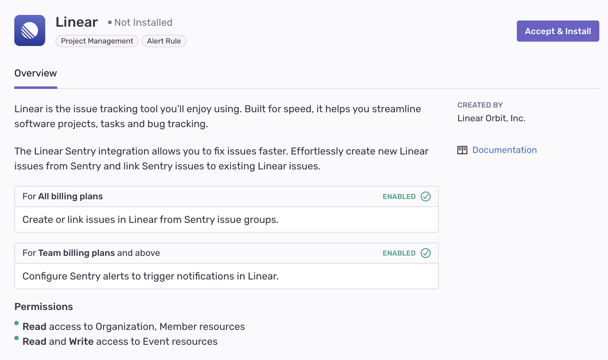
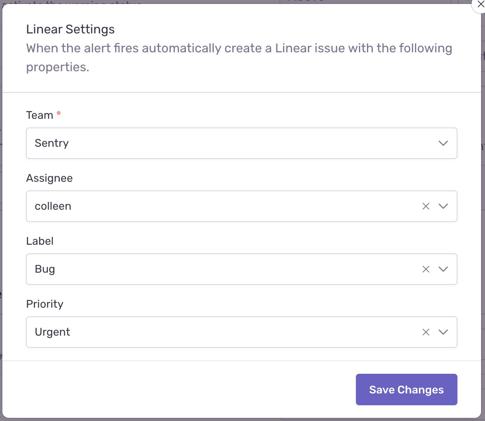
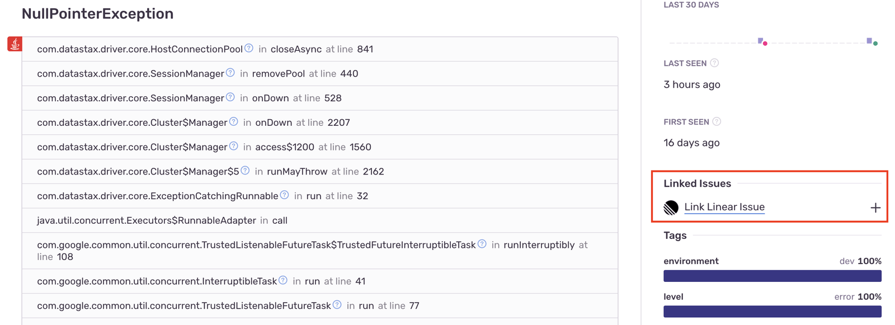
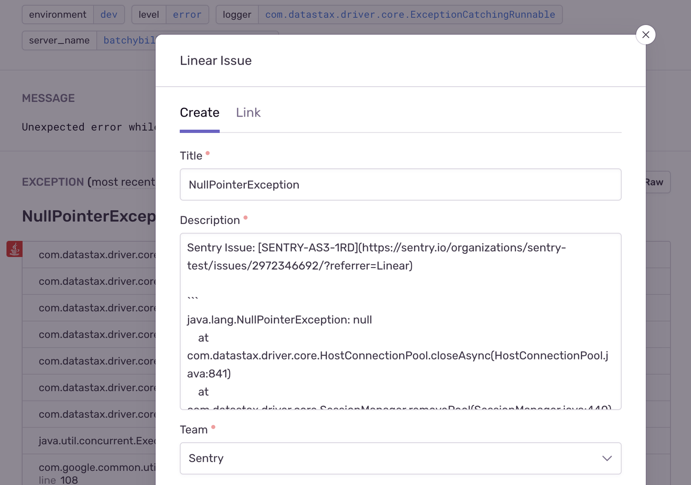

Linear is an issue tracking tool built for speed, streamlining software projects, tasks, and bug tracking. Effortlessly create new Linear issues from Sentry and link Sentry issues to existing Linear issues.

Linear maintains and supports this integration, which uses the [Sentry Integration Platform](/integrations/integration-platform/). See [Linear's Sentry documentation](https://linear.app/docs/sentry) for setup instructions and supported features.

## Install and Configure

<Alert>

Sentry owner, manager, or admin permissions are required to install this integration.

Linear **won't** work with self-hosted Sentry.

</Alert>

1. Navigate to [**Settings > Integrations**](https://sentry.io/orgredirect/organizations/:orgslug/settings/integrations/) > **Linear**

   

2. Follow the full [Linear installation instructions](https://linear.app/docs/sentry).

## Issue Management

Issue tracking allows you to create Linear issues from within Sentry, and link Sentry issues to existing Linear issues. Issue management can be configured in two ways — automatically or manually.

### Automatically

To configure issue management automatically, create an [Alert](/product/monitors-and-alerts/alerts/). When selecting the action, choose "Notify Integration" and then "Linear", or select "Linear" from the action dropdown:

When the alert runs this action, Sentry sends a request to the Linear integration to create an issue. For alert triggers, filters, and throttling, see [Creating an Alert](/product/monitors-and-alerts/alerts/create-alerts/).

### Manually

To configure issue management manually, navigate to a specific Sentry issue and find the "Linked Issues" section on the right panel:

Here, you’ll be able to create or link Linear issues.

