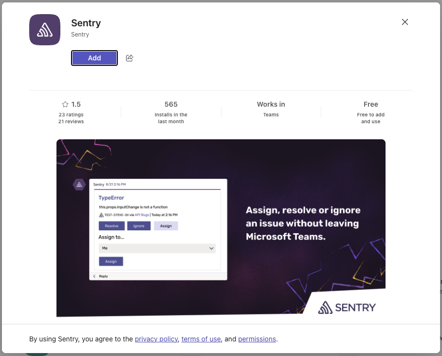
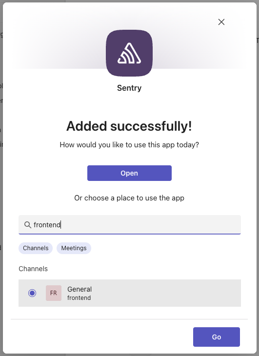
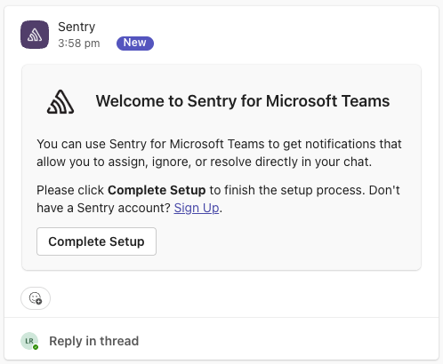
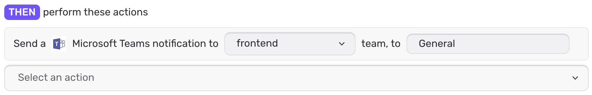
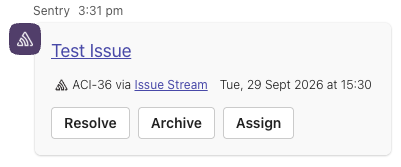
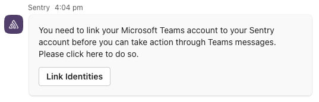
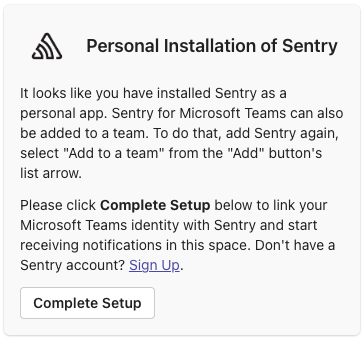
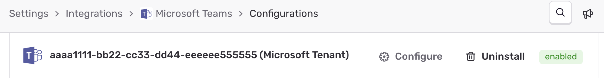

Set up the Microsoft Teams integration for Sentry so you can receive alerts and triage issues directly from Teams channels. 

<Alert level="info" title="Heads Up">
When installing this integration, Microsoft Teams will only grant access to the channels available to the single team selected during setup.
As such, its common to install the app multiple times, one for each team you'd like Sentry to have access to.
</Alert>

## Installation

<Alert>

Sentry owner, manager, or admin permissions are required to install this integration.

</Alert>

1. Visit [the Microsoft Teams App Store](https://teams.microsoft.com/l/app/5adee720-30de-4006-a342-d454317db1d4)

2. Click "Add" (or "Open", if re-installing)

   

3. This will automatically add a personal installation, but now we can select a channel to proceed with a team installation.
 
<Alert level="warning" title="Note">
Selecting **any** channel (e.g. General) in a Team will grant Sentry access to fire alerts to **all** channels for that team. You do not need to install the integration for _every channel belonging to that one Team_.
</Alert>

   

4. After clicking 'Go', a welcome message will appear in the selected channel within a few seconds. Click "Complete Setup" to associate the Team with your Sentry organization.

   

5. Repeat the steps above for any other Team you'd like Sentry to be able to access.

## Configure

Use Microsoft Teams for [alerts](/product/monitors-and-alerts/alerts/) regarding issues, environments, deployment, etc.

### Alerts

<Alert>
If MS Teams is not appearing as an option in the alert actions, re-install the integration and make sure to select a Team's channel when installing. 
</Alert>

Set up an alert by going to **Alerts** and clicking "Create Alert". From here, you can configure alerts to route notifications to your Microsoft Team's channels.

In [Alerts](/product/monitors-and-alerts/alerts/), select "MS Teams" in the actions dropdown and then select your team and channel:

Once you receive a Microsoft Teams notification, you can use the "Resolve", "Archive", or "Assign" buttons to update the Issue in Sentry.

The first time you try to interact with a notification, you will get a message from the Sentry bot asking you to link your identity. Click "Link Identities" to complete this step. Until you do this, you can't interact with messages.

## Uninstallation

To remove a team installation from a specific Team in Microsoft Teams:

1. In Microsoft Teams, find the Team under "Teams and channels"
2. Click on the three dots ("More team options") to the right of your Team's name
3. Click "Manage team"
4. Click on "Apps" at the top (it may be hidden in a dropdown labelled "Channels")
5. Click on the three dots ("More options") and select "Remove", then confirm in the popup. This will not affect personal installations.

To remove a personal installation in Microsoft Teams:

1. In Microsoft Teams, navigate to the App Catalogue via **Store** in the sidebar, and search for the app.
2. Hover over the listing, and click the three dots  ("More options")
3. Select "Uninstall", then confirm in the popup. This will not affect any team installations.

After uninstallation, the corresponding install can be removed in Sentry from **Settings > Integrations > Microsoft Teams > Configurations**.

## Troubleshooting

### Personal Installation of Sentry

Due to some changes around the Microsoft Teams installation flows, you may be receiving messages about personal installations when setting up the integration. These happen automatically before selecting a team and may mislead you while installing.

If you click the link and complete this installation (attaching it to a Sentry organization), you'll see a new configuration with a Microsoft Tenant and a unique identifier that may be confusing.

These installations are not available to receive alerts, and have been erroneously publicly available for some time. Only Team-level installations are properly supported at the moment, so feel free to remove these configurations and disregard the direct messages.
