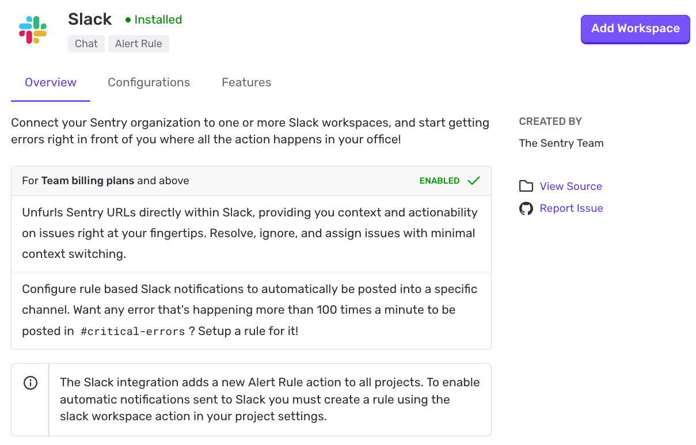
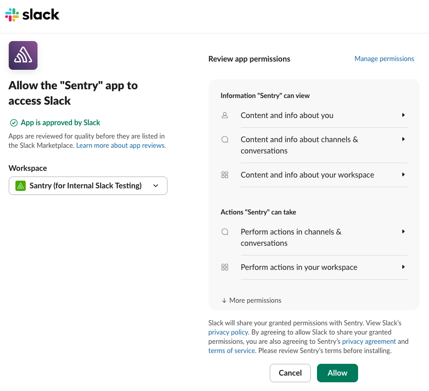
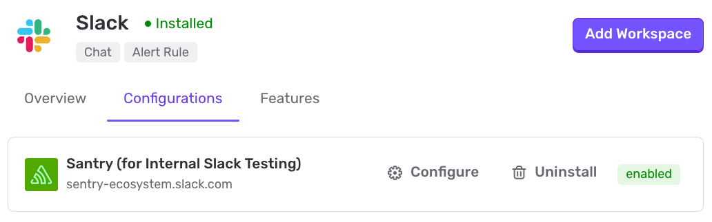
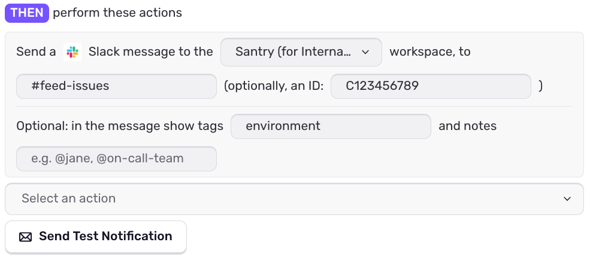
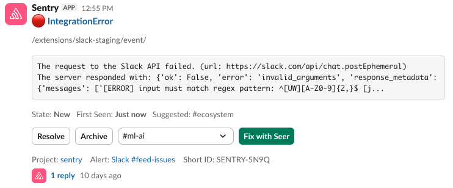
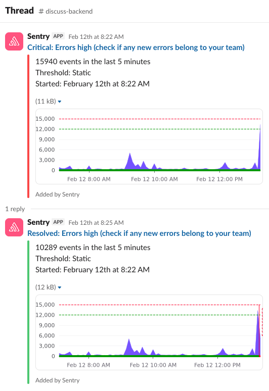
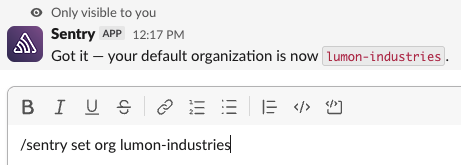

## Install

<Alert>

Sentry owner, manager, or admin permissions are required to install this integration.

</Alert>

Slack defaults to let any workspace member authorize apps, but they may have to request access. See this [Slack help article](https://get.slack.help/hc/en-us/articles/202035138-Add-an-app-to-your-workspace) for more details.

1.  In [sentry.io](https://sentry.io), navigate to **Settings > Integrations > Slack**.

2.  Click "Add Workspace".

    

3.  Toggle to the Slack workspace to which you want to connect using the dropdown menu in the upper right corner of the authentication window. Then select "Allow". Repeat this process if you are connecting to multiple workspaces.

    

Your integration details page will refresh and show the Slack workspace you just added.

Your Slack integration is now available to all projects in your Sentry organization. To enable Slack notification for private channels, add the Slack app to the channel. One quick method: use `@sentry` to invite the Sentry bot the Slack channel.

In the next section, we'll walk you through configuring your notification settings.

## Configure

Use Slack for notifications and [alerts](#alerting) regarding issues, environments, deployment, etc.

### Personal Notifications

You can receive personal workflow, deploy, and issue alert notifications from our Slack integration. Manage your [personal notification settings](/product/notifications/notification-settings/) by navigating to **User Settings > Notifications**.

#### Linking Your Slack and Sentry Accounts

In order to receive personal notifications from our Slack integration, your Slack identity must be linked with your Sentry account. This can be done by typing `/sentry link` in Slack.

### Team Notifications

You can receive [team alert notifications](/product/alerts/create-alerts/issue-alert-config/#then-conditions-actions) from our Slack integration. To enable this feature, type `/sentry link team [organization_slug]` in the desired Slack channel. To view a team's associated Slack channel in [sentry.io](https://sentry.io), navigate to **Settings > Teams > [Team] > Notifications**.

### Alerting

After installing the Slack integration, you'll have the option to select Slack as an action for your alerts.

Select the Slack workspace, and provide a channel or user you wish to notify. Optionally, you can specify any tags you'd like to include in the notification, as well as text, like mentions or links to internal documentation.

Sentry will validate access when saving the alert, but you can also send a test notification to double check.

All issue types have their own appearance in Slack, and may differ slightly based on the alert, and available features.

For example, Error alerts will have tools to "Resolve", "Archive" and "Assignee" right from Slack. If you've enabled [Seer](/product/ai-in-sentry/seer/), you will also get an initial guess at the root cause and the option to fix the issue right from Slack. These enhancements can be modified under **Settings > Seer > Advanced Settings > Enable Seer Context in Alerts**.

For metric issues, a chart of the metric's history will be included in the alert, with a follow-up alert appearing as a threaded reply for future status changes.

## Seer Agent

<Alert>

This feature is currently in open beta. Please reach out on [GitHub](https://github.com/getsentry/sentry/discussions) if you have feedback or questions. Features in beta are still in-progress and may have bugs. We recognize the irony.

</Alert>

If your organization has access to [Seer Agent](/product/ai-in-sentry/seer/#seer-agent), you'll be able to prompt it directly from Slack to help you debug issues and incidents. To trigger it, just invite the bot to a channel, and @mention it via `@sentry` with your request. Any interaction with Seer Agent will prompt you to link your Sentry account to the Slack Workspace for verification, if you haven't already. It will process your request, look for context, and add a message to the thread with its findings. 

It has all the capabilities of the web version, but also automatically gathers context from conversations in the thread. You must always `@sentry` in your messages in order to trigger the agent, even after the first @mention. 

For [paid Slack Workspaces with access to AI assistant apps](https://slack.com/pricing), you can also open Seer Agent as an Agent in Slack, using the dropdown in the top-right of your Slack window. This will open a new persistent panel in your Slack window for private conversations with Seer Agent. In these conversations, you don't have to mention it every time, and new chats will open with a few example prompts to get you started.

If you have a single Slack Workspace connected to multiple Sentry organizations, Seer Agent will automatically try to infer the Sentry organization to search based on thread context (e.g. Sentry links). If this behaviour doesn't fit your needs, you can use `/sentry set org [organization_slug]` to manually set your preference when interacting with Seer Agent. Your chats and mentions will fallback to the set organization if no organization can be inferred.

## Permissions

In order for Sentry to be able to notify and debug your issues from Slack, we request the following permission when you install the app. The following are required, and apply to the Slack app being added to your workspace.

| Required Bot Scope     | Usage                                                                                                                                            |
| ---------------------- | ------------------------------------------------------------------------------------------------------------------------------------------------ |
| `assistant:write`      | Allows Seer to act as an [AI Assistant in Slack](https://slack.com/help/articles/33076000248851-Understand-AI-apps-in-Slack).                    |
| `app_mentions:read`    | Allows Slack to notify Sentry when a user has @mentioned the bot.                                                                                |
| `channels:read`        | Allows Sentry to view info about, list, and validate public channels in your workspace. Used primarily for configuring alerts.                   |
| `chat:write`           | Allows Sentry to send/update messages, such as alerts, notifications, and responses.                                                             |
| `chat:write.customize` | Allows Sentry to customize the bot's appearance when sending messages.                                                                           |
| `chat:write.public`    | Allows Sentry to post messages to public channels the bot hasn't been invited to. It cannot read the contents of these channels with this scope. |
| `commands`             | Enables the `/sentry` slash command, for controlling your Sentry integration settings, and account linking from Slack.                           |
| `groups:read`          | Allows Sentry to view info about, list and validate private channels **that the bot has been added to** in your workspace.                       |
| `im:history`           | Allows Slack to notify Sentry when a user direct messages the bot, and enables the bot to read through the conversation history when responding. |
| `im:read`              | Allows Sentry to read basic information about direct messages sent to the bot.                                                                   |
| `links:read`           | Allows Slack to notify Sentry when `sentry.io` links are shared in your workspace, allowing for rich previews.                                   |
| `links:write`          | Allows Sentry to unfurl `sentry.io` links shared in your workspace into rich previews.                                                           |
| `team:read`            | Allows Sentry to read the basic information (e.g. name, icon) of your workspace.                                                                 |
| `users:read`           | Allows Sentry to view info about, list, and validate users in your workspace. Used primarily for configuring alerts, and linking accounts.       |

Additionally we request the following optional bot scopes for the best experience when using Seer Agent.

| Optional Bot Scope | Usage                                                                                        |
| ------------------ | -------------------------------------------------------------------------------------------- |
| `channels:history` | Allows Sentry to read the contents of threads in public channels                             |
| `groups:history`   | Allows Sentry to read the contents of threads in private channels that it has been added to. |

Lastly, we also require the following scopes on each Slack user's behalf. These are limited to read-only access, meant for unfurls and account linking.

| User Scope         | Reason                                                                           |
| ------------------ | -------------------------------------------------------------------------------- |
| `links:read`       | Show rich previews when you share Sentry links in Slack.                         |
| `users:read`       | Read your Slack profile to connect it with your Sentry account.                  |
| `users:read.email` | Use your Slack email address to find and link your Sentry account automatically. |

More details on the scopes and their technical usage can be found on the [self-hosted Slack integration docs](https://develop.sentry.dev/integrations/slack/#scopes).

## Troubleshooting

### Rate Limiting Error

If you're attempting to save a Slack alert and are receiving the following error: "Requests to slack were rate limited. Please try again later.", you may enter in the channel or user ID in addition to the channel name.

To find a channel's ID in Slack click the name of the channel at the top of the application and the channel ID will be shown at the bottom of the pop up. To find a user's ID click on their avatar >> "View full profile" >> ... >> "Copy member ID".

### Can't Use Channel for an Alert

If you receive an error “The slack resource `example-channel` does not exist or has not been granted access in the `example-workspace` Slack workspace” while trying to set up an alert, we recommend checking whether our app is installed in the channel. In Slack, right click on your channel's name from the left bar and select "Open channel settings". Then click on the "Integrations" tab; the Sentry app should be listed under "Apps".
