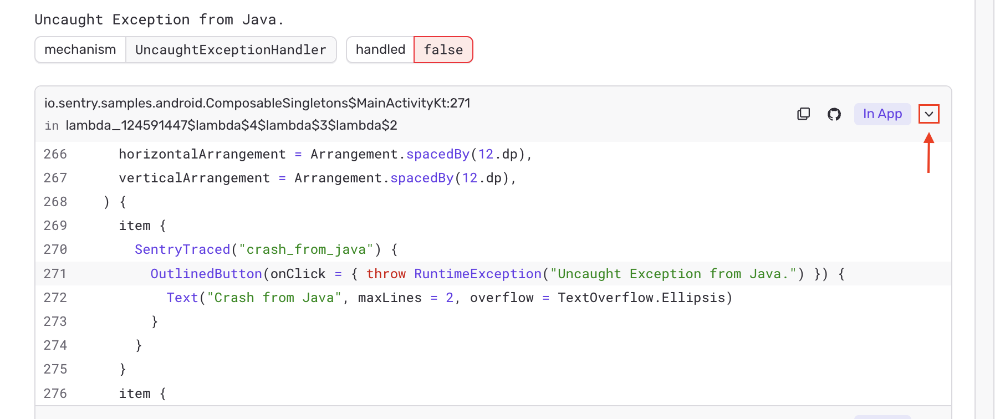

When an event reaches Sentry without inline source context — for example, a release built without source maps, a native crash, or any platform that doesn't ship source with the event — Sentry can fetch the source on demand from your connected SCM integration and render the surrounding lines next to each stack-trace frame.

This is the same context view you see on events that *do* carry inline source, but populated from the file in your repository at the time of the error. Expand a frame using the chevron on the right to view the fetched source.

## Prerequisites

- An installed SCM integration that supports stack-trace linking. The following providers are supported:
  - [Azure DevOps](/integrations/source-code-mgmt/azure-devops/)
  - [Bitbucket](/integrations/source-code-mgmt/bitbucket/)
  - [GitHub / GitHub Enterprise](/integrations/source-code-mgmt/github/)
  - [GitLab](/integrations/source-code-mgmt/gitlab/)
  - [Perforce](/integrations/source-code-mgmt/perforce/)
- A code mapping configured for each project where you want SCM source context. See the **Stack Trace Linking** section of your provider's page for setup instructions.

## Enable

Source context fetching is opt-in per project. To enable it:

1. Open your project's [General Settings](https://sentry.io/orgredirect/organizations/:orgslug/settings/projects/:projectId/) page.
2. Under **Client Security**, turn on **Enable SCM Source Context**.
3. Confirm the prompt.

The toggle requires `project:write` permission.

## How It Works

When a frame in the issue stack trace lacks inline source context, Sentry:

1. Resolves the frame's file path to a repository path using the project's code mappings.
2. Calls the SCM integration with the resolved path and the commit SHA of the release (falling back to the code mapping's default branch if no commit is associated).
3. Returns the lines surrounding the frame's `lineno` and renders them inline.

Files are fetched lazily as you expand frames, and cached for the life of the request — there's no background indexing or long-term storage of your source on Sentry's side.

## Access

Once enabled, **any project member who can view the project can view fetched source for any file matched by the project's code mappings**. Effectively, this gives access to the contents of code-mapped paths in the connected repository to anyone with `project:read` on the Sentry project.

The SCM integration's own access scope still applies — Sentry can only return files that the configured integration token can read.

If your repository contains code that should not be visible to all project members, scope the integration's token narrowly, restrict code mappings to the directories you want exposed, or leave SCM Source Context disabled for that project.

## Disable

To turn the feature off for a project, flip the same toggle off. New requests stop fetching from your SCM immediately. Frames continue to display inline source context (where the event already carries it) as before.

## Limitations

- Each frame's source is fetched at request time. Pages with many frames lacking inline context will incur additional latency proportional to the number of unique files.
- The integration's API rate limits apply. Sentry stops fetching for the rest of the request once a rate-limit response is returned by the provider.
- Source is fetched at the commit SHA associated with the release, when available, and otherwise at the default branch — content may differ from the exact revision running in production if no release is associated with the event.
