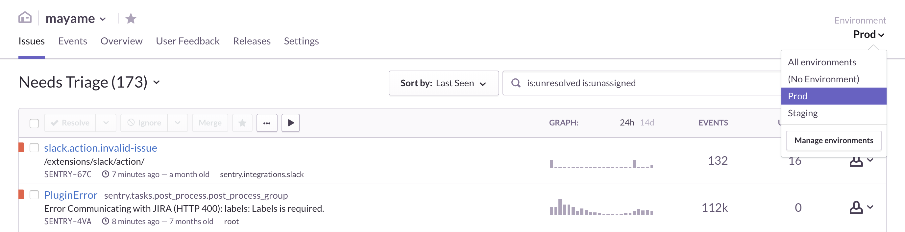
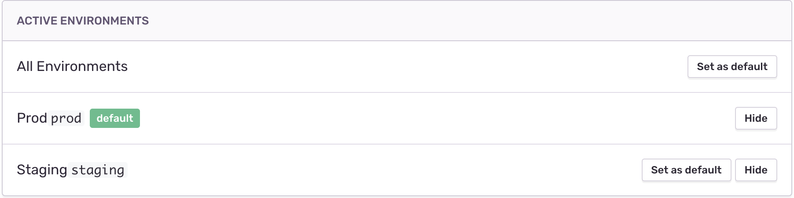

Environments
------------

*Note: The environments feature is only available for early adopters. You can enable early adopter features by navigating to your organization settings.*
 
As of Sentry 9, you can easily filter issues, releases, and user feedback by environment. On the top right of your screen, you’ll see a dropdown of different environments. Toggling between environments will allow you to see issue data, release data, and user feedback data filtered by environment.

Inside the Environment Filter
-----------------------------

**Issues**

Sentry defines an issue as a grouping of similar events. If one or more events within an issue are tagged with a certain environment, that issue will appear in your view when filtered by that environment. For example, if an issue is composed of one event tagged with :code:`Production` and one event tagged with :code:`Staging`, the issue will appear in your view when filtering by :code:`Production` as well as by :code:`Staging`.

In addition, the environment filter affects all issue-related metrics like count of users affected, times series graphs, and event count.

**Releases**

You can filter releases by which environment they've been deployed to (to learn more about configuring releases and deploys, click `here <https://docs.sentry.io/learn/releases/>`_). For example, a release linked to a :code:`QA` deploy and a :code:`Prod` deploy will appear in your view when filtering by :code:`QA` as well as :code:`Prod`. All issue-related metics within a given release will be affected by the environment filter.

Hiding environments
-------------------

If a certain environment is not a useful filter for your team, you can hide the environment from your environments dropdown by navigating to your project settings > Environments, and selecting ‘Hide’. Data sent from that environment will still be visible under `All Environments`, and will still count against your quota. 

If you want to change the name of a given environment, you will have to modify your SDK configuration. *Note: this will not change environment names for past data.*

Setting a Default Environment
-----------------------------

If you would like to see Sentry filtered by a certain environment every time you open Sentry, you can set a default environment by navigating to your project settings > Environments, and clicking ‘Set as default.’

How to send environment data
----------------------------

Environment data is sent to Sentry by tagging issues via your SDK. You can send environment data to Sentry using the following SDKs: 

- `Javascript <https://docs.sentry.io/clients/javascript/config/>`_
- `Node.js <https://docs.sentry.io/clients/node/config/#configuration>`_
- `Python <https://docs.sentry.io/clients/python/advanced/>`_
- `Ruby <https://docs.sentry.io/clients/ruby/config/>`_
- `php <https://docs.sentry.io/clients/php/config/>`_
- `Java <https://docs.sentry.io/clients/java/config/>`_

