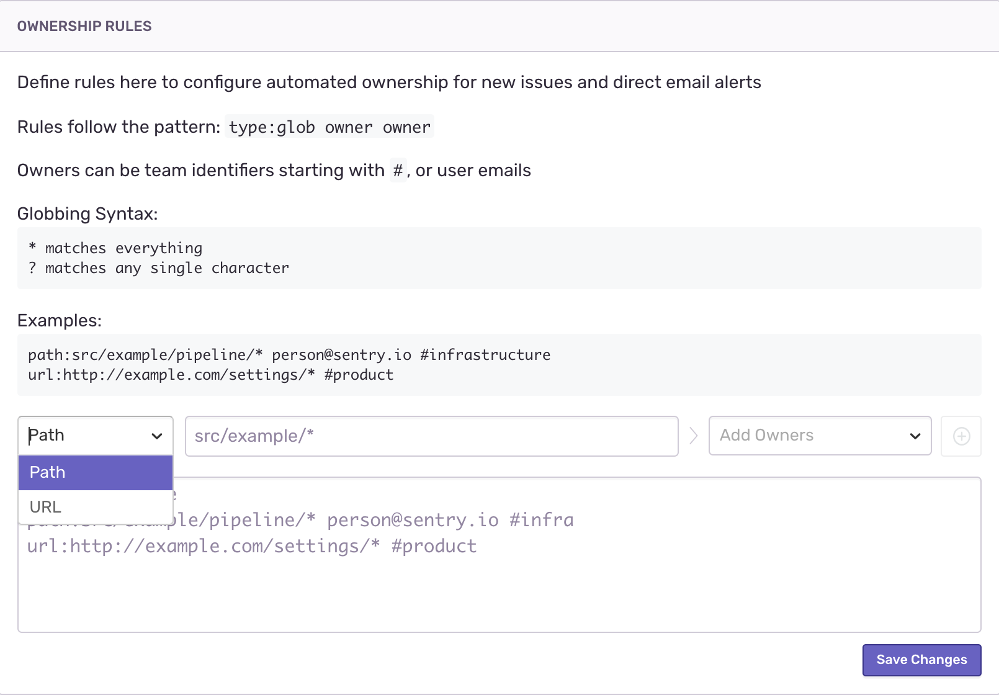
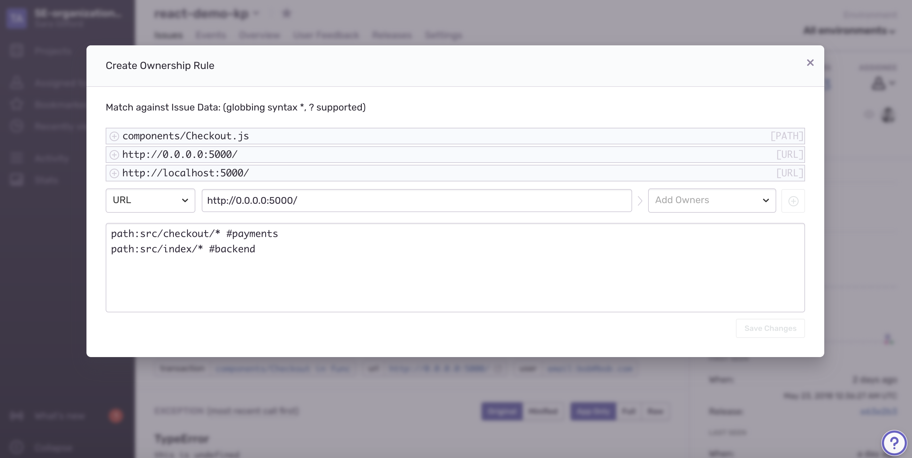

Issue Owners
------------

The Issue Owners feature allows you to reduce noise by directing notifications to specific teams or users based on a path or URL. This allows you to get issues into the hands of the developer who can fix them, faster.

How It Works
------------

Issue owners builds upon your alert rules to specify who to notify about a given issue (to learn more about alert rules, click `here <https://blog.sentry.io/2017/10/12/proactive-alert-rules>`_). 

In your project settings, you will define which users or teams own which paths or URLs for your application. When an exception is caught that triggers an alert, Sentry evaluates whether the exception’s URL tag matches the URL you specified, or if the path you specified matches any of the paths in the exception’s stacktrace. 

If there is a match, only Owners will receive the alert for the exception. By default, if there is no match, the alert will be sent to all members of teams associated with this project. You can also choose to specify that in the case of no match, no users be notified, by toggling off the switch in project settings > Issue Owners > ‘If ownership cannot be determined for an issue...’

.. image:: img/owners_default_everyone.png
  :width: 70%

Note that at this time the Issue Owners feature is only available for email notifications. This means that your alert rules must trigger email notifications in order to be affected by your Issue Owners rules.

Configuration
-------------

**Adding a New Rule**

To configure Issue Owners, navigate to your project settings > Issue Owners. 

To add a new rule, you can use the dropdown to specify whether you’re using a path or URL. Then add the path or URL, and specify which users or teams own that path. You can add multiple users or teams to one path.

You can also use the text editor below to manually add rules.

You can also add a new rule from an individual issue. From the issue details, click the ‘Create Ownership Rule’ on the right-hand panel.

.. image:: img/ownership_rule.png
  :width: 70%

In the resulting modal, you’ll see the paths and URLs connected to the issue, and can either select one to build a rule off of, or create your own rule.

**Syntax**

Issue Owner rules use the following structure:

:code:`type:glob owner`

:code:`type` can be either :code:`path` or :code:`url`, depending on whether you’re specifying a path or URL.

:code:`glob` will be the path or URL you are specifying (for example, :code:`src/javascript/*` or :code:`https://www.example.io/checkout`. You can use the `*` character to match everything, or the `?` character to match any single character. *Note: this feature does not support regex.*

:code:`owner` can be the email of a Sentry user, or the name of a team, prefaced with :code:`#` (i.e., :code:`#backend-team`). To list multiple owners of the same path or URL, place them on the same line like so:

:code:`type:glob owner1 owner2 owner3`

Note that teams and users must have access to the project to become owners. To grant a team access to a project, navigate to project settings > Project Teams, and click ‘Add Team to [project]’. To grant a user access to a project, the user must be a member of a team with access to the project. To add a user to a project’s team, navigate to Project Settings > Project Teams, select a team, then click ‘Add Member.’

Troubleshooting
---------------
- Make sure that all teams and users have access to the project; if they do not have the correct access, the Issue Owners rules will fail to save. To grant a team access to a project, navigate to project settings > Project Teams, and click ‘Add Team to [project]’. To grant a user access to a project, the user must be a member of a team with access to the project. To add a user to a project’s team, navigate to Project Settings > Project Teams, select a team, then click ‘Add Member.’
- Make sure that alert rules are configured to send email. First, check to see that the Mail plugin is enabled by navigating to project settings > Integrations. Then, navigate to project settings > Alerts > Rules, and confirm that notifications are being sent to Mail or to ‘all enabled legacy services.’
