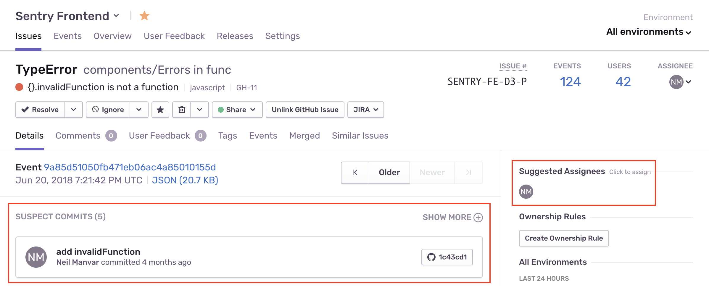
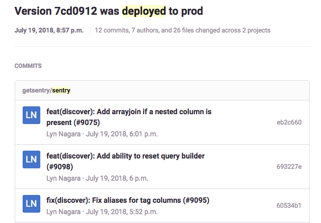

========
Releases
========

A release is a version of your code that is deployed to an environment.
When you give Sentry information about your releases, you unlock a number
of new features:

- Determine the issues and regressions introduced in a new release
- Predict which commit caused an issue and who is likely responsible
- Resolve issues by including the issue number in your commit message
- Receive email notifications when your code gets deployed

Additionally, releases are used for applying `sourcemaps <https://docs.sentry.io/clients/javascript/sourcemaps/>`__
to minified JavaScript to view original untransformed source code.

********************
Configuring Releases
********************
Configuring releases fully is a 3-step process:

1. :ref:`Tag Your Errors <tag-errors>`
2. :ref:`Link a Repository and Associate Commits <link-repository>`
3. :ref:`Tell Sentry When You Deploy a Release <create-deploy>`

.. _tag-errors:

Tag Your Errors
===============
Include a release ID (a.k.a version) where you configure your client SDK. This is commonly
a git SHA or a custom version number (check language-specific docs for exact syntax):

.. code-block:: javascript

  SentryClient.setRelease({
    release: "6d5a6a446805a06154e25e2fa203d67b9e762f5d"
  });

How you make the version available to your code is up to you. For example, you could
use an environment variable that is set during the build process.

This annotates each error with the release. We recommend that you tell Sentry about a
new release prior to deploying it as this will unlock a few more features (explained
in Step 2) . But if you don't, Sentry will automatically create a release entity in the
system the first time it sees an error with that release ID.

After this, you should see information about the release, such as new issues and
regressions introduced in the release.

.. image:: img/releases-overview.png

.. _link-repository:

Link a Repository and Associate Commits
=======================================

In this step you tell Sentry which commits are associated with a release, allowing Sentry
to pinpoint which commits likely caused an issue, and allowing you to resolve an issue by
including the issue number in your commit message.

This is a 2-step process:

a. Link a Repository
--------------------
Go to your organization’s settings, click "Repositories", and click "Add Repository".
You’ll need to be an Owner or Manager of your Sentry organization to do this.
This creates a webhook on the repository which sends Sentry metadata about each commit
(such as authors and files changed).

If you're linking a GitHub repository, ensure you have Admin or Owner permissions on the
repository, and that Sentry is an authorized OAuth app in your
`GitHub account settings <https://github.com/settings/applications>`__.

If you're still having trouble adding it, you can try to `disconnect <https://sentry.io/account/settings/identities/>`__
and then `reconnect <https://sentry.io/account/settings/social/associate/github/>`__
your GitHub identity.

b. Associate commits with a release
-----------------------------------
In your release process, add a step to create a release object in Sentry and associate it with
commits in your repository. There are 2 ways of doing this:

1. Using Sentry’s :ref:`sentry-cli` (**recommended**).
2. Using the API

Using the CLI
~~~~~~~~~~~~~
.. code-block:: bash

  # Assumes you're in a git repository
  export SENTRY_AUTH_TOKEN=...
  export SENTRY_ORG=my-org
  VERSION=$(sentry-cli releases propose-version)

  # Create a release
  sentry-cli releases new -p project1 -p project2 $VERSION

  # Associate commits with the release
  sentry-cli releases set-commits --auto $VERSION

**Note:** You need to make sure you're using :ref:`Auth Tokens <auth-tokens>`,
**not** :ref:`API Keys <api-keys>`, which are deprecated.

In the above example, we’re using the ``propose-version`` sub-command to automatically
determine a release ID. Then we’re creating a release tagged ``VERSION`` for the
organization ``my-org`` for projects ``project1`` and ``project2``. Finally we’re using
the ``--auto`` flag to automatically determine the repository name, and associate commits
between the previous release's commit and the current head commit with the release. If
you have never associated commits before, we'll use the latest 10 commits.

If you want more control over which commits to associate, or are unable to execute the
command inside the repository, you can manually specify a repository and range:

``sentry-cli releases set-commits --commit "my-repo@from..to" $VERSION``

Here we are associating commits (or refs) between ``from`` and ``to`` with the current release,
``from`` being the previous release's commit. The repository name ``my-repo`` should
match the name you entered when linking the repo in the previous step, and is of the
form ``owner-name/repo-name``. The ``from`` commit is optional and we'll use the previous
release's commit as the baseline if it is excluded.

For more information, see the `CLI docs <https://docs.sentry.io/learn/cli/releases/>`__.

Using the API
~~~~~~~~~~~~~
.. code-block:: bash

    # Create a new release
    curl https://sentry.io/api/0/organizations/:organization_slug/releases/ \
      -X POST \
      -H 'Authorization: Bearer {TOKEN}' \
      -H 'Content-Type: application/json' \
      -d '
      {
        "version": "2da95dfb052f477380608d59d32b4ab9",
        "refs": [{
            "repository":"owner-name/repo-name",
            "commit":"2da95dfb052f477380608d59d32b4ab9",
            "previousCommit":"1e6223108647a7bfc040ef0ca5c92f68ff0dd993"
        }],
        "projects":["my-project","my-other-project"]
    }
    '

**Note:** We changed releases to be an org-level entity instead of a project-level entity,
so if you are attempting to add commits to your existing releases configuration that uses
the project releases endpoint, you will need to change the url.

If you’d like to have more control over what order the commits appear in, you can send us
a list of all commits. That might look like this:

.. code-block:: python

    import subprocess
    import requests
    
    SENTRY_API_TOKEN = <my_api_token>
    sha_of_previous_release = <previous_sha>
    
    log = subprocess.Popen([
        'git',
        '--no-pager',
        'log',
        '--no-merges',
        '--no-color',
        '--pretty=%H',
        '%s..HEAD' % (sha_of_previous_release,),
    ], stdout=subprocess.PIPE)
    
    commits = log.stdout.read().strip().split('\n')
    
    data = {
        'commits': [{'id': c, 'repository': 'my-repo-name'} for c in commits],
        'version': commits[0],
        'projects': ['my-project', 'my-other-project'],
    }
    
    res = requests.post(
        'https://sentry.io/api/0/organizations/my-org/releases/',
        json=data,
        headers={'Authorization': 'Bearer {}'.format(SENTRY_API_TOKEN)},
    )

For more information, see the `API reference <https://docs.sentry.io/api/releases/post-organization-releases/>`__.

After this step, **suspect commits** and **suggested assignees** will start
appearing on the issue page. We determine these by tying together the commits in the release,
files touched by those commits, files observed in the stack trace, authors of those files,
and `ownership rules <https://docs.sentry.io/learn/issue-owners/>`__.

Additionally, you will be able to resolve issues by including the issue ID in your commit
message. You can find the issue id at the top of the issue details page, next to the assignee
dropdown. For example, a commit message might look like this:

.. code-block:: bash

    Prevent empty queries on users
    
    Fixes SENTRY-317

When Sentry sees this commit, we’ll reference the commit in the issue, and when you create
a release in Sentry we’ll mark the issue as resolved in that release.

**Note:** If you’re using GitHub, you may have a privacy setting enabled which prevents
Sentry from identifying the user’s real email address. If you wish to use the suggested
owners feature, you’ll need to ensure "Keep my email address private" is unchecked in
GitHub's `account settings <https://github.com/settings/emails>`__.

.. _create-deploy:

Tell Sentry When You Deploy a Release
=====================================
Tell Sentry when you deploy a release and we’ll automatically send an email to Sentry
users who have committed to the release that is being deployed.

You must have environment `context <https://docs.sentry.io/learn/context/>`__ set in
your SDK in order to use this feature. To let Sentry know you’ve deployed, just send
an additional request after creating a release:

.. code-block:: bash

    sentry-cli releases deploys VERSION new -e ENVIRONMENT

You can also use our `API <https://docs.sentry.io/api/releases/post-release-deploys/>`__
to create a deploy.

*****************
Release Artifacts
*****************
Javascript and iOS projects can utilize release artifacts to unminify or
symbolicate error stack traces. To learn more, please check out our
:ref:`iOS <sentry-cocoa-debug-symbols>` and :ref:`JavaScript <raven-js-sourcemaps>` docs.
