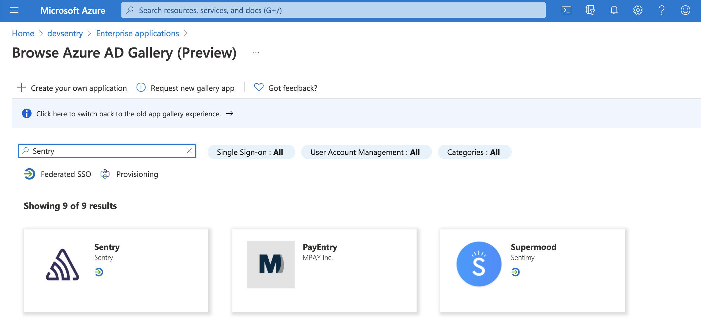
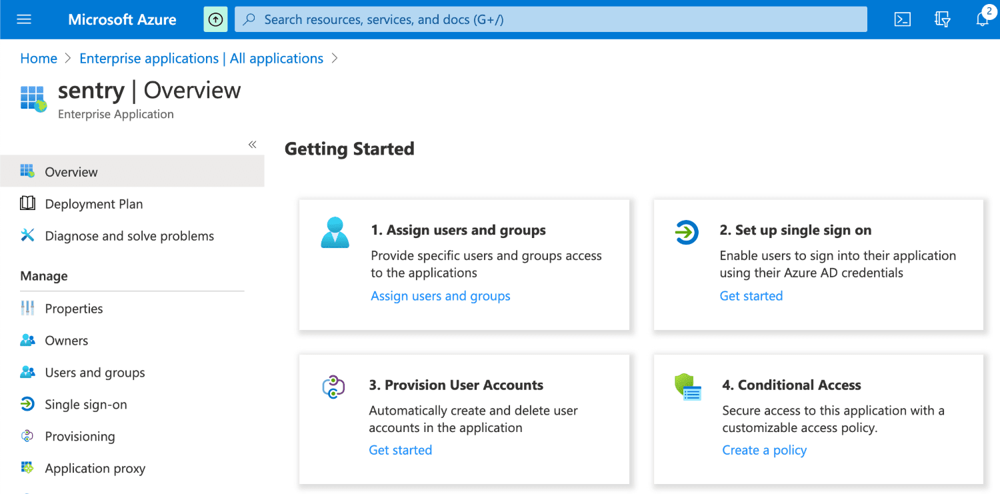
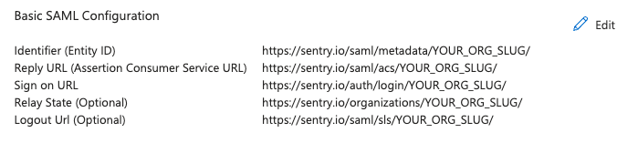
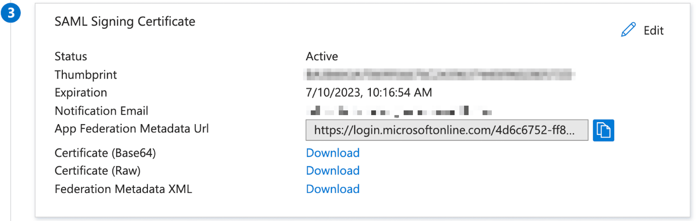
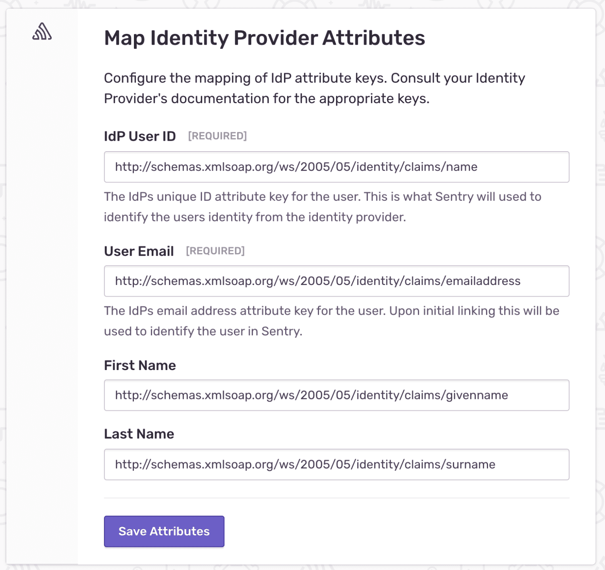
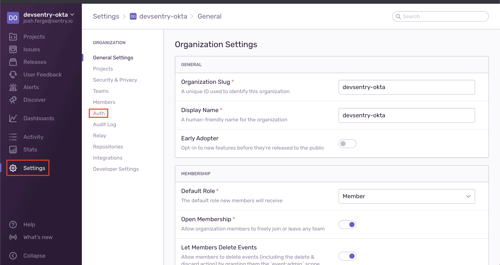
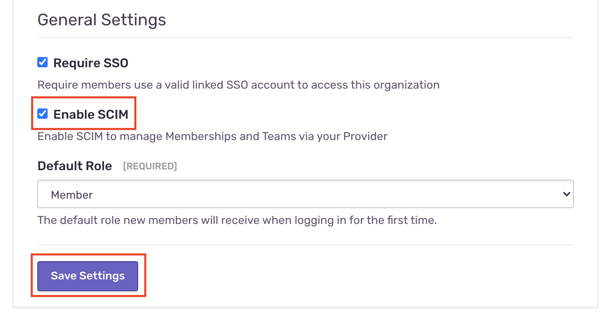
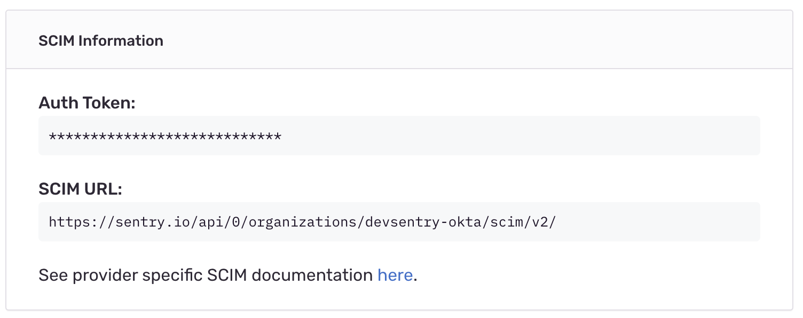
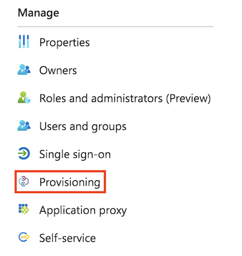
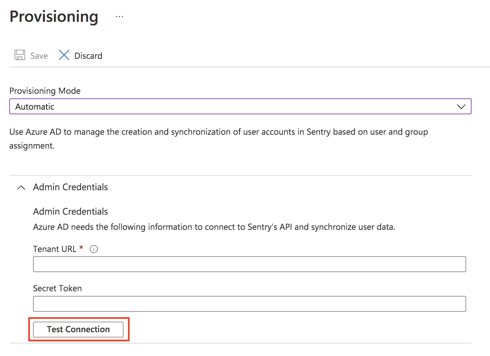

## Installation

<Alert level="warning">

If you change your organization slug, you'll need to make the same update in the steps where you enter the SAML configuration values.

</Alert>

<Alert>

Microsoft renamed Azure Active Directory to Microsoft Entra ID. The steps below use the [Microsoft Entra admin center](https://entra.microsoft.com), but the equivalent steps in the classic Azure portal (`portal.azure.com`) will also work.

</Alert>

1. Log in to the [Microsoft Entra admin center](https://entra.microsoft.com) (or the [classic Azure portal](https://portal.azure.com)).

1. Navigate to **Identity > Applications > Enterprise applications**.

1. If you don't require a permission group for Sentry, skip to Step 5.

1. In the search bar, search for "Groups" then navigate to it. From there, create a new group, add an owner and members to the group. Set "Group type" to Office 365. For more details about group creation, see the [Microsoft Entra docs](https://learn.microsoft.com/en-us/entra/fundamentals/groups-view-azure-portal).

1. Return to **Enterprise applications** and click "+ New application". Search for `Sentry` to create the application.

   

1. Once the application is created, you'll be directed to **Sentry - Overview**.

   

1. Click on "1. Assign users and groups", then "+ Add user". Add yourself and the group you've created to the Sentry app. Click "Assign".

1. Navigate back to **Overview**, click on "2. Set up single sign-on" and then select SAML as your single sign-on method.

1. In the "Basic SAML Configuration" section, enter the following data and save your changes.
   - Identifier (Entity ID): `https://sentry.io/saml/metadata/YOUR_ORG_SLUG/` <Alert level="warning">Ensure that the URL includes a trailing slash to prevent Azure from throwing a misconfiguration error (AADSTS650056).</Alert>

   - Reply URL (Assertion Consumer Service URL): `https://sentry.io/saml/acs/YOUR_ORG_SLUG/`

   - Sign on URL: `https://sentry.io/auth/login/YOUR_ORG_SLUG/`

   - Relay State (optional): `https://sentry.io/organizations/YOUR_ORG_SLUG/`

   - Logout URL (optional): `https://sentry.io/saml/sls/YOUR_ORG_SLUG/`

   

1. In the "SAML Signing Certificate" section, copy the "App Federation Metadata URL" (this field may also appear as "App Metadata URL").

   

1. Navigate to your **Org Settings > Auth** (or go to `https://sentry.io/settings/YOUR_ORG_SLUG/auth/`) and click on "Configure" for Active Directory.

1. Paste the App Federation Metadata URL from above and click "Get Metadata".

1. On the next page, enter the following keys in their respective fields to map the attributes from Microsoft Entra ID to Sentry, and then save them.
   - IdP User ID: `http://schemas.xmlsoap.org/ws/2005/05/identity/claims/name`

   - User Email: `http://schemas.xmlsoap.org/ws/2005/05/identity/claims/emailaddress`

   - First Name: `http://schemas.xmlsoap.org/ws/2005/05/identity/claims/givenname`

   - Last Name: `http://schemas.xmlsoap.org/ws/2005/05/identity/claims/surname`

   For more details about mappings for custom configs, see [The Role of Claims](https://learn.microsoft.com/en-us/windows-server/identity/ad-fs/technical-reference/the-role-of-claims).

   

1. Sentry will attempt to authenticate and link your account with Microsoft Entra ID. After successful authentication, you'll be redirected to Sentry's SSO configuration page, where you can take the following actions:
   - You can share the "Login URL" value, which will be used for SP-initiated SSO, with the users in your organization.

   - Scroll down to the bottom and ensure that "Require SSO" is checked if you want to enforce logging in with Microsoft Entra ID.

   - Set a "Default Role" for new SSO users. Selecting "Member" should cover most use cases.

   - If you made changes, click "Save Settings" to complete your setup.

## SCIM Integration

<Alert>

This feature is only available if your organization is on a Business or Enterprise plan; it is not available on Trial plans.

</Alert>

<Alert level="warning">

If you change your organization slug, you'll need to make the same update in the steps where you enter the SCIM configuration values.

</Alert>

Sentry users can manage provisioning using Microsoft Entra ID with SCIM. You'll need to have Microsoft Entra ID SSO set up and configured for your organization already. Sentry supports User and Group provisioning with Microsoft Entra ID.

### Sentry Configuration

1. Sign in to [sentry.io](https://sentry.io). Select **Settings > Auth**

   

1. Under General Settings select "Enable SCIM", then "Save Settings"

   
   - Sentry will display "SCIM Information" that contains your Auth Token and SCIM Base URL.

     

### Azure Configuration

1. Log in to the [Microsoft Entra admin center](https://entra.microsoft.com) (or the [classic Azure portal](https://portal.azure.com)).

1. Navigate to **Identity > Applications > Enterprise applications**.

1. Select the existing Sentry application.

1. Select "Provisioning" from the "Manage" menu.
   

1. Set "Provisioning Mode" to "Automatic".

1. Use the values from your Sentry SCIM configuration to enter your SCIM URL in the "Tenant URL" field and your SCIM Auth token in the "Secret Token" field.

1. Select "Test Connection" and wait for the message that confirms that the credentials are authorized to enable provisioning.

   

We recommend that you select the option to "Send an email notification when a failure occurs".

As a result of these changes, users who are assigned will be sent an invitation email. When a user is un-assigned, their membership object in Sentry will be deleted.

You can use Group Provisioning to sync and assign groups in Microsoft Entra ID; they will be reflected in Sentry teams.

<Alert>

Please see the [Microsoft Entra ID provisioning tutorial](https://learn.microsoft.com/en-us/entra/identity/saas-apps/sentry-provisioning-tutorial) for further documentation on provisioning setup. If you are using a custom enterprise application, you **must** follow the instructions for only enabling attribute mappings that Sentry supports (Step 5).

</Alert>
