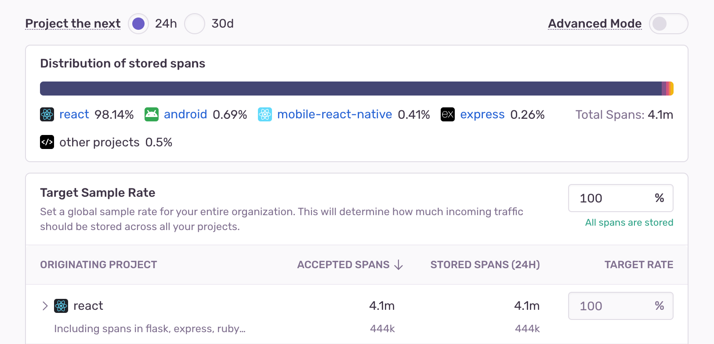
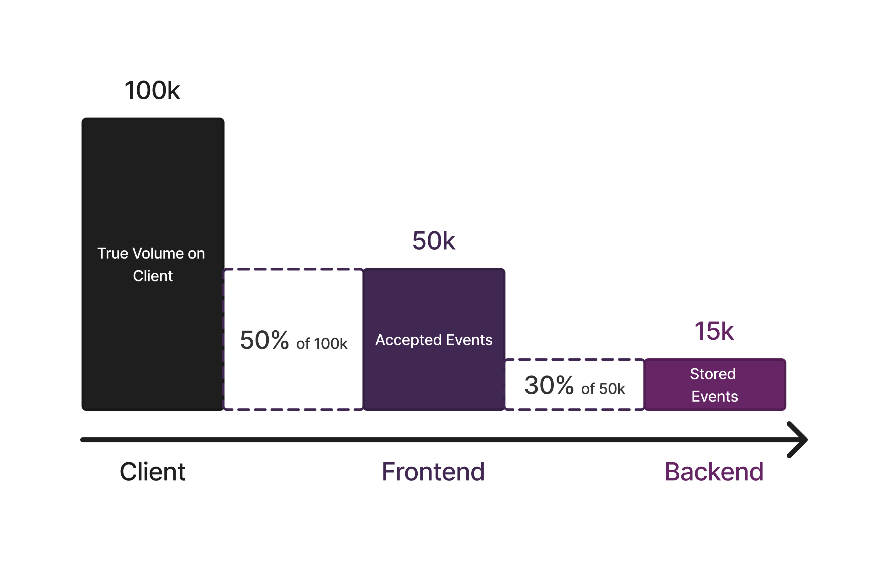
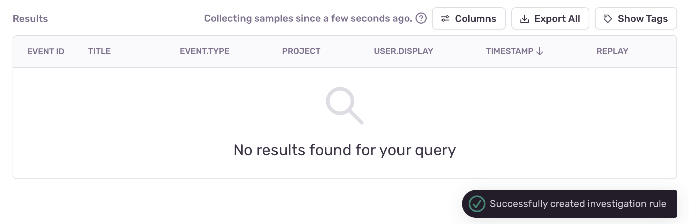

## Overview

Projects that generate large event volume can quickly consume your billing quota. This may create an imbalance where high-volume projects get more visibility, leaving insufficient quota for monitoring your other projects. That's where dynamic sampling comes in.

Dynamic Sampling employs advanced sampling techniques to retain a representative sample of the data you send to Sentry. Its algorithms are designed to prioritize keeping samples that are valuable for debugging and analysis, while reducing the retention of common or redundant data.

This process is applied directly on Sentry's servers, which allows you to configure and adjust sampling rates for stored spans right from the UI without needing to modify your SDK. This makes it possible for you to make instant updates without waiting for code freezes, app store approvals, or redeployments.

By analyzing incoming traffic patterns, Dynamic Sampling is able to tailor its decisions to both the actual traffic volume as well as the content of accepted spans. For more details, check out the [Dynamic Sampling Priorities](#dynamic-sampling-priorities) section.

<Alert>
  Dynamic Sampling including Sampling Priorities has been available on paid
  plans since November 2022. Configuration of custom sample rates has been
  available on our latest Enterprise plans since June 2024.
</Alert>

## Prerequisites

- [Admin-level permissions](/organization/membership/).
- Latest version of one of the below SDKs:
  - Python: 1.7.2 or later
  - JavaScript: 7.6.0 or later
  - Apple: 7.23.0 or later
  - Android: 6.5.0 or later
  - React Native: 4.3.0 or later
  - Dart and Flutter: 6.11.0 or later
  - PHP: 3.9.0 or later
  - Laravel: 3.0.0 or later
  - Symfony: 4.4.0 or later
  - Ruby: 5.5.0 or later
  - Java: 6.5.0 or later
  - .NET: 3.22.0 or later
  - Go: 0.16.0 or later

## Configuration

In this section, you'll learn how to use Dynamic Sampling in your organization. Dynamic Sampling offers two modes based on the desired sampling control:

- **Default mode** allows you to set an organization level target sample rate and automatically adjusts project level sampling to match the organization level sample rate.
- **Advanced mode** gives you more granular control by allowing you to manually set the sampling rate at the project level.

### Default Mode

To use Dynamic Sampling in default mode, you have to specify a target sample rate for your entire organization, which determines how much incoming traffic should be stored across all your projects. Dynamic Sampling then distributes this sample rate across your projects automatically. Sample rates are adjusted continuously to account for changes in event volume over time.

**The following adjustments are performed:**

- Low-Volume Projects get a higher sample rate, ensuring important data isn’t missed.
- High-Volume Projects have reduced sample rates to balance overall storage.
- Sample rates are continuously adjusted based on recent traffic patterns, using a short sliding window to adapt to seasonal changes like holidays, weekends, and nighttime traffic.

Dynamic Sampling also prioritizes the most valuable data within each project's allocated sample rate. You can learn more about this in the [Dynamic Sampling Priorities](#dynamic-sampling-priorities) section. This dynamic system ensures your sampling adapts to changing traffic and maintains balance across projects.

### Advanced Mode

If you want more fine-grained control, you can customize data retention by setting individual sample rates for specific projects by enabling the advanced mode.

Here you can configure a fixed sample rate for each project in your organization. This value will specify the percentage of incoming traffic that should be stored for each respective project. The sample rate can be between 0% and 100%, defaulting to 100% if not adjusted.

When you edit the sample rates for individual projects, an estimated overall sample rate for your organization will also be calculated. This is a weighted average based on the volume of traffic for each project. Keep in mind that this value is an estimate and may change as the volume of traffic fluctuates.

To adjust the sample rates of all your projects at once, edit the overall sample rate for your organization by going to the [Dynamic Sampling settings page](https://sentry.io/orgredirect/organizations/:orgslug/settings/dynamic-sampling/). This will proportionally update each project's sample rate to meet your chosen target. The maximum rate is 100%, and adjustments will be made to balance the rates across projects. You'll be able to review and finalize the updated sample rates before saving. Make sure to click the "Apply changes" button to save the new sample rates.

Whether advanced mode is activated or not, [Dynamic Sampling Priorities](#dynamic-sampling-priorities) will be applied within each project, boosting certain spans and deprioritizing others.

When you deactivate advanced mode, the recalibration process will start immediately and the per-project sample rates will be reset to the calculated values. There's no way to restore the manually configured project sample rates once you've deactivated advanced mode.

### Project Preview

The [project preview](https://sentry.io/orgredirect/organizations/:orgslug/settings/dynamic-sampling/) table on the Dynamic Sampling settings page shows you how your projects might be affected by the sample rate you've chosen. The preview shows the dynamically allocated rates for your projects based on either the last 24 hours or the last 30 days of traffic.

Because project rates continuously change, we recommend that you choose the 24-hour preview to get a more accurate view of your current sample rates for real-time analysis. We recommend the 30-day preview for seeing average sample rates in your billing cycle for long-term planning.

## Sample Rates for Distributed Traces

Because [distributed traces](/product/tracing/#whats-distributed-tracing) can originate in one project and have spans going across multiple other projects, it's important to note that Sentry **always applies the sample rate of the project where the trace originated** to every project that's part of that trace.

For example, if a trace starts in your frontend application, the sample rate you've set there will apply to a connected backend application that's part of the same trace. The same rule applies if the trace starts in a backend application.

If you navigate to the [project preview](https://sentry.io/orgredirect/organizations/:orgslug/settings/dynamic-sampling/) table, you'll see the number of sent spans next to the origin project where the trace started. This includes any spans from propogated traces in other projects that are connected to the origin project. This gives you a direct view of how many spans will be affected by the sample rates you configure. To see the span counts broken down by the project they belong to, click the expand icon to the left of each project in the preview.

## SDK versus Dynamic Sampling

SDK sampling happens at the application level, before events are sent to Sentry. It filters events by sending only a set percentage, reducing data volume and instrumentation overhead. This helps with managing high event volumes directly at the source.

Dynamic sampling, on the other hand, happens at the server level after events are sent to Sentry. Sample rates are adjusted dynamically based on the volume of events received by Sentry, without requiring any changes to the application.

SDK sample rates can usually only be changed when a new version of the application is deployed, unless a custom mechanism has been implemented making it possible to change the sample rate dynamically. But with Dynamic Sampling, it's possible to configure the sampling rate for each project in your organization dynamically, without requiring any changes to the application.

Additionally, advanced mode is not active, Dynamic Sampling continuously monitors the traffic for each project and adjusts the sample rate of each to prioritize the most relevant data.

### When to Use Dynamic Versus SDK Sampling

The biggest benefit of Dynamic Sampling is its flexibility. It adjusts the sample rate based on the volume of events received by Sentry. This makes it a great choice for organizations with both high and low-volume projects, as it helps maximize your quota by tailoring the sample rate to each project's event volume.

Dynamic Sampling can prioritize spans based on their content, offering more insight than SDKs. For example, it can focus on spans from the latest release or low-volume projects, giving you better visibility into the most important parts of your application.

SDK sampling uses a static rate set in the SDK configuration. It’s ideal for organizations with consistent event volumes that want to limit the percentage of events sent to Sentry. This helps reduce spans to lower overhead, save bandwidth (especially for mobile apps), or decrease the number of accepted spans.

### Deciding on Your SDK Sample Rate

To give Sentry the fullest, most accurate picture of your application’s health, we recommend sending us 100% of your events. You can do this by setting your [tracesSampleRate](/platform-redirect/?next=/performance/) to 1.0. If this isn't feasible for your organization, set a lower value, or switch to sampling selectively by using the [tracesSampler](/platform-redirect/?next=/performance/) to filter your events based on contextual data. Note, that when calculating throughput, metering is based on received, not stored events.

<Alert>
  Changes to your SDK sampling configuration may affect your quota. If you
  increase your SDK sampling rate, you'll also be increasing the volume of
  events you send to Sentry. This may require that you adjust your quota.
</Alert>

You can use both Dynamic and SDK Sampling together to further optimize your event volume for your specific use case. For example, you can set a low SDK sample rate to ensure that only a certain percentage of events are sent to Sentry, and then use Dynamic Sampling to adjust the sample rate based on the event volume received by Sentry.

## Dynamic Sampling Priorities

Below is a list of the strategies Dynamic Sampling employs to prioritize and deprioritize data. They are enabled by default, but can be updated on a per-project basis to better fit your organization's needs. To customize this behavior, go to Project Settings > Performance.

### How to Change Dynamic Sampling Priorities

To make changes to a project's dynamic sampling priorities in Sentry, go to **Settings > Projects**, select the project you're interested in, then scroll down to "Performance" in the "PROCESSING" section and make any updates under "DYNAMIC SAMPLING PRIORITIES" using the toggles. Each of your projects can have an individual set of dynamic sampling priorities.

<Arcade src="https://demo.arcade.software/bEv0SO2UEmqbVJVok99o?embed" />

### Automatic Priorities

Sentry automatically prioritizes or deprioritizes based on the following rules:

#### Latest Release

Latest releases are a dynamic sampling priority because when you create a new release, we assume you'll want to have more visibility during the early adoption phase, which improves your ability to catch new issues as your release is gaining traction.
Because you may want to deploy the same release in different environments, we'll also take your environment into account and prioritize those traces.

#### Dev Environments

Since dev environments usually generate a small number of events as compared to prod environments, we prioritize them during your testing phase so you can get meaningful insights. We consider an environment to be a dev environment if its name matches one of the following glob patterns:

- `*debug*`
- `*dev*`
- `*local*`
- `*qa*`
- `*test*`

#### Low Volume Projects

<Alert>
  You won't be able to disable the Low Volume Projects dynamic sampling priority
  because it's set on an organization-wide level, not on a per-project basis.
</Alert>

Some projects within your organization are very high-volume compared to others. This means that low-volume projects might get drowned out if we treat all projects equally. To ensure that you have enough samples regardless of project scale, we prioritize low-volume projects.

#### Low Volume Transactions

Spans can be logically grouped by their transaction name within a project. This means that spans with the same transaction name most likely indicate the same operation or code path, while spans with different transaction names usually indicate different operations.
We prioritize low-volume transactions for the same reason we prioritize low-volume projects: so they don't get drowned out by high-volume transactions. We want to make sure that low-volume code paths are sampled in enough quantities to generate a complete view of your application.

#### Health Checks

We deprioritize health check type transactions because while they're important for checking the stability of your application, they don't have any value beyond the task associated with them. We consider a transaction to be a health check if its name matches one of the following glob patterns:

- `*healthcheck*`
- `*heartbeat*`
- `*/health`
- `*/healthy`
- `*/healthz`
- `*/live`
- `*/livez`
- `*/ready`
- `*/readyz`
- `*/ping`

### Get Samples

Our automated dynamic sampling priorities work well in a generic manner to collect a baseline of samples because they prioritize retaining data that's valuable for any customer at any given time. However, there are certain scenarios, such as investigating a particular issue, when very specific data becomes temporarily more important. In such cases, the automated sampling priorities may not provide enough samples, so you may want to create investigation rules.

Investigation rules are sampling rules that can be created through the Sentry UI to temporarily boost the number of events collected for a particular scenario (for example, events with specific tag values). These rules can be created to retain more samples when too few (less than 5) are available. Once created, a rule will be active for up to 48 hours or until 100 samples are collected. You'll be notified via email when enough events have been collected.

Investigation sampling rules only apply to transactions and don't guarantee that full traces will be sampled. The maximum number of sampling rules that can exist at the same time is 50.

#### Creating a New Rule

When you query transactions either in [Discover](/product/explore/discover-queries/) or in [Transaction Summary](/product/performance/transaction-summary/) and receive fewer than 5 samples, you can click "Get Samples" to create a new investigation rule and retain more samples of transactions for the respective query.

<Alert>

This feature only applies to transactions. Therefore, in Discover, you have to specify `event.type:transaction` in the query to access the feature, whereas in Performance the event type is implicit.

</Alert>

Clicking this button creates an investigation rule for the query. Once the rule is successfully created, a notification appears, and the button is replaced with a message showing the investigation is in progress and the amount of time it's been active.

If a user performs the same search later and the investigation is still active, the notification will indicate that there's an active rule already collecting data for the query.

It's also possible to create a rule from the Transaction Summary page in Performance.

